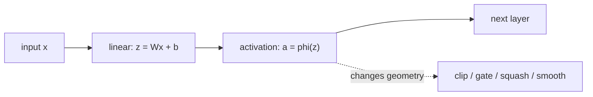

+++
title = "Activation Functions: The Small Nonlinearity That Shapes a Network"
date = 2026-06-18T10:00:00+08:00
tags = ["deep-learning", "activation-function", "neural-network", "gradient-descent"]
categories = ["AI"]
draft = false
image = "/images/posts/activation-functions-neural-networks/activation-function-icon.svg"
libraries = ["mathjax", "mermaid"]
description = "A mechanism-first guide to activation functions: why neural networks need nonlinearities, how sigmoid, tanh, ReLU, GELU, and SiLU differ, and why a 400-function survey is best read as a map rather than a menu."
+++

Activation functions look like small details. In a neural-network layer, the heavy computation is usually the matrix multiplication:

$$z = Wx + b$$

Then we apply a simple function elementwise:

$$a = \phi(z)$$

It is tempting to treat \\(\phi\\) as a plug-in choice: sigmoid, tanh, ReLU, GELU, SiLU, Mish, or one of hundreds of proposed variants. But the activation is not decoration. It decides whether stacked layers can represent nonlinear functions, whether gradients keep flowing, whether hidden values stay centered, and whether the model pays a large runtime cost for a tiny accuracy gain.

Kunc and Klema's 2024 survey, [*Three Decades of Activations*](https://arxiv.org/abs/2402.09092), collects about 400 real-valued activation functions. That is a useful warning: the field has many names, variants, and rediscoveries. For a blog post, listing all 400 would hide the real lesson. A better question is:

> what problem is an activation function solving, and what tradeoff does each family make?

## Why Nonlinearity Is Necessary {#why-nonlinearity}

Start with a two-layer network but remove the activation:

$$h = W_1 x + b_1$$

$$y = W_2 h + b_2$$

Substitute \\(h\\) into the second equation:

$$y = W_2(W_1x + b_1) + b_2 = (W_2W_1)x + (W_2b_1 + b_2)$$

The whole two-layer network collapses into one linear layer. Stacking more linear layers does not help; the composition of linear or affine maps is still affine.

The activation function breaks this collapse. After:

$$h = \phi(W_1x + b_1)$$

the second layer no longer sees a simple affine transformation of \\(x\\). It sees features that have been clipped, gated, squashed, bent, or smoothly reweighted. That is the core reason activation functions exist.

Here is a tiny scalar example. Let:

$$h_1 = \phi(2x - 1),\quad h_2 = \phi(-2x - 1),\quad y = h_1 + h_2$$

If \\(\phi(z)=z\\), then:

$$y = (2x - 1) + (-2x - 1) = -2$$

The input \\(x\\) disappears. But if \\(\phi(z)=\max(0,z)\\), then:

$$y = \max(0,2x-1) + \max(0,-2x-1)$$

Now the function is flat near the middle and grows on both sides. Two rectifiers have created a piecewise-linear "bend" that a single linear layer cannot express.

## A Practical Taxonomy {#taxonomy}

The 2024 survey separates activation functions into **fixed** functions and **adaptive** functions. Fixed functions have no trainable activation parameters; adaptive activation functions add parameters that are trained with the model. For learning the main ideas, another useful axis is: what does the function do to the signal and gradient?

| Family | Examples | Representative formula | Main tradeoff |
| --- | --- | --- | --- |
| Step-like | binary step, sign | \\(1[z\ge0]\\), \\(\operatorname{sign}(z)\\) | historically important, but weak for backprop |
| Saturating smooth | sigmoid, tanh | \\(\sigma(z)=1/(1+e^{-z})\\), \\(\tanh(z)\\) | stable range, weak deep gradients |
| Rectified | ReLU, Leaky ReLU, PReLU | \\(\max(0,z)\\), \\(\max(\alpha z,z)\\) | cheap and sparse, can create dead units |
| Smooth rectified / gated | GELU, SiLU/Swish, Mish | \\(z\Phi(z)\\), \\(z\sigma(z)\\) | often strong in modern nets, more expensive |
| Normalizing / output-layer | softmax | \\(e^{z_i}/\sum_j e^{z_j}\\) | useful for classification logits, not a hidden-layer drop-in |
| Adaptive / learned | PReLU, trainable splines, rational activations | e.g. \\(\max(\alpha z,z)\\) with trainable \\(\alpha\\) | more parameters, more implementation risk |

The point is not that one row always dominates. Each row spends the activation budget differently: hard thresholds buy discrete decisions but lose gradients; sigmoid/tanh buy bounded values but saturate; ReLU buys cheap gradient flow but throws away negative values; GELU and SiLU buy smoother gating at higher compute cost.



The family-level table compresses many details. Sigmoid and tanh both saturate, but tanh is zero-centered. ReLU and Leaky ReLU both belong to the rectified family, but their negative-side gradients differ. GELU and SiLU are both smooth gates, yet their negative-side curves are not identical. The gallery does not try to cover all 400 functions; it puts the common choices into one visual coordinate system.

## Sigmoid And Tanh: Bounded But Saturating {#sigmoid-tanh}

The logistic sigmoid is:

$$\sigma(z) = \frac{1}{1 + e^{-z}}$$

It maps every input into \\((0,1)\\). That is useful when the output should behave like a probability. Its derivative is:

$$\sigma^{\prime}(z) = \sigma(z)(1-\sigma(z))$$

The derivative is largest near \\(z=0\\) and becomes tiny when \\(z\\) is very positive or very negative. This is the saturation problem: if a neuron sits far into the flat left or right side, backprop sends almost no learning signal through it.

Tanh is a shifted and scaled sigmoid:

$$\tanh(z) = 2\sigma(2z) - 1$$

It maps into \\((-1,1)\\) and is zero-centered, which is often nicer for hidden activations than sigmoid. But it still saturates. This is why sigmoid and tanh are less common as default hidden-layer activations in deep feed-forward networks, even though they remain important in gates, recurrent networks, and probabilistic output heads.



A bounded activation controls the range of hidden values, but that same boundedness usually means flat tails. Flat tails are where gradients disappear.



## ReLU: Sparse, Cheap, And Surprisingly Effective {#relu}

ReLU is:

$$\operatorname{ReLU}(z) = \max(0,z)$$

Its derivative is simple:

$$\operatorname{ReLU}^{\prime}(z) = \begin{cases} 1, & z > 0 \\\\ 0, & z < 0 \end{cases}$$

Compared with sigmoid and tanh, ReLU does not saturate on the positive side. If \\(z>0\\), the gradient can pass through unchanged. It is also cheap: no exponential, no division, no table lookup.

ReLU's weakness is also obvious. On the negative side, the output is exactly zero and the gradient is zero. If a unit is pushed into a region where it is always negative, it can become a **dead ReLU**. Leaky ReLU changes the negative side from zero to a small slope:

$$\operatorname{LeakyReLU}(z) = \begin{cases} z, & z > 0 \\\\ \alpha z, & z \le 0 \end{cases}$$

PReLU makes \\(\alpha\\) trainable. This is a small example of the fixed-versus-adaptive distinction in the survey: the shape of the nonlinearity is no longer entirely chosen by the researcher; part of it is learned.

## GELU And SiLU: Smooth Gates Instead Of Hard Gates {#gelu-silu}

Modern Transformer-style models often use smooth rectified or gated activations. Two common examples are GELU and SiLU.

SiLU, also called Swish when written with a parameter in some papers, is:

$$\operatorname{SiLU}(z) = z\sigma(z)$$

Instead of hard-clipping negative values, it multiplies the input by a smooth gate between 0 and 1. Large positive inputs pass through almost unchanged; large negative inputs are mostly suppressed; values near zero are softly blended.

GELU is commonly written as:

$$\operatorname{GELU}(z) = z\Phi(z)$$

where \\(\Phi\\) is the standard normal cumulative distribution function. The intuition is similar: the input is weighted by a smooth probability-like gate.

Many LLM MLP blocks use not just GELU/SiLU alone, but a gated feed-forward form such as SwiGLU:

$$\operatorname{SwiGLU}(x) = (xW_1) \odot \operatorname{SiLU}(xW_2)$$

The activation is now part of a learned gate. One projection produces values, another projection produces a smooth gate, and the elementwise product decides which features pass forward.

The cost is system-level: sigmoid, tanh, erf, or approximations are more expensive than a max operation. On GPUs this may be hidden by fused kernels, but the implementation still matters.

## How To Choose An Activation {#how-to-choose}

There is no universal best activation. A practical decision should start from the role of the layer.

| Situation | Default choice | Why |
| --- | --- | --- |
| Simple MLP/CNN baseline | ReLU or Leaky ReLU | cheap, stable, easy to debug |
| Transformer MLP | GELU, SiLU, or SwiGLU-style gate | smooth gating works well in modern architectures |
| Binary probability output | sigmoid | output lies in \\((0,1)\\) |
| Multiclass logits | softmax at the loss/output boundary | turns logits into coupled class probabilities |
| Very deep network with normalization | follow the architecture's standard choice | initialization, normalization, and activation are tuned together |
| Hardware-constrained inference | ReLU or a fused common activation | runtime cost and kernel support matter |
| Research on activation design | use the 400-function survey as a map | avoid rediscovering an existing variant |

Two engineering rules matter more than the name of the function.

First, **activation, initialization, and normalization are coupled**. A function that works well with BatchNorm or LayerNorm may behave differently without it. A function with a nonzero mean changes the distribution seen by the next layer. A function with strong saturation needs inputs to stay in its sensitive region.

Second, **do not benchmark activations in isolation and overgeneralize**. A small CIFAR experiment, a Transformer language model, a physics-informed network, and an embedded inference model have different bottlenecks. Accuracy, gradient flow, memory bandwidth, vectorization, and kernel fusion can point to different choices.

## Reading The 400-Function Survey {#reading-survey}

The Kunc and Klema survey is valuable because it makes the activation-function space searchable. It also says something important about research practice: many proposed functions differ by a slope, shift, gate, learned parameter, or smooth approximation. Some ideas are rediscovered under new names.

For a practitioner, the paper is best read in three passes:

- **Use it as a dictionary** when you encounter an unfamiliar activation name.
- **Use its fixed/adaptive split** to ask whether a function has trainable shape parameters.
- **Use its breadth as a warning** that "new activation" papers need careful baselines and ablations.

For everyday model building, the useful mental model is much smaller:

| Dimension | Question to ask |
| --- | --- |
| Nonlinearity | Can stacked layers compose the bends and gates the task needs? |
| Gradient flow | Does backprop keep signal, or does it vanish in flat/clipped regions? |
| Value distribution | Does the next layer see stable activations, or a shifted distribution? |
| Compute and kernel support | Do exponentials, erf, lookup tables, or branches matter at inference time? |

That is the real checklist. An activation function is a local scalar function, but it changes the global behavior of optimization and representation. The right question is not "which of the 400 is best?" It is:

> what geometry, gradient behavior, and system cost does this network need?

[^fn:survey]: Vladimír Kunc and Jiří Kléma, [*Three Decades of Activations: A Comprehensive Survey of 400 Activation Functions for Neural Networks*](https://arxiv.org/abs/2402.09092), arXiv:2402.09092, 2024.
