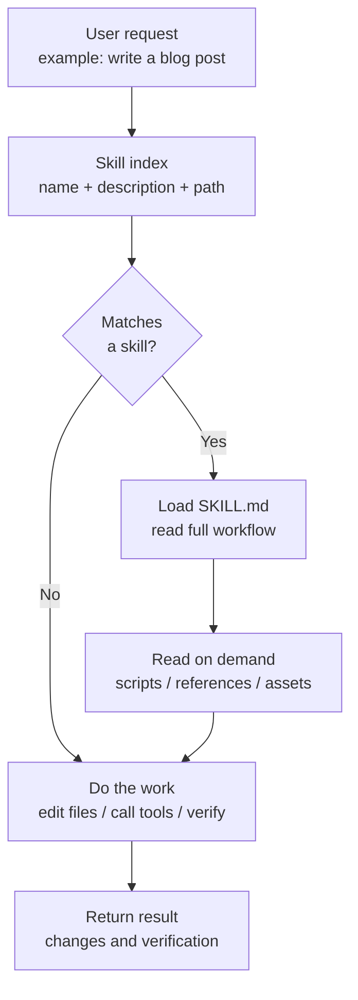
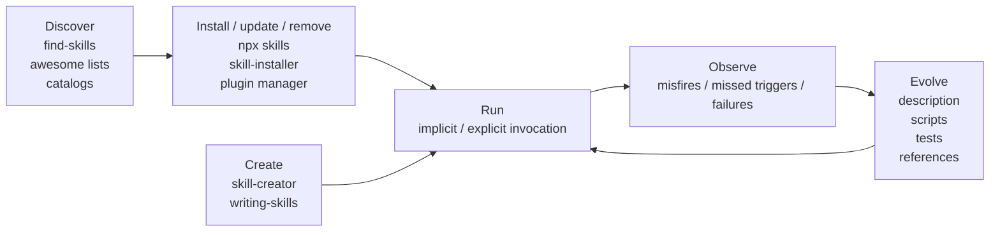
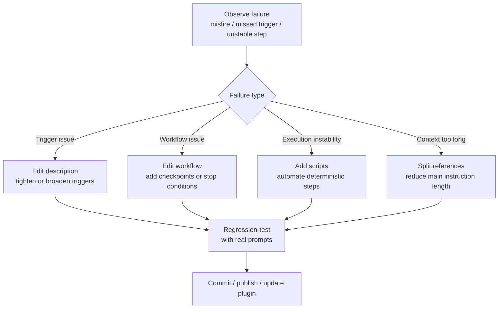

+++
title = "Agent Skill Management: Turning AI Assistants from Clever to Reliable"
date = 2026-05-23T10:30:00+08:00
tags = ["agent", "codex", "skills", "workflow"]
categories = ["notes"]
draft = false
image = "/images/icons/terminal.png"
libraries = ["mermaid"]
description = "A practical note on managing agent skills: how to install, create, remove, disable, update, and evolve skills, plus which meta-skills are worth installing first."
+++

## Why Skills Matter {#why-skills-matter}

After using coding agents for a while, I have found that the limiting factor is often not whether the model is clever enough today. It is whether the agent can reliably reuse experience.

In a real repository, there are many implicit rules: which test command to run, which files should not be touched casually, where generated images belong, what must be checked before publishing, and whether a bug report should trigger root-cause analysis before patching. Humans handle these rules through memory and habit. An agent does not automatically know them at startup. Putting everything into one giant `AGENTS.md` is not ideal either: the context grows, trigger boundaries blur, and the result becomes "everything is written down, but the important part may still not fire at the right time."

This is where skills matter. A skill packages a class of work into a reusable, triggerable, evolvable module. A good skill is not just a prompt template. It is a bounded operating manual: when to use it, when not to use it, which references to read, which scripts may be run, and how to verify completion.

This post is not about writing one specific skill. It is about **agent skill management**: how to add skills, remove or disable them, manage them with tools, choose the first meta-skills to install, and evolve skills through real use.

## The Minimal Skill Model {#skill-model}

In Codex, a skill is essentially a directory with at least one `SKILL.md` file. That file usually has two layers:

- metadata: `name` and `description`, which tell the agent what the skill is and when it should trigger;
- instructions: the actual workflow the agent should follow after the skill is selected.

The directory can also include supporting material:

- `scripts/`: deterministic helpers, such as conversion, validation, or file generation scripts;
- `references/`: long documents, specifications, and examples, so the main instruction file stays small;
- `assets/`: templates, images, config snippets, and scaffolding resources.

The key mechanism is **progressive disclosure**. The agent should not read every installed skill in full when it starts. It first sees the skill name, description, and path. Only when a task matches a skill does it load the full `SKILL.md`. This is similar to lazy loading in software: the index stays resident; the implementation is loaded on demand.



This model gives us the first rule of skill management: **the description is an entry point, not a summary**. It is not marketing copy for humans. It is a routing rule for the agent. If the description is too broad, the skill will misfire. If it is too narrow, the agent will fail to use it.

A good description should answer three questions:

- What kind of task does this skill solve?
- How will users usually phrase that task?
- Which nearby tasks should not trigger it?

For example, a blog-writing skill should explicitly mention triggers such as `write a post`, `create a blog entry`, and `draft an article`, while also making clear that it applies to one specific Hugo blog structure rather than all Markdown writing.

## The Skill Lifecycle {#skill-lifecycle}

Managing skills is a lifecycle, not a one-time installation step. A skill has to be added from a trustworthy source, scoped to the right place, kept current, and eventually disabled or removed when it stops helping.

The useful mental model is the same one we use for dependencies: install deliberately, isolate by scope, update with review, and prune aggressively.

### Add Skills Deliberately {#adding-skills}

There are three common ways to add a skill: install from the existing ecosystem, select from a repository, or create your own.

### Install from an Official or Community Source {#install-from-catalog}

If you only want to add a common capability to your local environment, prefer an installer over copying files by hand. My default recommendation is: **use the `skills` CLI for day-to-day management, and use `$skill-installer` for Codex-only official curated skills.**

A CLI such as `vercel-labs/skills` behaves more like a package manager. It supports GitHub shorthand, full URLs, GitLab, arbitrary git URLs, local paths, and agent-specific installation. If you use Codex, Claude Code, Cursor, Gemini CLI, or other agents side by side, using one CLI for install, list, update, and remove is clearer than maintaining separate inventories inside each agent:

```shell
# List skills in a repository
npx skills add vercel-labs/agent-skills --list

# Install selected skills
npx skills add vercel-labs/agent-skills \
  --skill frontend-design \
  --skill skill-creator

# Install for specific agents
npx skills add vercel-labs/agent-skills \
  --agent codex \
  --agent claude-code
```

Codex's `$skill-installer` is better treated as a native fallback: use it when official docs or the Codex UI directly point you to a curated skill, or when you want to try a temporary Codex-only skill from inside the current Codex session:

```text
$skill-installer linear
```

So the two are not mutually exclusive. The `skills` CLI owns the everyday inventory and cross-agent management; `$skill-installer` covers the Codex-native curated path. For long-term distribution, a plugin is usually more controlled than loose skill folders, because a plugin can package multiple skills, MCP configuration, app integrations, and presentation metadata together.

There is a practical caveat: the skill ecosystem is still young, and repository quality varies. Do not install everything just because a catalog advertises "1000+ skills." Skills are not VS Code extensions. Too many installed skills increase trigger noise and consume the initial skill-list budget. A better pattern is to list candidates first, then install based on task frequency and source credibility.

### Find Skills Online {#find-skills-online}

Good starting points include:

- official catalogs, such as `openai/skills`;
- cross-agent tooling repositories, such as `vercel-labs/skills`;
- curated lists, such as `awesome-agent-skills`;
- method-oriented repositories, such as `obra/superpowers`.

When evaluating a skill, I look for five signals:

| Signal | Why it matters |
| --- | --- |
| Trustworthy source | Official, well-known, or real-project skills are usually more reliable |
| Clear description | Unclear trigger boundaries pollute the workflow |
| Scripts or tests | Complex skills drift when they rely only on prose |
| Recent maintenance | Agent tooling changes quickly, so old instructions may be stale |
| Narrow permissions | Skills that run network calls, rewrite broad file ranges, or modify config need caution |

Meta-skills such as `find-skills` are useful for discovery, but they cannot replace judgment. My default is to install a small number of workflow and meta-management skills first, then add domain skills as real project needs appear.

### Create Your Own Skill {#create-your-own}

When you explain the same workflow to an agent for the third time, it is probably time to write a skill.

You can use `$skill-creator` interactively. It usually asks:

- What does the skill do?
- When should it trigger?
- Is it instruction-only, or does it need scripts?
- Does it need examples, templates, or reference files?

A minimal skill can also be handwritten:

```markdown
---
name: my-blog-writer
description: Write Hugo posts for this repository when the user asks to draft, edit, or publish a blog post.
---

# My Blog Writer

Use this skill when writing posts for this Hugo blog.

Workflow:

1. Inspect existing post structure.
2. Create a post bundle under `content/zh/posts/<slug>/`.
3. Use TOML front matter.
4. Prefer Mermaid for diagrams.
5. Run `hugo --minify` before claiming completion.
```

This is already usable. What makes it stable is iteration: add counterexamples, define non-trigger cases, move deterministic work into scripts, and add verification commands.

### Store Skills at the Right Scope {#where-to-store-skills}

Codex reads skills from several locations. At a high level, they fall into four scopes:

| Scope | Good fit |
| --- | --- |
| repo skill | Repository or module-specific workflows, such as blog publishing, firmware builds, or internal test commands |
| user skill | Personal workflows that apply across repos, such as resume writing, diagrams, or web research |
| admin skill | Team or machine-level defaults, such as internal SDKs or automation |
| system skill | Built-in or platform-provided capabilities |

My rule of thumb:

- put repository-specific facts in the repo, such as `.agents/skills/`;
- put personal habits and cross-repo workflows in the user directory;
- use a plugin when multiple people need a reusable package with MCP or app configuration;
- do not put all personal skills into a project repo, or teammates inherit your private habits.

### Remove, Disable, and Update Skills {#remove-disable-update}

Removal is the most neglected part of skill management. Many people install skills but never prune them, until the agent starts every session with a pile of stale rules.

I split cleanup into three actions: disable, delete, and archive.

### Disable First, Delete Later {#disable-first}

If a skill misfires occasionally, or you suspect it conflicts with another skill, disable it first. Codex can disable a specific skill through `[[skills.config]]` entries in `~/.codex/config.toml`:

```toml
[[skills.config]]
path = "/path/to/skill/SKILL.md"
enabled = false
```

Disabling is reversible. You can observe whether the agent becomes more stable without the skill. If the only problem is an overly broad description, fix the description. If the workflow itself is stale, delete it.

### Delete Once You Know It Is Unused {#delete-skills}

Deletion depends on where the skill came from:

| Source | How to remove it |
| --- | --- |
| Local handwritten skill | Delete the skill directory |
| Repo skill | Delete it from the repo and commit the change |
| Symlinked install | Remove the symlink or source directory, without deleting shared sources accidentally |
| Plugin-provided skill | Uninstall or disable it through the plugin manager |
| CLI-installed skill | Use that CLI's remove/update flow, or inspect the install directory before cleanup |

Before deleting, answer two questions:

- Does any other skill reference it as required background or as a sub-skill?
- Do any scripts, templates, or MCP configs depend on it?

Skill dependencies matter. Removing a foundational workflow skill can make higher-level skills vague. For example, deleting `verification-before-completion` removes the shared meaning behind many "verify before finishing" instructions.

### Update Based on Source {#update-skills}

Update strategy depends on the source:

- plugin skill: update through the plugin manager;
- git repo skill: pull upstream and review the diff;
- copied skill: compare with upstream manually to avoid overwriting local edits;
- self-authored skill: treat it like code, with review and verification.

For important skills, I do not recommend blind automatic updates. A skill is an agent behavior rule. Updating it changes how work gets done. For skills that run commands, edit files, or call external services, test a few real prompts after updating.

## Management Tools {#management-tools}

Skill management tools fall into three categories.

The first category is **installers / package managers**. The everyday default can be `vercel-labs/skills` with `npx skills add/list/update/remove`: it answers "where does the skill come from, where should it be installed, which agent should receive it, and how do I update or remove it later?" Codex's `$skill-installer` is more of a Codex-native entry point, useful for official curated skills, temporary Codex-only trials, or cases where the `skills` CLI does not know the exact source path.

The second category is **discovery tools**. `find-skills` helps answer "does a skill already exist?" It narrows the search space, but it does not judge quality for you.

The third category is **authoring tools**. `skill-creator` and Superpowers' `writing-skills` help answer "how do I turn experience into a reusable skill?"



If I had to recommend one starting set, it would be:

- `skills` CLI: everyday install, list, update, and remove;
- `skill-installer`: Codex curated / Codex-only fallback;
- `find-skills`: discovery;
- `skill-creator`: creation;
- `verification-before-completion`: evidence before completion;
- `systematic-debugging`: bug investigation;
- `requesting-code-review`: change review.

These are not tied to one tech stack. They improve the way the agent works.

## Operating Strategy {#operating-strategy}

The practical question is not "how many skills can I install?" It is "which small set makes the agent's behavior more predictable on real work?"

I would start with meta-skills, then add engineering workflow skills, and only then add domain skills that know the boundaries of your actual projects.

### Which Skills Are Worth Installing First {#recommended-skills}

Here are the skill types I would prioritize.

### First Batch: Meta-Skills {#meta-skills}

These skills do not directly write business code. They manage how the agent works.

| Skill | Purpose |
| --- | --- |
| `skill-creator` | Turn repeated workflows into new skills |
| `skills` CLI | Install, list, update, and remove skills day to day, especially across agents |
| `skill-installer` | Fallback entry point for Codex curated skills or temporary Codex-only installs |
| `find-skills` | Search for existing skills before reinventing one |
| `writing-skills` | Write and test skills with stricter discipline |
| `using-superpowers` | Force the agent to check relevant skills before tasks |

### Second Batch: Engineering Workflow Skills {#engineering-workflow-skills}

These are useful in most code repositories.

| Skill | Purpose |
| --- | --- |
| `systematic-debugging` | Find root cause before patching symptoms |
| `test-driven-development` | Keep implementation on a RED-GREEN-REFACTOR path |
| `verification-before-completion` | Run verification before claiming the task is done |
| `requesting-code-review` | Review changes for risks and omissions |
| `receiving-code-review` | Verify review feedback before applying it |
| `using-git-worktrees` | Isolate larger changes in separate workspaces |

`obra/superpowers` is worth studying because it is not a single skill. It is a composable software-development methodology. It connects brainstorming, planning, TDD, debugging, review, verification, and branch finishing into one workflow. Even if you do not adopt all of its constraints, it is a good example of how process skills can compose.

### Third Batch: Domain Skills {#domain-skills}

Install domain skills based on your actual work:

- frontend: design systems, Figma, accessibility, Playwright checks;
- documentation: Hugo, Docusaurus, Markdown linting, diagrams;
- backend: framework conventions, database migrations, API contracts;
- operations: Docker Compose, Kubernetes, Terraform;
- research: paper reading, experiment logging, benchmark analysis.

The evaluation question is not "does this skill look powerful?" It is "does this skill know my project boundary?" A generic frontend skill may produce a polished interface, but if it does not know the current component library, color system, or routing structure, it can introduce extra style drift. Repo-scoped skills are often more valuable than generic skills.

### How Skills Evolve {#skill-evolution}

A skill is not a document you write once. It is a system calibrated through use. Every time the agent uses a skill incorrectly, you have a data point.

I maintain skills through this loop:



Several lessons matter.

First, fix the description before expanding the body. Many skill problems are entry-point problems, not missing prose. The description should behave like a routing table, not an introduction.

Second, write down what the skill must not do. Agents tend to merge adjacent tasks. A blog-writing skill, for example, should say that it does not publish, deploy, or generate marketing art unless the user asks for that explicitly.

Third, move deterministic work into scripts. Anything that is the same every time should not be reinterpreted by the agent. Parsing files, generating diagrams, formatting output, and validating front matter are good script candidates.

Fourth, keep failure cases. Do not write only the happy path. A mature skill should include common mistakes, stop conditions, and boundaries that require user confirmation.

Fifth, control the number of installed skills. Too many skills make the initial index noisy and increase implicit-trigger uncertainty. Skill management is pruning, not collecting.

### A Practical Skill Management Strategy {#practical-strategy}

If starting from zero, I would proceed in this order:

1. Use the `skills` CLI as the everyday management entry point, and make sure you can list, install selected skills, update, and remove them.
2. Install meta-skills first: `find-skills` and `skill-creator`, while keeping `$skill-installer` as the Codex curated fallback.
3. Add engineering workflow skills: debugging, verification, code review, and TDD.
4. Observe real tasks for a week, then turn workflows you explain more than three times into repo skills.
5. For each new skill, write both trigger cases and non-trigger cases.
6. Clean up monthly: disable misfiring skills, delete unused ones, and update important ones.
7. For critical skills, maintain regression prompts covering should-trigger, should-not-trigger, and boundary cases.

The resulting layout might look like this:

```text
~/.agents/skills/
  skill-creator/
  find-skills/
  star-resume/
  diagram-tools/

repo/.agents/skills/
  project-build/
  project-release/
  project-blog-writer/
  project-code-review/
```

Personal directories hold long-lived habits. Repo directories hold project facts. Keeping them separate prevents skill pollution.

## Conclusion {#conclusion}

The point of skill management is not to install more capabilities. It is to make agent behavior more predictable.

A good skill should behave like a small, clear interface: what is the input, when should it be called, what does it do internally, how does it stop on failure, and how does it verify completion? Installation is the beginning. Deletion and disabling are governance. Continuous evolution is where the long-term value comes from.

If an agent is a tool-using collaborator, a skill is the executable version of team process. It turns "this is how I usually do it" into "the agent can do it this way next time." Once that works, the AI assistant is not merely cleverer. It is more reliable.

### Further Reading {#further-reading}

- [Agent Skills - Codex](https://developers.openai.com/codex/skills)
- [openai/skills](https://github.com/openai/skills)
- [vercel-labs/skills](https://github.com/vercel-labs/skills)
- [obra/superpowers](https://github.com/obra/superpowers)
- [VoltAgent/awesome-agent-skills](https://github.com/VoltAgent/awesome-agent-skills)
- [Agent Skills Specification](https://agentskills.io/specification)
