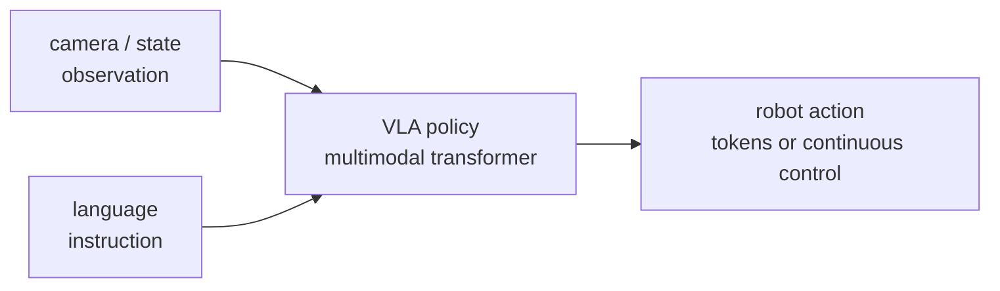
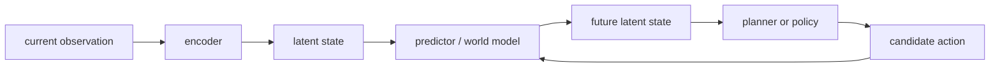
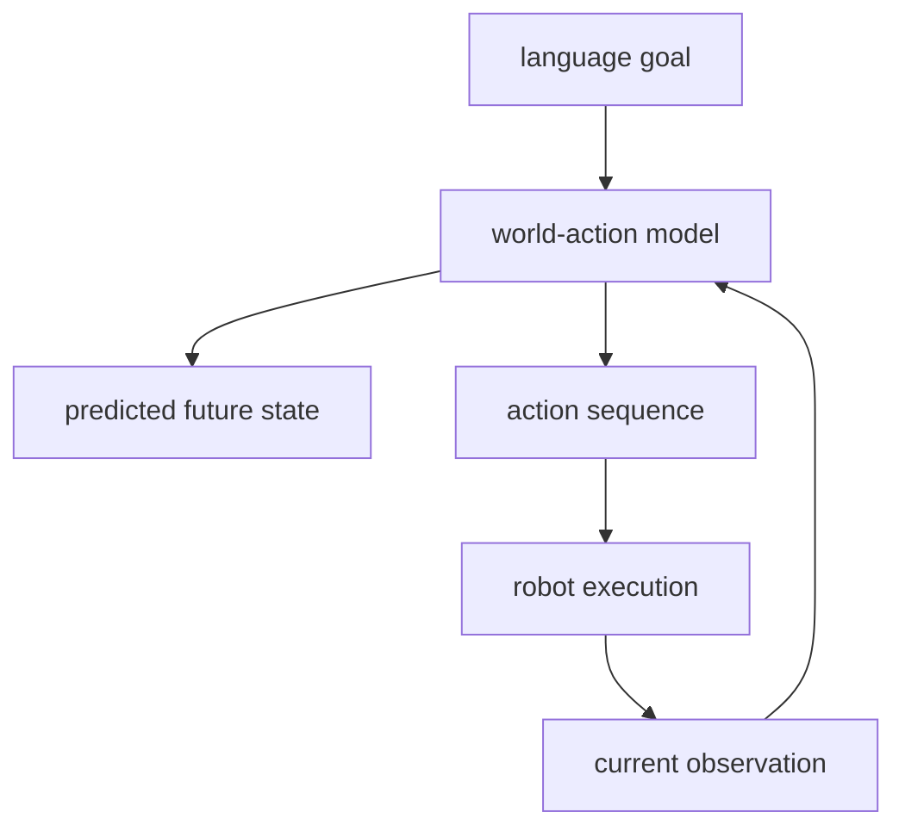
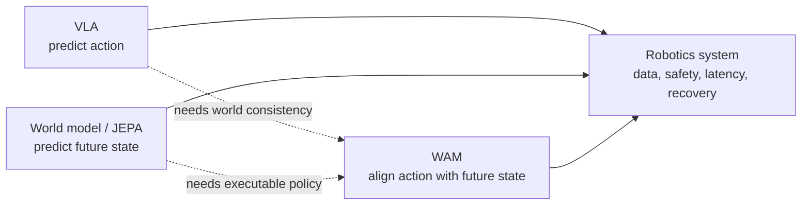

+++
title = "Three Routes For Embodied Models: VLA, World Models, And WAM"
date = 2026-06-18T10:00:00+08:00
tags = ["embodied-ai", "robotics", "vla", "world-model", "jepa"]
categories = ["notes"]
draft = false
image = "/images/posts/embodied-models-vla-jepa-wam/embodied-models-cover.svg"
libraries = ["mathjax", "mermaid"]
description = "A compact map of embodied model development: VLA policies, JEPA-style world models, and WAM-style models that tie actions to predicted future states."
+++

If a language model only has to answer with text, an embodied model has to answer one extra question: **what should this sentence become as an action?**

Suppose you tell a tabletop robot: “push the red cup next to the plate.” The model must identify the cup, understand “next to,” decide how the arm should move, close or release the gripper at the right moment, and recover if the cup slips. The hard part is not multimodality alone. It is the closed loop between language, vision, physical state, and continuous action: the action changes the world, and the new world changes the next action.

This post organizes recent embodied-model development into three routes:

- **VLA, or Vision-Language-Action models**: map visual and language inputs directly to robot actions.
- **JEPA / world models**: learn how the world changes, often by predicting future latent states instead of pixels.
- **WAM, or World Action Models**: bind future-state prediction and action generation together, so actions become explanations for future world changes.

These are not mutually exclusive boxes. A better way to read them is: **should the model predict the action, the future state, or the relationship between the two?**

One hierarchy is easy to confuse: **world model is not a fourth peer category beside VLA, JEPA, and WAM**. It is the broader question of whether the model explicitly learns how the world changes after action. JEPA is a representation-learning route toward world models. WAM ties the world model and action model more tightly together. A VLA policy may also learn part of a world model implicitly, but it usually does not make future-world prediction the explicit training target.



## Start With A Small Control Loop {#closed-loop}

Ignore robotics jargon for a moment. One control step has four variables:

- \\(o_t\\): the current observation, such as camera images, depth, and joint state.
- \\(g\\): the task condition, often a natural-language instruction.
- \\(a_t\\): the next action, such as an end-effector pose delta or an action token.
- \\(s_{t+1}\\): the world state after the action. This is usually not fully observable; we infer it through future observations.

Most multimodal question answering learns something like:

$$p(\text{answer} \mid o, g)$$

Embodied control at least has to learn:

$$p(a_t \mid o_{\le t}, g)$$

But even that is incomplete. A good action is not an isolated label. Its meaning comes from whether the world moves toward the goal after the action:

$$o_t, g \rightarrow a_t \rightarrow o_{t+1} \rightarrow a_{t+1}$$

The main disagreement between model families is where they place the learning pressure.

| Route | Main prediction target | Strength | Typical risk |
| --- | --- | --- | --- |
| VLA | predict actions directly | simple, end-to-end, can exploit large robot trajectories | may hide physical causality inside the policy |
| JEPA-style world model | predict future latent state | closer to learning how the world changes, useful for planning | the latent may not preserve what control needs |
| WAM | model future world state and action together | treats actions as world-changing explanations | training targets and data requirements are more complex |

## VLA: Turn Robot Control Into A Multimodal Policy {#vla}

The VLA idea is direct: if transformers can turn text, images, and audio into token sequences, robot actions can also be tokenized, or emitted through continuous action heads. The input is vision and language. The output is action.

A rough lineage looks like this:

- **RT-1** framed real robot control as sequence modeling and used a Transformer to output discretized actions. It showed that “scale robot data + sequence model” is a viable path.[^rt1]
- **PaLM-E** injected embodied observations into a large language model, allowing the model to process multimodal sensor input and embodied tasks.[^palme]
- **RT-2** transferred web-scale vision-language knowledge into robotic control, representing actions in a token-like form.[^rt2]
- **Open X-Embodiment / RT-X** pooled data across many robots and labs, pushing cross-embodiment generalization.[^rtx]
- **OpenVLA** and **Octo** represent open generalist robot policies: the former emphasizes an open-source VLA stack, while the latter emphasizes training a generalist policy across robot datasets.[^openvla][^octo]
- **\\(\pi_0\\)** generates continuous action chunks with flow matching, making VLA-style policies more natural for high-frequency continuous control.[^pi0]

Mechanically, VLA turns control into conditional generation:

$$a_{t:t+k} = \text{Policy}(o_{\le t}, g)$$

The value of \\(k\\) matters. If the model predicts only one action step, the robot can jitter. If it predicts an action chunk, control becomes smoother and the model can learn short-horizon skills.

The strength of VLA is engineering clarity: collect data, train the policy, roll it out on robots, collect failures, and repeat. Its boundary is just as clear: **the model may execute many actions correctly without explicitly learning how those actions change the world**. When the environment distribution, object physics, or task composition shifts, a direct policy can fail abruptly.

## JEPA / World Models: Learn How The World Changes First {#jepa}

JEPA, or Joint-Embedding Predictive Architecture, is not primarily about pixel reconstruction. It predicts missing or future parts in representation space. I-JEPA started with images; V-JEPA extended the idea to video. The point is to predict abstract representations instead of every pixel, so the model learns more stable world structure.[^ijepa][^vjepa]

For embodied AI, this is appealing. A robot does not need a pretty video generator as much as it needs an internal state that answers: “if I move this way, what changes?”

The key difference is:

- VLA learns \\(p(a_t \mid o_{\le t}, g)\\).
- A world model learns something closer to \\(p(z_{t+1} \mid z_t, a_t)\\), where \\(z_t\\) is the latent state of the observation.

If the model knows how actions affect future latent states, control can become search: try candidate actions, predict future states, and choose the one closest to the goal. This is the same broad idea as model-based planning in reinforcement learning and autonomous driving, but the representation can be supplied by large-scale self-supervised video learning.

V-JEPA 2 pushes this route toward physical reasoning and robot planning: learn world representations from video, then predict and plan in latent space.[^vjepa2] It does not force everything into one end-to-end action head; it emphasizes predictable physical representations as a first-class object.

The system boundary: **a good representation is not automatically a good controller**. A latent may be excellent for video understanding while discarding information needed for grasping, contact, friction, or recovery from occlusion. JEPA/world-model systems usually still need a policy, planner, goal representation, reward model, or additional robot data to close the loop.

## WAM: Make Actions Explain Future Worlds {#wam}

WAM can be read as a bridge between VLA and world models. Do not predict only actions. Do not predict only future state. Bind the two. An action is reasonable because it explains how the current observation can become a desired future observation.

One way to write the target is:

$$p(a_{t:t+k}, z_{t+1:t+k} \mid o_{\le t}, g)$$

The model generates or constrains both actions and future latents. If the robot says, “I will push the cup next to the plate,” the action sequence and the predicted future scene should agree.

This line of thought appears more often in 2025-2026 papers and surveys under names like “world models for robotics” and “world action models.”[^wamsurvey][^worldmodelsurvey] The trend is clear: scaling VLA parameters and data helps, but long-horizon tasks, failure recovery, and novel task compositions are hard if the model has no usable future model.

The difficulty is also here: the training target becomes more complex. Future state could mean video, latent state, object-centric state, or language subgoal. Action could mean discrete tokens, continuous trajectories, diffusion-generated chunks, or flow-generated chunks. Each choice changes the data requirement, inference latency, and deployment story.

## The Shared Principle {#principle}

Viewed together, these routes are not replacements for each other. They add structure at different points.

More generally, an embodied model must satisfy three constraints at once:

- **semantic constraint**: the action must match the language goal, such as choosing the red cup rather than the blue one.
- **geometric constraint**: the action must respect space, such as avoiding paths through the table.
- **physical constraint**: the action must respect dynamics, such as sliding, contact, and grip force.

VLA is strong at connecting semantics to demonstrated actions. JEPA/world models emphasize predictable geometry and physics. WAM tries to make action generation naturally constrained by predicted future world state.

That is why embodied AI is unlikely to be solved by a simple “robot GPT.” Language-model token prediction happens in a relatively stable symbolic space. Robot action tokens immediately change the data distribution. **The core of embodied intelligence is not multimodal input; it is the feedback loop after action.**

## A Reading Checklist {#reading-checklist}

When I read a new embodied-model paper, I ask:

- does it predict action, future observation, latent state, or several of them together?
- is the action discrete token, continuous control, diffusion trajectory, or flow-generated chunk?
- does the data come from one robot, many robots, simulation, video, or web-scale VLM pretraining?
- is there an explicit world model? If not, how does the system handle recovery and long-horizon tasks?
- does evaluation measure language understanding, or real robot task success?
- where are inference frequency, latency, and safety constraints handled during deployment?

If there is one rule to remember, it is this: **a real embodied model does not merely understand the world; it predicts how its own actions will change the world.**

[^rt1]: Anthony Brohan et al., [RT-1: Robotics Transformer for Real-World Control at Scale](https://arxiv.org/abs/2212.06817), 2022.
[^palme]: Danny Driess et al., [PaLM-E: An Embodied Multimodal Language Model](https://arxiv.org/abs/2303.03378), 2023.
[^rt2]: Anthony Brohan et al., [RT-2: Vision-Language-Action Models Transfer Web Knowledge to Robotic Control](https://arxiv.org/abs/2307.15818), 2023.
[^rtx]: Open X-Embodiment Collaboration, [Open X-Embodiment: Robotic Learning Datasets and RT-X Models](https://arxiv.org/abs/2310.08864), 2023.
[^openvla]: Moo Jin Kim et al., [OpenVLA: An Open-Source Vision-Language-Action Model](https://arxiv.org/abs/2406.09246), 2024.
[^octo]: Octo Model Team et al., [Octo: An Open-Source Generalist Robot Policy](https://arxiv.org/abs/2405.12213), 2024.
[^pi0]: Physical Intelligence, [\\(\pi_0\\): A Vision-Language-Action Flow Model for General Robot Control](https://www.physicalintelligence.company/download/pi0.pdf), 2024.
[^ijepa]: Mahmoud Assran et al., [Self-Supervised Learning from Images with a Joint-Embedding Predictive Architecture](https://arxiv.org/abs/2301.08243), 2023.
[^vjepa]: Adrien Bardes et al., [Revisiting Feature Prediction for Learning Visual Representations from Video](https://arxiv.org/abs/2404.08471), 2024.
[^vjepa2]: Meta AI, [V-JEPA 2](https://ai.meta.com/research/publications/v-jepa-2-self-supervised-video-models-enable-understanding-prediction-and-planning/), 2025.
[^wamsurvey]: Siyin Wang et al., [World Action Models: The Next Frontier in Embodied AI](https://arxiv.org/abs/2605.12090), 2026.
[^worldmodelsurvey]: Peng-Fei Zhang et al., [A Step Toward World Models: A Survey on Robotic Manipulation](https://arxiv.org/abs/2511.02097), 2025.
