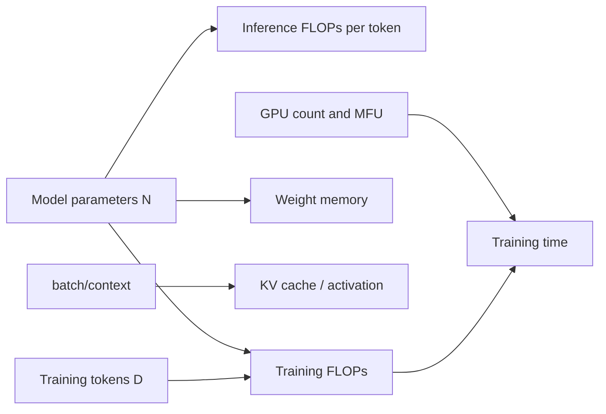
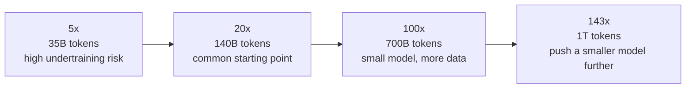
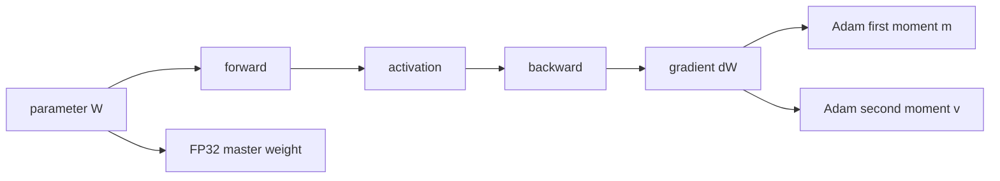

+++
title = "Estimating Compute and Memory Requirements for LLM Training and Inference"
date = 2026-05-27T22:00:00+08:00
tags = ["llm", "training", "inference", "flops", "memory", "transformer"]
categories = ["AI"]
series = ["LLM Inference Internals"]
draft = false
image = "/images/posts/llm-flops-memory-estimation/flops-memory-icon.svg"
libraries = ["mathjax", "mermaid"]
description = "A back-of-the-envelope framework for estimating LLM training FLOPs, inference FLOPs, weight memory, KV cache, and training memory."
+++

## Introduction {#introduction}

How many GPUs would it take to train a 7B model? How long would 1T training tokens take? If I only want to serve inference, can a 24 GB consumer GPU fit the model? Why does memory usage explode when the context length grows from 4K to 32K?

These questions look like engineering configuration questions, but they share a stable estimation framework. Once we know a few core quantities:

- model parameter count \\(N\\)
- training token count \\(D\\)
- batch size \\(B\\)
- sequence length \\(S\\)
- hidden dimension, number of layers, number of KV heads
- data type, such as FP32, BF16, FP16, INT8, or INT4

we can estimate the **compute cost (FLOPs) and memory footprint** of training and inference to first order: keep the terms that determine the order of magnitude, and temporarily ignore framework overhead, communication, padding, and kernel implementation details.

The goal of this post is not to reproduce the exact profiler output of a specific training stack. It is to build a mental model that is easy to calculate by hand:

By the end, we should be able to answer two kinds of questions:

- **Training**: What is the total compute? How long will training take? Where does memory go?
- **Inference**: Does the model fit in memory? How much compute does each generated token need? Why do long contexts and concurrency consume so much memory?

Here is the cheat sheet first, so the post is easy to revisit later:

| Scenario | First-order formula | Main variables | Question answered |
| --- | --- | --- | --- |
| Inference compute | \\(\text{Forward FLOPs/token} \approx 2N\\) | parameter count \\(N\\) | how much compute one generated token needs |
| Training compute | \\(\text{Training FLOPs} \approx 6ND\\) | parameter count \\(N\\), training tokens \\(D\\) | total compute for the training corpus |
| Weight memory | \\(\text{Weight memory} = N \times \text{bytes/parameter}\\) | parameter count, data type | whether model weights fit in memory |
| KV cache | \\(\text{KV cache} = 2LBSH_{kv}d_{head}\times\text{bytes}\\) | layers, concurrency, context, KV heads | why long contexts and high concurrency consume memory |
| Training memory | parameters + gradients + optimizer states + activations | optimizer, precision, batch, sequence length | why training memory is much larger than inference memory |

## Units Before Estimation {#estimation-units}

Before separating training from inference, we need a shared language. Compute is measured in FLOPs, and memory is measured in bytes. This section sets up the FLOPs intuition that the rest of the post builds on.

### FLOPs: Matrix Multiplication Is The Building Block {#what-are-flops}

FLOPs means floating point operations. In deep learning, the most important operation is matrix multiplication.

Suppose we have two matrices:

$$A \in \mathbb{R}^{m \times k}, \quad B \in \mathbb{R}^{k \times n}$$

Their product is:

$$C = AB, \quad C \in \mathbb{R}^{m \times n}$$

Each element of \\(C\\) needs \\(k\\) multiplications and \\(k-1\\) additions. In engineering estimates, one multiply plus one add is usually counted as 2 FLOPs, so the matrix multiplication cost is approximately:

$$\text{FLOPs}(A B) \approx 2mkn$$

This is the primitive underneath the whole post. Transformer linear layers, QKV projections, MLPs, and output projections are all dominated by matrix multiplication.

A tiny example makes this more concrete. Suppose a linear layer maps a 3-dimensional input to a 2-dimensional output. Its weight matrix is \\(W \in \mathbb{R}^{3 \times 2}\\), and one token's hidden state is \\(x \in \mathbb{R}^{1 \times 3}\\):

$$y = xW,\quad y \in \mathbb{R}^{1 \times 2}$$

The output \\(y\\) has 2 elements. Each element multiplies 3 input dimensions by 3 weights and then sums them, so the cost is approximately:

$$2 \times 1 \times 3 \times 2 = 12\ \text{FLOPs}$$

The layer has 6 weight parameters, and each participates in one multiply-add. That is exactly \\(2 \times 6 = 12\\) FLOPs. The \\(2N\\) inference rule later in the post is this same idea scaled up to a dense Transformer: most parameter matrices are read and used in matrix multiplications for each token's forward pass.



If you only remember one rule: multiplying an \\((m \times k)\\) matrix by a \\((k \times n)\\) matrix costs about \\(2mkn\\) FLOPs.



## Training: From Total FLOPs To Training Time {#training-compute-time}

The training estimate follows one main path: estimate total compute, convert it into time using effective hardware throughput, then check memory bottlenecks. Starting from \\(N\\) and \\(D\\), we get \\(6ND\\), then map that number onto GPU count, MFU, and training memory.

### Training FLOPs: Why 6ND Is Common {#training-flops}

Training is much more expensive than inference because it includes both forward and backward passes.

For a dense Transformer, total training compute is commonly estimated as:

$$\text{Training FLOPs} \approx 6ND$$

where:

- \\(N\\): model parameter count
- \\(D\\): number of training tokens

This formula is not specific to LLMs. It also applies to many ordinary neural networks whose cost is dominated by dense matrix multiplication. The core assumption is that most trainable parameters participate in the forward pass, and backward propagation must compute both activation gradients and weight gradients.

Using the tiny linear layer above, the forward pass computes \\(xW\\), which costs about \\(2N\\). Backward propagation then needs two more matrix multiplications:

- input gradient: \\(\nabla_x = \nabla_y W^T\\)
- weight gradient: \\(\nabla_W = x^T \nabla_y\\)

These two operations have the same order of cost as the forward pass, so each is also approximately \\(2N\\). For one training sample, token, or position, the total becomes:

| Stage | FLOPs / token | Meaning |
| --- | ---: | --- |
| forward | \\(2N\\) | use parameters to compute outputs |
| backward for activations | \\(2N\\) | propagate gradients to the previous layer |
| backward for weights | \\(2N\\) | compute parameter gradients |
| total | \\(6N\\) | training cost per token |

So training on \\(D\\) tokens costs:

$$6N \times D = 6ND$$

### Example: Training A 7B Model On 1T Tokens {#example-7b-1t}

Assume:

- model size \\(N = 7 \times 10^9\\)
- training tokens \\(D = 10^{12}\\)

Total training compute:

$$\begin{aligned} \text{FLOPs} &\approx 6ND \\\\ &= 6 \times 7 \times 10^9 \times 10^{12} \\\\ &= 4.2 \times 10^{22} \end{aligned}$$

That is 42 ZFLOPs, where:

$$1\ \text{ZFLOP} = 10^{21}\ \text{FLOPs}$$

This number is too large to be intuitive by itself. It becomes more useful when converted into training time.

### From FLOPs To Training Time {#flops-to-time}

Training time can be estimated as:

$$\text{Training time} = \frac{\text{Total FLOPs}}{\text{GPU count} \times \text{Peak FLOPs per GPU} \times \text{MFU}}$$

MFU means Model FLOPs Utilization: the fraction of theoretical peak compute that the model actually uses.

Why do we need MFU? Because GPU peak throughput is only an upper bound. Real training is affected by:

- kernels not always running at peak
- attention, normalization, communication, and data loading overhead
- gradient all-reduce, tensor parallel communication, and pipeline bubbles in multi-GPU training
- low GPU utilization when batch size is too small
- activation checkpointing adding extra forward recomputation

Suppose we train a 7B model on 64 GPUs. Each GPU has a BF16 peak of 300 TFLOPs, and MFU is 40%:

$$\begin{aligned} \text{Effective FLOPs/s} &= 64 \times 300 \times 10^{12} \times 0.4 \\\\ &= 7.68 \times 10^{15} \end{aligned}$$

Training on 1T tokens takes:

$$\begin{aligned} \text{Time} &= \frac{4.2 \times 10^{22}}{7.68 \times 10^{15}} \\\\ &\approx 5.47 \times 10^6\ \text{s} \\\\ &\approx 63.3\ \text{days} \end{aligned}$$

So this estimate says: 7B + 1T tokens + 64 GPUs at 300 TFLOPs each + 40% MFU is roughly a two-month training job.



This is a capacity-planning estimate, not a promise. Real time also depends on checkpointing, failure recovery, data pipelines, parallelism strategy, cluster scheduling, and training stability.



#### 7B vs 70B At The Same Token Count {#size-comparison}

With the same 1T training tokens, increasing parameter count by 10x also increases training FLOPs by roughly 10x:

| Model size | Training tokens | Training FLOPs | Relative to 7B |
| --- | ---: | ---: | ---: |
| 7B | 1T | \\(4.2 \times 10^{22}\\) | \\(1\times\\) |
| 70B | 1T | \\(4.2 \times 10^{23}\\) | \\(10\times\\) |

If GPU count, per-GPU peak throughput, and MFU stay fixed, training time also increases by about 10x. Conversely, training the 70B model in the same time requires about 10x more effective compute.

### Training Tokens And Parameter Count {#tokens-vs-parameters}

The formula \\(6ND\\) shows that training cost depends on both model size and token count. Double the model size and compute roughly doubles; double the number of tokens and compute also roughly doubles.

This explains a key tradeoff: under a fixed training budget, we cannot blindly increase model size or blindly add more data. Parameters and tokens compete for the same compute budget.

A common rule of thumb is to train on tens of tokens per parameter. For a 7B model, using 20 tokens per parameter gives:

$$D \approx 20N = 20 \times 7 \times 10^9 = 1.4 \times 10^{11}$$

or about 140B tokens.

This ratio is not arbitrary. Early Kaplan-style scaling laws leaned more toward large models with comparatively less data, while the Chinchilla result made the "balance model size and training tokens under a fixed compute budget" view much more prominent. One way to think about the choices is:

| tokens / parameter | Tokens for a 7B model | Bias | Intuition |
| ---: | ---: | --- | --- |
| 5 | 35B | high undertraining risk | large capacity, but little data seen |
| 20 | 140B | Chinchilla-style common scale | model size and data are more balanced |
| 100 | 700B | smaller model, more data | train longer and absorb more data |
| 143 | 1T | common engineering choice for overtraining smaller models | use more high-quality tokens to squeeze capability from a smaller model |

Real projects are also shaped by data quality, duplication, target benchmarks, budget, and training stability. High-quality tokens are expensive and scarce, so "20 tokens per parameter" is a starting point, not a law.

If the same 7B model is trained on 1T tokens, then:

$$\frac{10^{12}}{7 \times 10^9} \approx 143$$

or about 143 tokens per parameter. This may be useful when smaller models continue improving with more data, or when data quality, training objective, and downstream requirements shift the best ratio.

The main point is not to memorize one fixed ratio. It is to understand that \\(N\\) and \\(D\\) jointly determine the training budget.

### Training Memory: More Than Model Weights {#training-memory}

Training memory is more complex than inference memory because training stores weights, gradients, optimizer states, and intermediate activations.

A rough decomposition is:

$$\text{Training memory} \approx \text{parameters} + \text{gradients} + \text{optimizer states} + \text{activations} + \text{temporary buffers}$$

#### Parameters, Gradients, And Optimizer States {#params-gradients-optimizer}

For Adam / AdamW mixed-precision training, common states include:

| Item | Typical precision | bytes / parameter |
| --- | --- | ---: |
| model parameters | BF16 / FP16 | 2 |
| parameter gradients | BF16 / FP16 | 2 |
| FP32 master weights | FP32 | 4 |
| Adam first moment \\(m\\) | FP32 | 4 |
| Adam second moment \\(v\\) | FP32 | 4 |
| total | - | 16 |

So parameter-related states alone for a 7B model can require:

$$7 \times 10^9 \times 16 = 112\ \text{GB}$$

before counting activations.

This is also not LLM-specific. For the tiny linear layer with only 6 parameters, mixed-precision AdamW gives roughly this parameter-state memory:

| State | Count | bytes / item | Tiny-layer memory |
| --- | ---: | ---: | ---: |
| BF16 parameters | 6 | 2 | 12 bytes |
| BF16 gradients | 6 | 2 | 12 bytes |
| FP32 master weights | 6 | 4 | 24 bytes |
| Adam \\(m\\) | 6 | 4 | 24 bytes |
| Adam \\(v\\) | 6 | 4 | 24 bytes |
| total | - | - | 96 bytes |

At inference time, this tiny layer only needs 12 bytes of BF16 weights. During training, parameter-related states alone grow to 96 bytes, exactly 16 bytes per parameter. The LLM estimate is the same accounting ledger scaled to billions of parameters.

Frameworks and optimizers differ. Some implementations do not keep FP32 master weights; some optimizer states can be quantized; ZeRO/FSDP can shard parameters, gradients, and optimizer states across GPUs.

But the estimate is enough to show one important fact: **training memory cannot be estimated like inference memory.** A 7B FP16 model needs about 14 GB for inference weights, but training can exceed 100 GB before activations are included.

#### Activation Memory {#activation-memory}

Backpropagation needs intermediate forward-pass results, so training must also store activations.

Activation memory roughly scales with:

$$\text{Activation memory} \propto B \times S \times L \times d_{model}$$

where:

- \\(B\\): micro-batch size
- \\(S\\): sequence length
- \\(L\\): number of layers
- \\(d_{model}\\): hidden dimension

This explains why increasing context length during training is expensive. Longer sequences increase not only attention cost, but also activation memory.

Activation checkpointing is a common way to reduce activation memory. The idea is to avoid storing all intermediate results during the forward pass, then recompute some activations during the backward pass.

This is a classic compute-memory tradeoff:

| Strategy | Memory | Compute |
| --- | --- | --- |
| no checkpointing | high | low |
| activation checkpointing | low | high |

After enabling checkpointing, the \\(6ND\\) training FLOPs estimate becomes an underestimate, because the backward pass now includes extra forward recomputation.

## Inference: From Per-Token FLOPs To Memory {#inference-compute-memory}

Inference follows a different path. It cares about per-token forward compute, whether the weights fit in memory, and how context length and concurrency increase KV cache memory. We start from \\(2N\\), then check weights and KV cache.

### Inference FLOPs: Why It Is About 2N Per Token {#inference-flops}

For a dense Transformer, most parameters are used once during the forward pass. Each parameter usually participates in one multiply-add, so a simple estimate is:

$$\text{Forward FLOPs per token} \approx 2N$$

where \\(N\\) is the model parameter count.

The main computation behind this sentence is matrix multiplication. For a linear layer \\(y=xW\\), each weight \\(W_{ij}\\) is multiplied by some input \\(x_i\\) and accumulated into some output \\(y_j\\). One multiply plus one add is approximately 2 FLOPs, so a dense linear layer with \\(N\\) weights costs about \\(2N\\) FLOPs for one token's forward pass.

A Transformer is built from many dense projections: Q/K/V projections, the attention output projection, MLP up/down projections, and the final LM head. Those matrices make up most of the parameter count \\(N\\). The inference estimate therefore starts with \\(2N\\) as the main term, then handles long-context attention and KV cache separately.

For a 7B model:

$$2N = 2 \times 7 \times 10^9 = 14 \times 10^9$$

So generating one token with a 7B dense model costs roughly 14 GFLOPs of forward compute.

Generating 1000 tokens costs:

$$14 \times 10^9 \times 1000 = 1.4 \times 10^{13}$$

or about 14 TFLOPs.

This captures the main term: more parameters make each token more expensive, and more generated tokens increase total compute linearly.

#### Prefill vs Decode {#prefill-vs-decode}

LLM inference cannot be understood from total FLOPs alone, because inference has two stages:

| Stage | Input shape | Main bottleneck | Property |
| --- | --- | --- | --- |
| prefill | process the whole prompt at once | compute | prompt tokens are parallelizable |
| decode | generate one token at a time | memory bandwidth / KV cache | autoregressive and sequential |

For example, if a prompt has 4096 tokens, the model first runs prefill to compute hidden states and KV cache for all 4096 tokens. This stage has large matrix multiplications and tends to use GPUs efficiently.

Then each decode step generates one token. The model still runs through all layers, but attention must read an ever-growing KV cache. At this stage, the bottleneck is often memory bandwidth and KV cache management, not raw FLOPs.

This is why two requests with the same total token count can have very different speeds:

- request A: 4000 prompt tokens + 100 output tokens
- request B: 100 prompt tokens + 4000 output tokens

The first is prefill-heavy; the second is decode-heavy. Decode is more sequential and more sensitive to KV cache reads.

### Inference Memory: Weights + KV Cache + Temporary Buffers {#inference-memory}

Inference memory mainly has three parts:

$$\text{Inference memory} \approx \text{weights} + \text{KV cache} + \text{temporary buffers}$$

#### Weight Memory {#weight-memory}

Weight memory is the easiest part to estimate:

$$\text{Weight memory} = N \times \text{bytes per parameter}$$

Common data types:

| Data type | bytes / parameter |
| --- | ---: |
| FP32 | 4 |
| BF16 / FP16 | 2 |
| INT8 | 1 |
| INT4 | 0.5 |

For a 7B model:

| Data type | Weight memory |
| --- | ---: |
| FP16 / BF16 | \\(7B \times 2 \approx 14\\) GB |
| INT8 | \\(7B \times 1 \approx 7\\) GB |
| INT4 | \\(7B \times 0.5 \approx 3.5\\) GB |

This explains why a 7B FP16 model usually does not fit comfortably on an 8 GB GPU, while INT4 quantization can make it practical on consumer hardware.

#### KV Cache Memory {#kv-cache-memory}

In autoregressive inference, previous tokens' keys and values are cached so they do not need to be recomputed at every step. KV cache memory can be estimated as:

$$\text{KV cache} = 2 \times L \times B \times S \times H_{kv} \times d_{head} \times \text{bytes}$$

where:

- \\(2\\): one cache for keys and one for values
- \\(L\\): number of layers
- \\(B\\): batch size, or number of sequences served concurrently
- \\(S\\): context length
- \\(H_{kv}\\): number of KV heads
- \\(d_{head}\\): dimension per head
- \\(\text{bytes}\\): bytes per element

For traditional MHA, \\(H_{kv}\\) equals the number of query heads. For GQA/MQA, \\(H_{kv}\\) is smaller, and KV cache memory decreases accordingly.

Assume a 7B model with:

- \\(L = 32\\)
- \\(H_{kv} = 32\\)
- \\(d_{head} = 128\\)
- BF16/FP16, 2 bytes per element
- \\(B = 1\\)
- \\(S = 4096\\)

Then:

$$\begin{aligned} \text{KV cache} &= 2 \times 32 \times 1 \times 4096 \times 32 \times 128 \times 2 \\\\ &= 2,147,483,648\ \text{bytes} \\\\ &\approx 2\ \text{GB} \end{aligned}$$

If batch size becomes 8:

$$2\ \text{GB} \times 8 = 16\ \text{GB}$$

If context length grows from 4K to 32K:

$$2\ \text{GB} \times 8 = 16\ \text{GB}$$

If both batch size is 8 and context length is 32K:

$$2\ \text{GB} \times 8 \times 8 = 128\ \text{GB}$$

This is why long-context and high-concurrency inference are so memory-hungry: KV cache grows linearly with both \\(B\\) and \\(S\\).

For more on the mechanism, see [Why K and V Can Be Cached in LLM Inference](/posts/kv-cache/).

## Correction Terms: Long Context, MoE, And Engineering Discounts {#correction-terms}

The previous formulas intentionally keep only the leading terms, because that is what makes quick order-of-magnitude reasoning possible. Real models do not always stay within those assumptions: long context amplifies attention cost, MoE changes what "parameter count" means, and engineering details add more discounts or overhead. This section puts those correction terms back into the model.

### When The Quadratic Attention Term Matters {#attention-quadratic-term}

The estimates \\(2N\\) and \\(6ND\\) work because dense Transformers are often dominated by parameter matrix multiplications. But attention also has a term that grows quadratically with sequence length.

For a sequence of length \\(S\\), self-attention computes:

$$QK^T$$

Ignoring batch and head details, this scales like:

$$S^2 d$$

When sequence length is moderate, MLPs and linear projections usually dominate. For long contexts, the \\(S^2\\) attention term becomes harder to ignore.

FlashAttention is easy to misunderstand here. It does not change the mathematical \\(S^2\\) relationship into \\(S\\). It reduces memory traffic and intermediate memory by using tiling and online softmax, avoiding materialization of the full attention matrix.

In other words:

- standard attention still lets each token attend to other tokens
- FlashAttention optimizes memory access and intermediate storage
- long-context attention still deserves explicit estimation

### MoE Models Need Active Parameter Count {#moe}

The formulas above assume dense models: each token passes through almost all parameters.

MoE (Mixture of Experts) models are different. They may have a very large total parameter count, but each token activates only a subset of experts.

For MoE, distinguish:

- total parameters: determine weight storage and distributed loading pressure
- active parameters: determine actual forward/backward compute per token

For inference FLOPs, we should not simply use \\(2 \times \text{total parameters}\\). A better estimate is closer to:

$$\text{Forward FLOPs/token} \approx 2 \times \text{active parameters per token}$$

Training FLOPs are similar: use the parameters actually activated per token for the main compute cost. Total parameter count still matters for memory, communication, checkpointing, and loading.

## Resource Estimation Quick Reference {#checklist}

Finally, here is the estimation flow in execution order. The opening table is better for formula lookup; this section is better when doing actual capacity planning.

### Training Checklist {#training-checklist}

Step 1, estimate total compute:

$$\text{Training FLOPs} \approx 6ND$$

Step 2, estimate training time:

$$\text{Time} = \frac{6ND}{\text{GPU count} \times \text{Peak FLOPs/GPU} \times \text{MFU}}$$

Step 3, check memory:

- parameters
- gradients
- optimizer states
- activations
- temporary buffers
- communication buffers

Step 4, add correction terms:

- activation checkpointing reduces memory but adds compute
- ZeRO/FSDP shards parameters, gradients, and optimizer states
- tensor parallelism and pipeline parallelism add communication and bubbles
- long contexts increase attention and activation costs
- MoE requires separating total parameters from active parameters

### Inference Checklist {#inference-checklist}

Step 1, estimate weight memory:

$$\text{Weight memory} = N \times \text{bytes per parameter}$$

Step 2, estimate forward compute per generated token:

$$\text{Forward FLOPs/token} \approx 2N$$

Step 3, estimate KV cache:

$$\text{KV cache} = 2 \times L \times B \times S \times H_{kv} \times d_{head} \times \text{bytes}$$

Step 4, separate prefill and decode:

- prefill is more compute-throughput bound
- decode is more memory-bandwidth, KV-cache, and scheduling bound

Step 5, add engineering correction terms:

- quantization reduces weight memory, but does not always improve speed proportionally
- GQA/MQA can greatly reduce KV cache
- larger batch size improves throughput but increases KV cache
- longer contexts increase capacity requirements and can reduce decode performance

## Summary {#summary}

Real systems are more complicated. Training is affected by MFU, parallelism strategy, checkpointing, communication, and data pipelines. Inference is affected by the prefill/decode mix, KV cache management, memory bandwidth, and quantization implementation.

But those complexities do not invalidate the estimation formulas. They are correction terms layered on top of the mental model. Start with \\(2N\\), \\(6ND\\), weight memory, and KV cache to get the right order of magnitude, then adjust for the specific model architecture and system implementation.

## References {#references}

- Kaplan et al., [Scaling Laws for Neural Language Models](https://arxiv.org/abs/2001.08361)
- Hoffmann et al., [Training Compute-Optimal Large Language Models](https://arxiv.org/abs/2203.15556)
- Narayanan et al., [Efficient Large-Scale Language Model Training on GPU Clusters Using Megatron-LM](https://arxiv.org/abs/2104.04473)
- Dao et al., [FlashAttention: Fast and Memory-Efficient Exact Attention with IO-Awareness](https://arxiv.org/abs/2205.14135)
