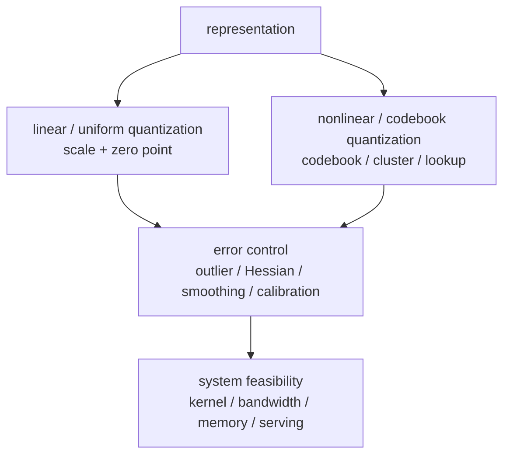
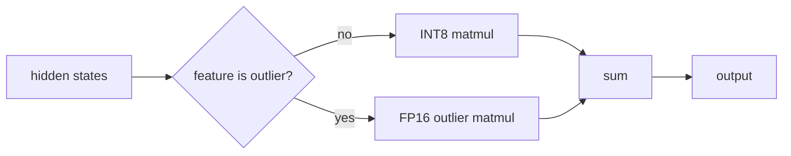

+++
title = "A Survey of LLM Quantization: From Linear Quantization to Codebooks"
date = 2026-06-01T21:00:00+08:00
tags = ["llm", "quantization", "inference", "memory", "int8", "int4", "fp8"]
categories = ["AI"]
draft = false
image = "/images/posts/llm-quantization/quantization-buckets-icon.svg"
libraries = ["mathjax", "mermaid"]
description = "A practical survey of LLM quantization, covering linear quantization, codebook quantization, LLM.int8(), SmoothQuant, GPTQ, AWQ, NF4, AQLM, KV cache quantization, and FP8."
+++

## Introduction {#introduction}

A 7B model stored in FP16 needs this much memory just for parameters:

$$
7 \times 10^9 \times 2\ \text{bytes} \approx 14\ \text{GB}
$$

That does not include the KV cache, activations, temporary workspaces, CUDA graphs, batching overhead, or runtime fragmentation. For a 70B model, FP16 weights alone are about 140 GB, which is already beyond a single commodity GPU.

Quantization has a simple direct goal: **represent model values with fewer bits**. FP16 uses 16 bits per weight, INT8 uses 8 bits, and INT4 uses 4 bits. In the ideal case, weight memory drops to roughly \\(1/2\\) and \\(1/4\\) of FP16.

The difficulty is that a large model is not a zip file. Weights, activations, and the KV cache all participate in matrix multiplications. Once values are approximated by fewer bits, quantization error enters every layer and then flows through residual connections, normalization, attention, and MLP blocks. The real question is not "can we store FP16 weights as INT4?" It is:

- Which tensors should be quantized, and which should stay in higher precision?
- Should scales be computed per tensor, per channel, or per group?
- Where do outliers concentrate the error?
- Why does INT8 often work with little degradation, while INT4 needs methods such as GPTQ and AWQ?
- In an inference system, does quantization save memory, bandwidth, compute, or only disk space?

This post is a readable survey of LLM quantization. We start from the basic split between **linear quantization** and **nonlinear quantization**. Clustering, codebook quantization, NF4, and AQLM belong to the nonlinear/codebook family; LLM.int8(), SmoothQuant, GPTQ, and AWQ mostly build on linear quantization, then improve it through outlier handling, scale migration, or second-order error compensation.

By the end, we should be able to answer:

- What is the difference between linear quantization and clustering/codebook quantization?
- Why are activation outliers especially harmful in LLM quantization?
- What errors do GPTQ, AWQ, and SmoothQuant optimize?
- Why can NF4 and AQLM keep compressing at lower bit widths?
- For a concrete workload, should we choose INT8, INT4, FP8, NF4, or KV cache quantization?

## Framework: representation first, error control second {#framework}

Quantization is often introduced as a list of names: INT8, INT4, NF4, FP8, GPTQ, AWQ, SmoothQuant. A better entry point is to separate two layers.

**First layer: how are values represented?** Linear quantization maps values onto uniformly spaced grid points. It is simple and hardware friendly. Nonlinear quantization maps values to non-uniform representatives. It can reduce error, but lookup tables, codebooks, and kernels become more complex.

**Second layer: how is error controlled?** Naive round-to-nearest controls only local rounding error. LLM.int8() separates outliers. SmoothQuant migrates activation outliers into weights. GPTQ uses approximate second-order information to minimize layer output error. AWQ uses activation statistics to protect important weight channels.

**Third layer: can hardware realize the benefit?** Storing weights as INT4 on disk does not mean the matrix multiplication actually runs as INT4. Many weight-only methods mainly reduce HBM traffic, while W8A8 and FP8 methods are more likely to use low-precision Tensor Core paths.

The rest of the post maps each method back to this framework.

## Math basics: linear quantization, codebooks, and error {#math-model}

### Linear quantization: scale, zero point, and rounding {#linear-quantization}

Start with affine quantization, the most common linear form. Given a floating point value \\(x\\), we store an integer \\(q\\):

$$
q = \text{clip}\left(\text{round}\left(\frac{x}{s}\right) + z,\ q_{\min}, q_{\max}\right)
$$

Dequantization maps it back to an approximate floating point value:

$$
\hat{x} = s(q - z)
$$

Here:

- \\(s\\) is the scale, which decides the floating point interval between adjacent integer grid points.
- \\(z\\) is the zero point, which lets floating point zero land exactly on an integer.
- \\([q_{\min}, q_{\max}]\\) is the integer range, such as \\([-128,127]\\) or \\([0,255]\\) for INT8.



With symmetric quantization, we usually set \\(z=0\\) and keep only a scale:

$$
q = \text{clip}\left(\text{round}\left(\frac{x}{s}\right), -Q, Q\right), \quad \hat{x} = sq
$$

This is often a good fit for weights because many weight distributions are roughly centered around zero. Activations are not always symmetric, so asymmetric quantization may be a better fit there.

Linear quantization is attractive because it is simple. Dequantization needs only an integer subtraction and a multiplication, and matrix multiplication kernels are easier to optimize:

$$
\hat{X}\hat{W} = s_x s_w (Q_x - z_x)(Q_w - z_w)
$$

That is why mainstream inference hardware first tends to support regular formats such as INT8 and FP8. The cost is uniform spacing. If the data distribution is highly non-uniform, many grid points are wasted in low-probability regions while dense regions do not get enough resolution.

### Nonlinear/codebook quantization: lookup tables and clustering {#nonlinear-codebook-quantization}

Nonlinear quantization does not require uniformly spaced grid points. It first defines a codebook:

$$
\mathcal{C} = \{c_{0}, c_{1}, \ldots, c_{K-1}\}
$$

Each floating point value \\(x\\) stores the index of the nearest codeword instead of a scaled integer:

$$
i^\* = \arg\min_i |x - c_i|^2,\quad \hat{x}=c_{i^\*}
$$

If the codebook comes from k-means, this is clustering quantization. A group of weights is clustered into \\(K\\) centers, and each weight stores only the index of its nearest center. A 4-bit codebook has 16 codewords; a 2-bit codebook has 4 codewords.



The contrast looks like this:

| Dimension | Linear quantization | Clustering/codebook quantization |
| --- | --- | --- |
| Representation | scale + integer | codebook + index |
| Grid points | uniformly spaced | non-uniform, possibly learned |
| Strength | hardware friendly, mature kernels | better fit to weight distributions, stronger low-bit potential |
| Weakness | outliers can enlarge the scale | lookup and codebook overhead are more complex |
| Examples | INT8, INT4, GPTQ, AWQ, SmoothQuant | k-means quantization, NF4, AQLM |

NF4 can be understood as a special codebook. It does not learn arbitrary per-layer k-means centers; it uses a fixed non-uniform 4-bit codebook designed for approximately normal weight distributions. AQLM goes further and approximates a weight vector as the sum of multiple codebook entries:

$$
\hat{w} = c^{(1)}[a] + c^{(2)}[b] + \cdots + c^{(M)}[m]
$$

The intuition is that when the bit width falls to 3 bits, 2 bits, or below, uniformly spaced scalar grid points become too coarse. More flexible codebook structures can preserve more information.

### Choosing the scale {#scale-choice}

The simplest scale comes from min-max:

$$
s = \frac{x_{\max} - x_{\min}}{q_{\max} - q_{\min}}
$$

For symmetric INT8 over a floating point range \\([-a,a]\\), this becomes:

$$
s = \frac{a}{127}
$$

This looks reasonable, but it has an obvious problem: **one extreme outlier can enlarge the scale for the whole tensor**. Once the scale becomes larger, integer grid points become coarser, and many small weights in the main body of the distribution are represented poorly.

Consider a one-dimensional example. Most weights are in \\([-1,1]\\), but one value is 8. With symmetric INT4 over \\([-7,7]\\), covering 8 requires:

$$
s = \frac{8}{7} \approx 1.14
$$

Then values such as 0.3, 0.4, and 0.5 may land on adjacent grid points or even the same grid point. To accommodate one outlier, the main region loses a lot of resolution.



The core tension in quantization is dynamic range versus resolution: a larger dynamic range means a larger scale and coarser grid points; a smaller dynamic range gives denser grid points but increases the risk of clipping outliers.



### Where error comes from {#error-sources}

Quantization error has two main sources:

$$
x - \hat{x} = e_{\text{round}} + e_{\text{clip}}
$$

where:

$$
e_{\text{round}} = x - s\cdot \text{round}(x/s)
$$

**Rounding error** comes from snapping a value to the nearest grid point. Without clipping, a single value under uniform quantization has error roughly bounded by \\([-s/2, s/2]\\).

**Clipping error** comes from range truncation. If a value exceeds the representable range, it is pushed to the boundary. A small amount of clipping is not always bad because it can buy denser grid points for the main body. But clipping important weights or activation outliers can directly damage certain heads or channels.

This is why quantization is not simply choosing a bit width. It is choosing an error allocation strategy: where should the finite grid points be spent?

### Granularity: per-tensor, per-channel, and group-wise {#granularity}

A scale can serve one large tensor or a smaller slice. Finer granularity adapts better to local distributions, but metadata and kernel complexity increase.

| Granularity | Scale count | Strength | Weakness | Common use |
| --- | ---: | --- | --- | --- |
| per-tensor | 1 scale per tensor | simple, little metadata | vulnerable to outliers | activation INT8 |
| per-channel | 1 scale per output channel | better weight accuracy | kernels need per-row/column scales | INT8 weights |
| group-wise | 1 scale per weight group | INT4 accuracy/overhead tradeoff | group size is an extra hyperparameter | weight-only INT4 |

For a linear layer:

$$
Y = XW
$$

If \\(W \in \mathbb{R}^{d_\text{in} \times d_\text{out}}\\), per-channel quantization usually gives each output channel one scale. The intuition is that different output channels may have very different weight distributions. Sharing one scale across all channels can sacrifice small-range channels to large-range channels.

INT4 commonly uses group-wise quantization, such as one scale for every 128 consecutive weights. Smaller groups reduce error, but they add more scale metadata and more dequantization overhead. In practice, many weight-only INT4 methods are balancing group size, scale precision, and dequantization kernels.

## Method family: what problem does each method solve? {#methods}

With these accounts in place, common method names become easier to parse. The figure below gives a high-level map: all methods revolve around the same matrix multiplication \\(Y=XW\\), but they control error in different places.



### Method table: locate first, then expand {#method-taxonomy}

| Family | Method | Main object | Representative format | Key question |
| --- | --- | --- | --- | --- |
| linear scalar quantization | RTN / min-max | W/A/KV | INT8/INT4 | how should scales be chosen, and what about outliers? |
| linear + outlier separation | LLM.int8() | W + A | INT8 + FP16 | a few activation outliers cannot be quantized naively |
| linear + scale migration | SmoothQuant | W + A | W8A8 | activations are hard to quantize; weights are easier |
| linear + second-order compensation | GPTQ | W | INT4/INT3 | weight errors should be weighted by layer-output impact |
| linear + salient-channel protection | AWQ | W | INT4 | a few important weight channels need protection |
| nonlinear/codebook | k-means / VQ | W | codebook + index | uniformly spaced grids waste low-bit capacity |
| nonlinear/fixed codebook | NF4 | W | 4-bit codebook | normal-like weights can use better 4-bit levels |
| nonlinear/multiple codebooks | AQLM | W | additive codebooks | extreme low-bit compression needs combinatorial expressivity |
| runtime cache quantization | KV cache quant | KV | INT8/INT4/codebook | long-context serving has a dynamic memory bottleneck |

### RTN: round-to-nearest as the baseline {#rtn}

RTN, or round-to-nearest, simply rounds values to the nearest integer grid point under a chosen scale. It is the most basic **linear scalar quantization** method: each weight independently lands on a uniformly spaced grid. It needs little or no calibration data and is the simplest post-training quantization baseline.

INT8 RTN often works well because the grid is dense enough. INT4 RTN is more fragile because each group has only a small number of usable grid points, so outliers and important weights compete more aggressively for resolution.

RTN is simple, fast, and calibration-free. Its weakness is equally direct: it treats all weight errors as equally important. It does not know the real activation distribution, nor does it know how an error affects the layer output. RTN is therefore a baseline, not usually the endpoint for low-bit LLM quantization.

### LLM.int8(): isolate outlier dimensions {#llm-int8}

Plain INT8 quantization often works well for smaller models, but large models expose a special problem: hidden states contain a small number of extreme outlier features. They are few, but they matter for attention and MLP outputs. If the scale is enlarged to cover these outliers, ordinary values lose resolution; if the outliers are clipped, model quality can degrade sharply.

The core idea of LLM.int8() is **mixed-precision decomposition**: split the matrix multiplication along the feature dimension. Normal dimensions use INT8, while outlier dimensions stay in FP16.

For a linear layer:

$$
Y = XW
$$

split the input dimensions into normal dimensions \\(\mathcal{N}\\) and outlier dimensions \\(\mathcal{O}\\):

$$
Y =
X_{\mathcal{N}} W_{\mathcal{N}}
+
X_{\mathcal{O}} W_{\mathcal{O}}
$$

LLM.int8() applies vector-wise INT8 quantization to the first term and FP16 computation to the second:

$$
Y \approx
\text{dequant}\left(Q_8(X_{\mathcal{N}}) Q_8(W_{\mathcal{N}})\right)
+
X_{\mathcal{O}}^{\text{fp16}} W_{\mathcal{O}}^{\text{fp16}}
$$

This works because outlier features are important but few. Keeping a small outlier path in FP16 does not erase the memory and speed benefits, while avoiding the most damaging INT8 errors.

**Strength**: very stable INT8 inference for large models, especially because it handles activation outliers more reliably than naive W8A8.

**Weakness**: requires a mixed-precision path and more complex kernels/scheduling. It is mainly an INT8 inference method, not an aggressive INT4 weight-compression method.

### SmoothQuant: move the activation problem into weights {#smoothquant}

LLM.int8() says "detect outliers, then treat them separately." SmoothQuant takes a different route: it transforms activations to make them easier to quantize so that all matrix multiplications can use W8A8 INT8.

For a linear layer:

$$
Y = XW
$$

insert a per-channel diagonal scaling matrix \\(D\\):

$$
Y = XW = (X D^{-1})(D W)
$$

Without quantization, this is an exact algebraic identity. With quantization, \\(XD^{-1}\\) has smaller activation outliers, while \\(DW\\) has a larger weight dynamic range. SmoothQuant relies on the observation that **activations are harder to quantize, while weights are relatively easier**, so it migrates quantization difficulty from activations into weights.

A common formulation uses a smoothing coefficient alpha to control the migration strength. In simplified form:

$$
s_j = \frac{\max |X_j|^\alpha}{\max |W_j|^{1-\alpha}}
$$

and for channel \\(j\\):

$$
X_{j}^{\prime} = \frac{X_{j}}{s_{j}}, \quad W_{j}^{\prime} = s_{j} W_{j}
$$

A larger alpha emphasizes smoothing activations; a smaller alpha protects weights. This hyperparameter expresses the core SmoothQuant tradeoff: outliers are moved from one tensor to another, not made to disappear.

**Strength**: fits W8A8, can use real INT8 GEMM, and can improve both throughput and memory usage. It has worked well across very large models.

**Weakness**: needs calibration data to estimate activation ranges; scaling factors and hardware kernels must align; it is mainly an INT8 method, not the most aggressive memory-compression path.

### GPTQ: reduce the output impact of weight quantization {#gptq}

GPTQ is also post-training quantization, but it does not look only at per-weight error. It asks how quantization affects the layer output. For a linear layer \\(Y=XW\\), a weight error \\(\Delta W\\) causes:

$$
\Delta Y = X \Delta W
$$

If calibration data tells us that some input directions are more common or more important, weight errors along those directions should be smaller. The squared output error can be written as:

$$
E = \lVert X(W-\hat{W}) \rVert^2
$$

Here \\(E\\) is the layer output error. Minimizing it means making weight error small under the input covariance \\(X^T X\\). GPTQ uses approximate Hessian information to quantize columns and compensate future columns. The question it asks is: **which weight errors hurt this layer output the most?**

That is why GPTQ is common for weight-only INT4. It tries to preserve layer outputs under extreme bit width, instead of mechanically rounding weights.

An intuition: RTN rounds each weight independently. GPTQ quantizes one column, estimates how the error affects later columns, and compensates part of that error into weights not yet quantized. This reduces total output error.

**Strength**: good fit for 4-bit/3-bit weight-only quantization; high compression; often much more stable than RTN; practical for local deployment and single-machine large models.

**Weakness**: slower offline quantization and calibration samples are needed. It mainly quantizes weights, while activations often remain FP16/BF16, so the compute path may not be true INT4 GEMM. Quality also depends on kernel support and group size.

### AWQ: protect salient weight channels {#awq}

AWQ, or activation-aware weight quantization, starts from a simple observation: not all weights are equally important. Some channels are more salient under real activations, and quantizing them causes larger output error.

AWQ uses calibration data to identify these salient channels, then protects them through a scaling strategy so that INT4 weight quantization damages the critical path less. Like SmoothQuant, it uses scaling freedom in a linear layer. Unlike SmoothQuant, AWQ focuses on weight-only low-bit quantization and on which weights deserve protection.

For \\(Y=XW\\), if a certain input channel often has large activation magnitude, weight error on that channel is amplified in the output. AWQ's empirical observation is that protecting a small number of salient channels can significantly reduce INT4 degradation.

Mathematically, we can again use scaling freedom. For a channel scale matrix \\(S\\):

$$
Y = XW = (X S^{-1})(S W)
$$

AWQ chooses \\(S\\) not to make all activations suitable for INT8, but to give important weight channels a better representation under group-wise INT4. In short, SmoothQuant leans toward "make activations quantizable"; AWQ leans toward "do not damage important weights at low bit width."

**Strength**: good fit for INT4 weight-only deployment, relatively manageable calibration cost, practical for edge or single-machine inference.

**Weakness**: still mainly saves weight memory and weight bandwidth. Activations and KV cache do not shrink automatically. If the workload is not bottlenecked by weight reads, speedups may be limited.

### KV cache quantization: serving long contexts and high concurrency {#kv-cache-quantization}

GPTQ and AWQ mainly handle weights. In online inference, the KV cache can become the bottleneck faster than weights. KV cache memory grows linearly with batch size and context length:

$$
\text{KV bytes} = 2 \times L \times B \times S \times H_\text{kv} \times d_h \times \text{bytes}
$$

The factor 2 is for K and V. \\(L\\) is the number of layers, \\(B\\) is batch size, \\(S\\) is sequence length, \\(H_\text{kv}\\) is the number of KV heads, and \\(d_h\\) is the head dimension.

Moving from FP16 to INT8 roughly halves KV cache memory; moving to INT4 roughly quarters it. For long-context serving, this can matter more than weight quantization because weights are a fixed cost, while the KV cache grows with live requests.

KV cache quantization is also sensitive. Error in K changes attention scores before softmax:

$$
\text{score}_{t,i} = \frac{q_t \cdot k_i}{\sqrt{d_h}}
$$

Error in V changes the final aggregated content:

$$
o_t = \sum_i \text{softmax}(\text{score}_{t,i}) v_i
$$

Common strategies therefore avoid naive global INT4. They may use per-head or per-channel scales, quantize K and V differently, keep recent tokens in high precision, or enable cache quantization only for long-context workloads.

**Strength**: directly increases batch size and context capacity, which is valuable for serving throughput.

**Weakness**: error enters the attention path. More complex tasks and longer contexts require real workload testing. Benefits depend on whether the serving engine can read and write quantized KV efficiently.

### Clustering quantization: replace uniform grids with codebooks {#cluster-quantization}

Clustering quantization is the most direct nonlinear method. For weight quantization, first cluster weights \\(w_1,\ldots,w_n\\) into \\(K\\) centers:

$$
\min_{c_1,\ldots,c_K}\sum_{i=1}^n \min_j \|w_i-c_j\|^2
$$

After quantization, each weight stores the index of its nearest center:

$$
\hat{w}[i] = \mathcal{C}[\operatorname{index}(i)]
$$

If \\(K=16\\), each index needs only 4 bits. The difference from INT4 is that INT4's 16 grid points are uniformly spaced, while k-means centers concentrate around dense regions of the weight distribution.

This family can have better low-bit error behavior, especially when weight distributions are clearly non-uniform. The codebook spends finite representation capacity in high-probability regions. The downside is worse hardware friendliness: matrix multiplication often needs lookup, decoding, or special kernels, and the codebook itself must be stored.



Clustering quantization is not the same kind of concept as INT4. INT4 is a bit width or storage format; clustering quantization is a way to choose 16 representative values. A 4-bit method can be linear INT4 or a 16-codeword codebook.



### NF4 and QLoRA: a 4-bit codebook for normal-like weights {#nf4-qlora}

NF4, or NormalFloat 4-bit, can be understood as fixed codebook quantization. It assumes normalized pretrained weights are close to a normal distribution, then places 16 codewords at positions better suited to that distribution instead of spacing them uniformly.

The idea is close to Lloyd-Max quantization: if most values concentrate near zero, more codewords should be placed near zero and fewer in the tails. With the same 4 bits, NF4 can fit normal-like weights better than uniform INT4.

QLoRA uses NF4 to store a frozen base model, then trains LoRA adapters. The key point is that NF4 mainly compresses frozen base weights. It does not turn the entire training process into 4-bit backpropagation. During training, quantized weights are still dequantized to the compute dtype before participating in forward and backward passes.

**Strength**: strong memory savings for parameter-efficient fine-tuning; a fixed codebook is more regular than learning per-layer k-means centers.

**Weakness**: depends on the weight distribution matching NF4's assumption; mainly serves frozen-base-plus-adapter training, not universal low-bit inference acceleration.

### AQLM: additive codebooks for extreme low-bit expressivity {#aqlm}

A single codebook has limited expressive power. AQLM, or Additive Quantization of Language Models, uses additive codebooks: instead of representing a group of weights with one codeword, it represents it as the sum of multiple codewords:

$$
\hat{w} = c^{(1)}[a] + c^{(2)}[b] + \cdots + c^{(M)}[m]
$$

If each codebook provides a small set of candidates, multiple codebooks combine into a richer representation space. Intuitively, this is like composing a more precise vector from several basic building blocks, which is more flexible than one 2-bit or 3-bit scalar grid.

AQLM-style methods mainly target extreme low-bit weight quantization. They can compress heavily and may preserve quality better than simple scalar quantization. Their drawback is engineering complexity: encoding, decoding, and kernels are all harder than common weight-only INT4 methods such as GPTQ and AWQ.

### QAT: make the model adapt during training {#qat}

QAT, or quantization-aware training, simulates quantization error during training or fine-tuning so that the model adapts to low-precision representation. It usually costs more than PTQ, or post-training quantization, but can be more stable for aggressive bit widths, smaller models, or quality-sensitive workloads.

The key distinction is that PTQ asks "can this already-trained model tolerate quantization?" QAT asks "can the model learn to tolerate quantization during training?" The latter has a higher quality ceiling but changes the training pipeline.

### FP8 versus INT8/INT4 {#fp8-vs-int}

INT8 and INT4 are fixed-point quantization: one scale plus a set of integer grid points. FP8 is a low-bit floating point format that still has an exponent and mantissa, such as E4M3 or E5M2.

Fixed-point formats have uniform spacing within a scale range. They fit values whose range is known and can be scaled by tensor, channel, or group.

Floating point formats are denser near zero and coarser at larger magnitudes. They fit tensors with larger or more variable dynamic range, especially training tensors or activations.

| Format | Representation | Strength | Typical scenario |
| --- | --- | --- | --- |
| INT8 | scale + 8-bit integer | mature kernels, stable accuracy | W8A8 inference |
| INT4 | scale + 4-bit integer | strong memory compression | weight-only inference |
| FP8 | low-bit floating point | more natural dynamic range | training, inference GEMM, activations |
| NF4 | non-uniform 4-bit codebook | fits normal-like weights | QLoRA / adapter training |

FP8 should not be treated as "another INT8." It solves a different numerical problem: preserving some dynamic range when the bit width is very low.

## Feasibility: tradeoffs, memory accounting, and decision path {#feasibility}

### Method comparison: tradeoffs and feasibility {#method-comparison}

First, a short table for positioning each method:

| Method | Family | Object | Format | Calibration |
| --- | --- | --- | --- | --- |
| RTN / min-max | linear scalar | W / A | INT8 / INT4 | no |
| LLM.int8() | linear + outlier | W + A | INT8 + FP16 | weak |
| SmoothQuant | linear + scale migration | W + A | W8A8 | yes |
| GPTQ | linear + second-order compensation | W | INT4 / INT3 | yes |
| AWQ | linear + channel protection | W | INT4 | yes |
| k-means / VQ | codebook | W | codebook + index | yes |
| NF4 / QLoRA | fixed codebook | W | 4-bit codebook | usually no |
| AQLM | multiple codebooks | W | additive codebooks | yes |
| KV cache quant | cache quantization | KV | INT8 / INT4 | depends |
| QAT | quantization-aware training | W / A / KV | various | training data |

Now the core tradeoffs:

| Method | Core idea | Strength | Limitation |
| --- | --- | --- | --- |
| RTN / min-max | round to nearest grid point | simple, fast, good baseline | does not know which errors matter; low-bit quality drops easily |
| LLM.int8() | normal dimensions in INT8, outlier dimensions in FP16 | stable large-model INT8, explicit outlier handling | complex mixed-precision kernels, not aimed at INT4 compression |
| SmoothQuant | migrate quantization difficulty using \\(XW=(XD^{-1})(DW)\\) | can use INT8 GEMM, clear throughput benefit | needs calibration and kernels, mainly INT8 |
| GPTQ | minimize layer output error | strong weight-only low-bit accuracy | slower offline quantization, no activation/KV savings |
| AWQ | protect salient channels using activation statistics | deployment-friendly INT4, manageable calibration cost | still weight-only, speedups depend on bottleneck |
| k-means / VQ | learn non-uniform representatives | flexible low-bit representation | lookup and kernels are more complex |
| NF4 / QLoRA | 4-bit codebook for normal-like weights | large fine-tuning memory savings | mainly compresses frozen weights |
| AQLM | approximate weights with sums of codewords | high quality potential at extreme compression | complex encoding and deployment |
| KV cache quant | control K/V error in attention | useful for long context and high concurrency | attention-sensitive; must test against workload |
| QAT | simulate quantization during training | higher quality ceiling | costly and more complex workflow |

This table highlights a common trap: **"INT4" is not one method; it is a target format.** RTN INT4, GPTQ INT4, AWQ INT4, and NF4 are all around 4-bit compression, but they allocate error differently. Some use uniform scales, some use second-order compensation, and some use a fixed non-uniform codebook.

### A hand calculation: how much does a 7B model save? {#worked-example}

Assume a 7B model with \\(N=7\times 10^9\\) weights.

| Weight format | bytes / parameter | weight memory |
| --- | ---: | ---: |
| FP16 / BF16 | 2 | 14 GB |
| INT8 | 1 | 7 GB |
| INT4 | 0.5 | 3.5 GB |

The real value is slightly larger because scales, zero points, group metadata, and some high-precision layers also consume memory. For group-wise INT4 with group size 128 and one FP16 scale per group:

$$
\text{scale overhead} = \frac{2}{128} = 0.015625\ \text{bytes / parameter}
$$

Relative to INT4's 0.5 bytes per parameter, metadata adds:

$$
\frac{0.015625}{0.5} = 3.125\%
$$

So INT4 weights for a 7B model are not exactly 3.5 GB. They are more like 3.6 GB plus implementation-specific overhead. This order of magnitude explains why INT4 makes larger models practical on consumer GPUs.

But in high-batch, long-context serving, weights may not be the only bottleneck. Consider \\(L=32\\), \\(H_\text{kv}=8\\), \\(d_h=128\\), \\(B=32\\), \\(S=8192\\), and FP16 KV cache:

$$
2 \times 32 \times 32 \times 8192 \times 8 \times 128 \times 2
\approx 34.4\ \text{GB}
$$

Even with INT4 weights, the KV cache can still consume a large amount of memory. Quantization strategy must be chosen together with the serving shape.

### Choosing a quantization method {#decision-guide}

Use this sequence of questions.

**If the goal is to run a larger model on one machine**, start with weight-only INT4 methods such as GPTQ or AWQ. They are friendly to inference frameworks, save the most weight memory, and are usually much more stable than naive RTN INT4.

**If the goal is the lowest possible bit-width for weight compression**, codebook methods are worth studying. NF4 fits QLoRA-style adapter fine-tuning; AQLM, multiple codebooks, and vector quantization are more suitable for research or specialized deployment, but only if the inference engine has efficient kernels.

**If the goal is stable INT8 inference**, LLM.int8() and SmoothQuant are two representative routes. LLM.int8() keeps an FP16 path for outliers and is robust but systemically complex. SmoothQuant migrates activation outliers into weights and is better aligned with W8A8 INT8 GEMM.

**If the goal is online serving throughput**, first identify whether the bottleneck is weight bandwidth, KV cache memory, or prefill GEMM. Weight-only methods help when decode is bandwidth-bound. KV cache quantization, PagedAttention, and scheduling matter more for long-context high-concurrency serving. SmoothQuant W8A8 or FP8 GEMM is more direct when prefill dominates.

**If the goal is low-risk production rollout**, INT8 is usually safer than INT4. W8A8 in particular requires careful calibration of activation outliers. Without a calibration set, weight-only quantization or selectively keeping sensitive layers in high precision is safer.

**If the goal is lower-memory training or fine-tuning**, distinguish "quantized base weights" from "low-precision training compute." QLoRA's NF4 usually compresses the frozen base model while training LoRA adapters. It does not make the entire backward pass 4-bit. FP8 training is another path and needs hardware, framework, and loss-scaling support.



Do not rank quantization methods only by bit width. A mature INT8 kernel can be faster than a particular INT4 format; an INT4 model can save weight memory and still be limited by KV cache batch size.



## Common pitfalls {#pitfalls}

**Pitfall 1: a smaller model file means faster inference.** Not necessarily. File size affects loading and storage. Runtime speed depends on whether kernels use low precision, whether the bottleneck is HBM bandwidth, and the prefill/decode/batch mix.

**Pitfall 2: all layers should be quantized the same way.** Embeddings, the LM head, and some attention or MLP layers are more error-sensitive. Practical systems often keep selected layers in higher precision or use different bit widths and group sizes by layer.

**Pitfall 3: per-token benchmarks represent serving performance.** Single-request decode, long-prompt prefill, high-concurrency continuous batching, and long-context KV cache pressure have different bottlenecks. Quantization must be tested against the real workload.

**Pitfall 4: low bit width necessarily means low quality.** Quality depends on model size, calibration data, quantization granularity, outlier protection, task sensitivity, and decoding strategy. INT4 is not magic, but it is not inherently unusable either.

**Pitfall 5: LLM.int8(), SmoothQuant, GPTQ, and AWQ are just different names.** They control different error sources: LLM.int8() handles activation outliers, SmoothQuant migrates activation quantization difficulty, GPTQ minimizes layer output error, and AWQ protects salient weight channels.

**Pitfall 6: clustering quantization is just an implementation detail.** The numerical assumptions differ. Linear quantization assumes uniformly spaced grid points are good enough; codebook quantization assumes finite codewords should be placed where values are more probable or more important.

## Summary {#summary}

The main idea of quantization can be compressed into one sentence: **approximate continuous model values with finite grid points, and place the error where the model can tolerate it.**

Numerically, the core issue is representation: linear quantization uses scales and zero points, while codebook quantization uses indices to look up representative values. Algorithmically, the question is how each method handles outliers, important channels, layer output error, and low-bit codebook design. Systemically, the real benefit depends on memory, bandwidth, and kernel support.

So before asking "INT4 or INT8?", ask:

- Is the bottleneck weight memory, KV cache memory, HBM bandwidth, or GEMM compute?
- Is the workload local chat, single-request inference, batched prefill, or online concurrent decode?
- Can I prepare representative calibration data?
- How much quality regression is acceptable, and which tasks cannot degrade?

Once these questions are clear, quantization stops being a list of format names and becomes an engineering toolbox that can be reasoned about.

## References {#references}

- [LLM.int8(): 8-bit Matrix Multiplication for Transformers at Scale](https://arxiv.org/abs/2208.07339)
- [SmoothQuant: Accurate and Efficient Post-Training Quantization for Large Language Models](https://arxiv.org/abs/2211.10438)
- [GPTQ: Accurate Post-Training Quantization for Generative Pre-trained Transformers](https://arxiv.org/abs/2210.17323)
- [AWQ: Activation-aware Weight Quantization for LLM Compression and Acceleration](https://arxiv.org/abs/2306.00978)
- [QLoRA: Efficient Finetuning of Quantized LLMs](https://arxiv.org/abs/2305.14314)
- [AQLM: Extreme Compression of Large Language Models via Additive Quantization](https://arxiv.org/abs/2401.06118)
- [A Survey of Quantization Methods for Efficient Neural Network Inference](https://arxiv.org/abs/2103.13630)
- [The Art and Science of Quantizing Large-Scale Models](https://arxiv.org/abs/2409.11650)
