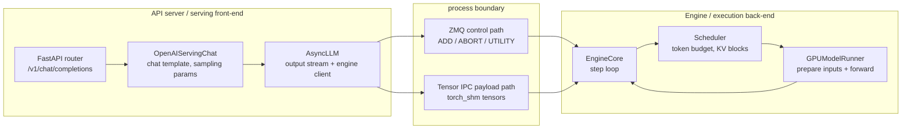
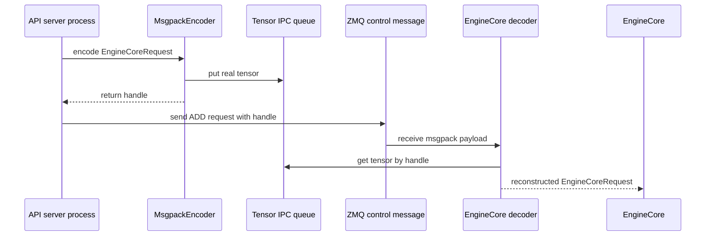

+++
title = "vLLM Request Lifecycle: From OpenAI API to One Forward Pass"
date = 2026-06-07T15:30:00+08:00
tags = ["llm", "inference", "vllm", "sglang", "source-reading", "ai-infra"]
categories = ["AI"]
series = ["vLLM and SGLang Source Reading"]
draft = false
image = "/images/posts/vllm-sglang-source-reading/source-reading-code-path-icon.svg"
libraries = ["mermaid"]
description = "A source-reading walkthrough of the vLLM V1 request path: OpenAI-compatible HTTP entrypoint, serving render, AsyncLLM, EngineCore client, Tensor IPC, scheduler, and one GPUModelRunner forward pass."
+++

From the outside, vLLM looks like an OpenAI-compatible HTTP server: send `/v1/chat/completions`, receive a token stream. The useful source-reading question is narrower:

**When does a JSON request become an engine request? When does it cross process boundaries? When does it enter the scheduler? When does one model forward actually happen?**

This post follows the vLLM V1 path: OpenAI Chat Completions API, `AsyncLLM`, `EngineCore`, `Scheduler`, `GPUWorker`, and `GPUModelRunner`. For multimodal requests, we only track the `mm_tensor_ipc == "torch_shm"` path, where large tensors bypass the main ZMQ/msgpack payload.

## Start With The Layers {#architecture}

The path is easier to read as front-end and back-end layers. Here, front-end means the OpenAI serving layer in the API server process; back-end means the EngineCore process and GPU worker.



Expanded as a call path:

```text
POST /v1/chat/completions
  -> api_router.py:create_chat_completion()
  -> OpenAIServingChat.create_chat_completion()
  -> render_chat_request()
  -> engine_client.generate(...)
  -> AsyncLLM.generate()
  -> input_processor.process_inputs()
  -> EngineCoreRequest
  -> EngineCoreClient.add_request_async()
  -> ZMQ ADD request
  -> EngineCore.add_request()
  -> Scheduler.add_request()
  -> EngineCore.step()
  -> Scheduler.schedule()
  -> model_executor.execute_model(scheduler_output)
  -> GPUWorker.execute_model()
  -> GPUModelRunner.execute_model()
  -> _prepare_inputs(), attention metadata, slot mapping
  -> _model_forward(...)
```

The key mental model: **the request lifecycle is not one queue**. Control messages, tensor payloads, scheduler state, and output streams are different state lines aligned by request id.

## What The API Process Does {#api-process}

The OpenAI-compatible route lives in:

- `vllm/entrypoints/openai/chat_completion/api_router.py`
- `vllm/entrypoints/openai/chat_completion/serving.py`

The `/v1/chat/completions` handler is thin: resolve the chat handler, call `handler.create_chat_completion()`, then return either JSON or a `StreamingResponse`.

```python
handler = chat(raw_request)
generator = await handler.create_chat_completion(request, raw_request)

if isinstance(generator, ChatCompletionResponse):
    return JSONResponse(content=generator.model_dump(), ...)

return StreamingResponse(content=generator, media_type="text/event-stream")
```

No scheduler and no forward pass happen here. This is the HTTP boundary: validation, cancellation/load-aware wrappers, and response shape.

The API-to-engine translation happens in `OpenAIServingChat._create_chat_completion()`:

```python
result = await self.render_chat_request(request)
conversation, engine_inputs = result
...
generator = self.engine_client.generate(
    engine_input,
    sampling_params,
    sub_request_id,
    ...
)
```

This layer renders messages through the chat template, turns fields such as `max_tokens`, `temperature`, and `top_p` into `SamplingParams`, and produces engine input. Multimodal content enters the engine input path here and may later become tensor payload.

On the V1 path, `engine_client.generate()` enters `AsyncLLM.generate()`. `AsyncLLM` does two things at once:

```python
self.output_processor.add_request(request, prompt, parent_req, index, queue)
await self.engine_core.add_request_async(request)
```

It registers the output stream in the API process, and sends an `EngineCoreRequest` to the engine process. Input and output paths split here.

## Process Boundary: ZMQ And Tensor IPC {#transport}

Inside `AsyncLLM`, `self.engine_core` is an EngineCore client. It does not directly call `EngineCore.add_request()`, and it does not call `model.forward()`. It sends a typed control message:

```python
request.client_index = self.client_index
await self._send_input(EngineCoreRequestType.ADD, request)
self._ensure_output_queue_task()
```

In the V1 multi-process path, this control path uses ZMQ. `MsgpackEncoder` encodes the request body; the EngineCore input thread decodes it into an `EngineCoreRequest`. This path carries control semantics: `ADD`, `ABORT`, `UTILITY`, target engine identity, request object, and output queue task.

Large multimodal tensors take a separate payload path. Text-only requests mostly contain token ids and parameters, which are fine for msgpack/ZMQ. Preprocessed image, audio, or video tensors can be much larger.

When `mm_tensor_ipc == "torch_shm"`, vLLM creates a `torch.multiprocessing.Queue` while launching EngineCore. On the API server side, the encoder puts the real tensor into the shared-memory queue and leaves only a lightweight handle in the ZMQ message:

```python
{
    "sender_id": ...,
    "message_id": ...,
    "tensor_id": ...,
}
```

On the EngineCore side, the decoder sees that handle and asks `TensorIpcReceiver` to fetch the real tensor.



The boundary is simple: ZMQ carries control messages; Tensor IPC carries large request payload tensors. Output tokens do not use Tensor IPC.

## What The Engine Process Does {#engine-process}

After the EngineCore input thread decodes an `EngineCoreRequest`, the request reaches:

```python
self.scheduler.add_request(request)
```

Still no forward pass. The request has only entered scheduler state. Model execution happens in `EngineCore.step()`:

```python
scheduler_output = self.scheduler.schedule()
future = self.model_executor.execute_model(scheduler_output, non_block=True)
...
engine_core_outputs = self.scheduler.update_from_output(
    scheduler_output, model_output
)
```

`Scheduler.schedule()` is mostly model-agnostic. It does not care how GPT-2, Llama, or Qwen implements its layers. It cares which tokens the GPU should compute this iteration, which KV blocks they use, and where new KV entries should be written.

Small example:

```text
token budget = 6

A: new request, 10-token prompt, schedule 4 prefill tokens this step
B: already decoding, schedule 1 token
C: prefix cache hit, schedule 1 missing token

scheduled tokens = 4 + 1 + 1 = 6
```

The `4` for A is not the prompt length. It is the prefill chunk size chosen for this iteration. If the chunk limit or token budget changes, it could be 5 or 6; in a single-request case, it could be close to 10. The point is that one forward computes this iteration's token batch, not a whole request.

These mechanisms mostly live at the scheduler/cache layer:

| Mechanism | What scheduler cares about | Does it change model math? |
|---|---|---|
| continuous batching | merge tokens from different requests into one batch | no |
| chunked prefill | admit only a prompt chunk per iteration | no |
| prefix caching | skip already-computed prefix tokens | no, but positions/KV view changes |
| paged attention | allocate, reuse, and release KV blocks | attention backend memory access changes |
| speculative decoding | organize draft/verify token work | may add a verification path |

## Where One Forward Happens {#one-forward}

The GPU path enters `GPUWorker.execute_model()` and then `GPUModelRunner.execute_model()`.

`GPUWorker` first checks whether this iteration has real scheduled tokens:

```python
forward_pass = scheduler_output.total_num_scheduled_tokens > 0
```

Usually, requests imply scheduled tokens. The worker layer still has to handle pipeline-parallel communication, profiling, deferred state corrections, pooling, and special runners. Once execution reaches `GPUModelRunner` input preparation, the code expects the scheduled token count to be positive; otherwise this is not an ordinary transformer forward.

`GPUModelRunner.execute_model()` has three useful phases:

1. update batch state and prepare `input_ids`, `positions`, logits indices, and spec decode metadata;
2. prepare attention metadata and KV-cache slot mapping;
3. call `_model_forward(...)` inside `set_forward_context(...)`.

```python
with set_forward_context(
    attn_metadata,
    self.vllm_config,
    num_tokens=num_tokens_padded,
    ...
):
    model_output = self._model_forward(
        input_ids=input_ids,
        positions=positions,
        intermediate_tensors=intermediate_tensors,
        inputs_embeds=inputs_embeds,
        **model_kwargs,
    )
```

This is the "one forward pass" in the title. Its input is no longer OpenAI JSON or a full prompt string. It is a tensorized batch prepared by the scheduler and model runner:

- `input_ids` / `inputs_embeds`: tokens or embeddings for this iteration;
- `positions`: token positions;
- `attn_metadata`: context required by the attention backend;
- `slot_mappings`: KV-cache write locations;
- `model_kwargs`: multimodal, LoRA, spec decode, encoder-decoder, and other extra inputs.

`_model_forward()` eventually calls the concrete model class. This implies a contract: the model is not just any PyTorch module. It must accept the token/embedding inputs, positions, pipeline intermediate tensors, and extra model inputs that the runner passes. Attention metadata, KV slot mapping, CUDA graph mode, and microbatch details enter through `set_forward_context(...)`, where attention layers can read them.

So model-specific forward optimizations do not live in `Scheduler.schedule()`. The scheduler builds this iteration's token batch; the model runner and attention backend prepare the execution environment; the model class and kernels decide how GPT-2, Llama, Qwen, MoE, and similar architectures run.

## Return Path {#return-path}

After forward, vLLM still needs sampling and state updates. `EngineCore.step()` calls:

```python
engine_core_outputs = self.scheduler.update_from_output(
    scheduler_output, model_output
)
```

This merges sampled tokens, logprobs, finished state, KV/cache release, and related updates back into scheduler state. EngineCore outputs then return to the API process. `AsyncLLM` pushes them into the per-request collector, and the HTTP handler keeps yielding the SSE stream.

The loop is:

```text
API request
  -> engine request
  -> scheduler state
  -> scheduled token batch
  -> one model forward
  -> sampled token / state update
  -> async output collector
  -> HTTP response stream
```

This loop repeats until the request finishes. A long prompt may require several prefill or chunked-prefill forwards before TTFT. During decode, each streamed token usually corresponds to one scheduling iteration, one model execution, and one sampling update.

## Boundaries To Remember {#boundaries}

- The OpenAI API layer is not the engine layer: `ChatCompletionRequest` expresses API semantics, while `EngineCoreRequest` expresses schedulable engine work.
- `AsyncLLM.generate()` is not a forward pass; it is the async facade in the API server process.
- ZMQ is the control path; Tensor IPC is a payload side channel.
- `SchedulerOutput` is the direct upstream of one forward pass: it decides which tokens and KV blocks this iteration uses.
- One forward is one engine iteration, not one request.

The next post will stay at the scheduler boundary: waiting queue, running queue, token budget, preemption, and why vLLM's scheduler says it has no fixed prefill/decode phase.
