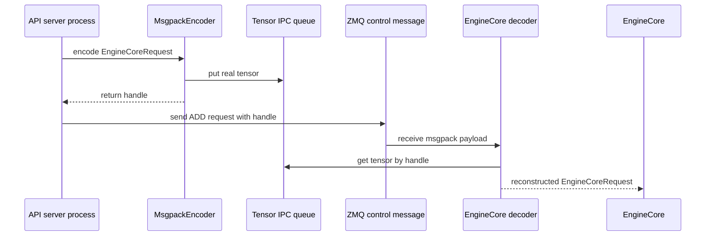

+++
title = "vLLM Request Lifecycle: From OpenAI API to One Forward Pass"
date = 2026-06-07T15:30:00+08:00
tags = ["llm", "inference", "vllm", "sglang", "source-reading", "ai-infra"]
categories = ["AI"]
series = ["vLLM and SGLang Source Reading"]
draft = false
image = "/images/posts/vllm-sglang-source-reading/source-reading-code-path-icon.svg"
libraries = ["mermaid"]
description = "A source-reading walkthrough of the vLLM V1 request path: OpenAI-compatible HTTP entrypoint, serving render, AsyncLLM, EngineCore client, Tensor IPC, scheduler, and one GPUModelRunner forward pass."
+++

From the outside, vLLM looks like an OpenAI-compatible HTTP server: send `/v1/chat/completions`, receive a token stream. The useful source-reading question is narrower:

**When does a JSON request become an engine request? When does it cross process boundaries? When does it enter the scheduler? When does one model forward actually happen?**

This post follows the vLLM V1 path: OpenAI Chat Completions API, `AsyncLLM`, `EngineCore`, `Scheduler`, `GPUWorker`, and `GPUModelRunner`. For multimodal requests, we only track the `mm_tensor_ipc == "torch_shm"` path, where large tensors bypass the main ZMQ/msgpack payload.

## Overview: Four Lines Aligned By Request Id {#architecture}

The request lifecycle is not one simple queue. It is several state lines aligned by request id:

- the API server owns HTTP, chat templates, sampling params, and output streams;
- ZMQ carries control messages such as `ADD`, `ABORT`, and `UTILITY`;
- Tensor IPC carries large multimodal tensor payloads;
- EngineCore, Scheduler, and ModelRunner own scheduling and GPU execution.



Expanded as a call path:

```text
POST /v1/chat/completions
  -> api_router.py:create_chat_completion()
  -> OpenAIServingChat.create_chat_completion()
  -> render_chat_request()
  -> engine_client.generate(...)
  -> AsyncLLM.generate()
  -> input_processor.process_inputs()
  -> EngineCoreRequest
  -> EngineCoreClient.add_request_async()
  -> ZMQ ADD request
  -> EngineCore.add_request()
  -> Scheduler.add_request()
  -> EngineCore.step()
  -> Scheduler.schedule()
  -> model_executor.execute_model(scheduler_output)
  -> GPUWorker.execute_model()
  -> GPUModelRunner.execute_model()
  -> _prepare_inputs(), attention metadata, slot mapping
  -> _model_forward(...)
```

## API Process: OpenAI Request To Engine Work {#api-process}

The OpenAI-compatible route lives in:

- `vllm/entrypoints/openai/chat_completion/api_router.py`
- `vllm/entrypoints/openai/chat_completion/serving.py`

The `/v1/chat/completions` handler is thin: resolve the chat handler, call `handler.create_chat_completion()`, then return either JSON or a `StreamingResponse`. No scheduler and no forward pass happen here.

The API-to-engine translation happens in `OpenAIServingChat._create_chat_completion()`: messages are rendered through the chat template, fields such as `max_tokens`, `temperature`, and `top_p` become `SamplingParams`, and multimodal content enters the engine input path. Then `engine_client.generate()` enters `AsyncLLM.generate()`:

```python
self.output_processor.add_request(request, prompt, parent_req, index, queue)
await self.engine_core.add_request_async(request)
```

The API process registers the output stream for the HTTP handler and sends an `EngineCoreRequest` to the engine process. Input and output paths split here.

## Process Boundary: ZMQ For Control, Tensor IPC For Payload {#transport}

Inside `AsyncLLM`, `self.engine_core` is an EngineCore client. It does not directly call `EngineCore.add_request()`, and it does not call `model.forward()`. It sends a typed control message:

```python
request.client_index = self.client_index
await self._send_input(EngineCoreRequestType.ADD, request)
self._ensure_output_queue_task()
```

In the V1 multi-process path, this control path uses ZMQ. `MsgpackEncoder` encodes the request body; the EngineCore input thread decodes it into an `EngineCoreRequest`.

Large multimodal tensors take a separate payload path. When `mm_tensor_ipc == "torch_shm"`, the API server-side encoder puts the real tensor into a shared-memory queue and leaves only a lightweight handle in the ZMQ message. On the EngineCore side, the decoder sees that handle and asks `TensorIpcReceiver` to fetch the real tensor.



The boundary is simple: ZMQ carries control messages; Tensor IPC carries large request payload tensors. Output tokens do not use Tensor IPC.

## EngineCore: schedule, execute, update {#engine-process}

After the EngineCore input thread decodes an `EngineCoreRequest`, the request reaches:

```python
self.scheduler.add_request(request)
```

Still no forward pass. The request has only entered scheduler state. Model execution happens in `EngineCore.step()`:

```python
scheduler_output = self.scheduler.schedule()
future = self.model_executor.execute_model(scheduler_output, non_block=True)
...
engine_core_outputs = self.scheduler.update_from_output(
    scheduler_output, model_output
)
```

Small example:

```text
token budget = 6

A: new request, 10-token prompt, schedule 4 prefill tokens this step
B: already decoding, schedule 1 token
C: prefix cache hit, schedule 1 missing token

scheduled tokens = 4 + 1 + 1 = 6
```

The `4` for A is not the prompt length. It is the prefill chunk size chosen for this iteration. One forward computes this iteration's token batch, not a whole request.

The mechanisms split like this:

| Mechanism | What scheduler cares about | Does it change model math? |
|---|---|---|
| continuous batching | merge tokens from different requests into one batch | no |
| chunked prefill | admit only a prompt chunk per iteration | no |
| prefix caching | skip already-computed prefix tokens | no, but positions/KV view changes |
| paged attention | allocate, reuse, and release KV blocks | attention backend memory access changes |
| speculative decoding | organize draft/verify token work | may add a verification path |

The GPU path enters `GPUWorker.execute_model()` and then `GPUModelRunner.execute_model()`. At that point, the input is no longer OpenAI JSON or a full prompt string. It is a tensorized batch prepared by the scheduler and model runner:

- `input_ids` / `inputs_embeds`: tokens or embeddings for this iteration;
- `positions`: token positions;
- `attn_metadata`: context required by the attention backend;
- `slot_mappings`: KV-cache write locations;
- `model_kwargs`: multimodal, LoRA, spec decode, encoder-decoder, and other extra inputs.

## Return Path And Boundaries {#return-path}

After forward, vLLM still needs sampling and state updates. `EngineCore.step()` calls:

```python
engine_core_outputs = self.scheduler.update_from_output(
    scheduler_output, model_output
)
```

This merges sampled tokens, logprobs, finished state, KV/cache release, and related updates back into scheduler state. EngineCore outputs then return to the API process. `AsyncLLM` pushes them into the per-request collector, and the HTTP handler keeps yielding the SSE stream.

The loop is:

```text
API request
  -> engine request
  -> scheduler state
  -> scheduled token batch
  -> one model forward
  -> sampled token / state update
  -> async output collector
  -> HTTP response stream
```

Boundaries to remember:

- The OpenAI API layer is not the engine layer: `ChatCompletionRequest` expresses API semantics, while `EngineCoreRequest` expresses schedulable engine work.
- `AsyncLLM.generate()` is not a forward pass; it is the async facade in the API server process.
- ZMQ is the control path; Tensor IPC is a payload side channel.
- [`SchedulerOutput`]() is the direct upstream of one forward pass: it decides which tokens and KV blocks this iteration uses.
- [`GPUModelRunner`]() consumes `SchedulerOutput` and turns it into tensors, attention metadata, and real GPU execution.
- One forward is one engine iteration, not one request.
