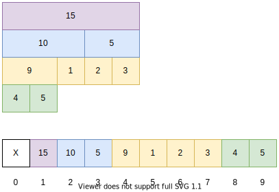

The recursive version is not as good as the [iterative version](../segment-tree-iterative/), but if you need to update a range of instead of just a single element of the array, you need to know the recursive version, because the [lazy propagation method](../segment-tree-recursive-with-lazy-propagation) (used to tackle the range updating problem) is modified on the basis of a recursive segment tree. So let's see how to implement the segment tree in a recusive style.

<!--more-->

## Compare with the iterative version

### More space

The recursive version also uses an array to store the segment tree, but the tree is not a complete binary tree. It is rather a full binary tree (every node has 0 or 2 children) and all levels are filled except possibly the last level.
The iterative version builds a complete binary tree, so it's more compact, and more space saving.

### Slower

## Example Problem

We will still use this range sum query problem:



[leetcode 307: Range Sum Query - Mutable](https://leetcode.com/problems/range-sum-query-mutable/)
Given an integer array `nums`, find the sum of the elements between indices `i` and `j` (`i ≤ j`), inclusive.
The `update(i, val)` function modifies nums by updating the element at index `i` to `val`.



For this problem, the **identity element** is **0**, and the binary operation is **+** between integers.

if size of the array is `n`, then we only need an array of `2*n` length to store the segment tree. (property of a [Complete Binary Tree](https://en.wikipedia.org/wiki/Binary_tree#Arrays))



### Define the binary operation

Here we will just use `+` for our operation, you can if you need define a merge function for your special operation $\oplus$.

```C++
inline int merge(int a, int b) {
  return a + b;
}
```

### Build the Tree

### Query a range sum

### Update an element/elements

### Complete Solution to the Problem

## When should I use the recursive version

## Refs

* [GeeksforGeeks: Segment Tree | Set 1 (Sum of given range)](https://www.geeksforgeeks.org/segment-tree-set-1-sum-of-given-range/)
* [A Recursive approach to Segment Trees, Range Sum Queries & Lazy Propagation](https://leetcode.com/articles/a-recursive-approach-to-segment-trees-range-sum-queries-lazy-propagation/)
* [Segment tree Theory and applications](http://maratona.ic.unicamp.br/MaratonaVerao2016/material/segment_tree_lecture.pdf)
* [wiki: binary tree - in an array](https://en.wikipedia.org/wiki/Binary_tree#Arrays)
