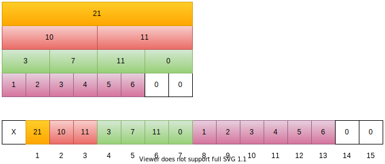

A segment tree is a binary tree where each node represents an interval. Each node stores some property of its corresponding interval: like the maximum/minimum num, the sum of that interval.

<!-- more -->
## Applicable Problems

For any array `a`, where every element belongs to some monoid $(S, \oplus)$ we can build a segment tree to answer the following queries (problems):
– `Get(l, r)` — returns $a_l \oplus a_{l+1} \oplus \dotsb a_r$
– `Change(p, x)` — set $a_p = x$



* **Monoids** are semigroups with identity.
* $\oplus$ is an associative binary operation.
* **Identity element** for some pair $(S, \oplus)$ is such an element $e \in S$ that for every $a \in S$ condition $a ⊕ e = e \oplus a = a$ holds;



## Example Problem



[leetcode 307: Range Sum Query - Mutable](https://leetcode.com/problems/range-sum-query-mutable/)
Given an integer array `nums`, find the sum of the elements between indices `i` and `j` (`i ≤ j`), inclusive.
The `update(i, val)` function modifies nums by updating the element at index `i` to `val`.



For this problem, the **identity element** is **0**, and the binary operation is **+** between integers.
And for simplicity we use the **identity element** to extend the length of the original array to some integer power of 2.

### Build the Tree

We want to construct an array like below (the original array is `{1, 2, 3, 4, 5, 6}`)





```C++
// s
```





```C++
// iterative version is faster but more code
```



### Query a range sum

### Update an element/elements

## Refs

* [A Recursive approach to Segment Trees, Range Sum Queries & Lazy Propagation](https://leetcode.com/articles/a-recursive-approach-to-segment-trees-range-sum-queries-lazy-propagation/)
* [Segment tree Theory and applications](http://maratona.ic.unicamp.br/MaratonaVerao2016/material/segment_tree_lecture.pdf)
