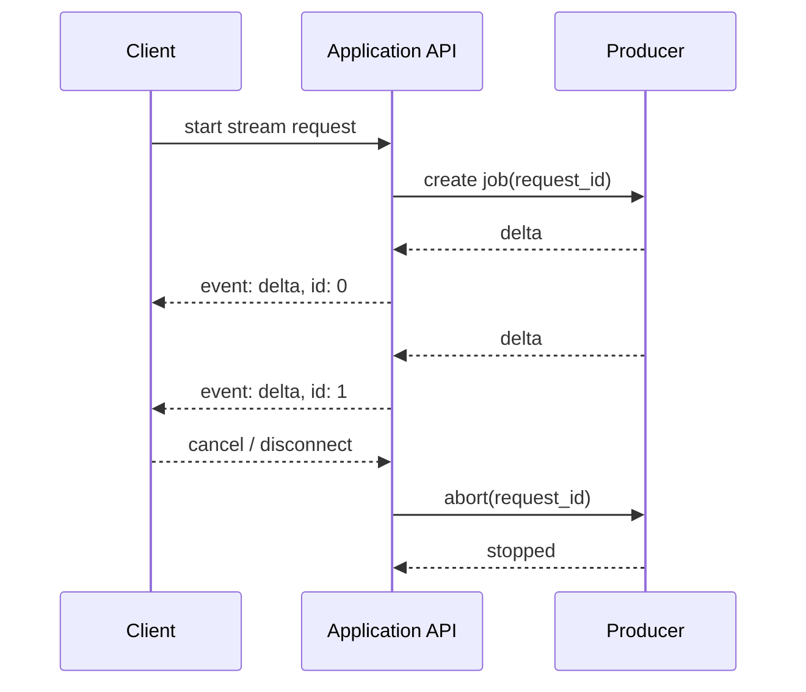
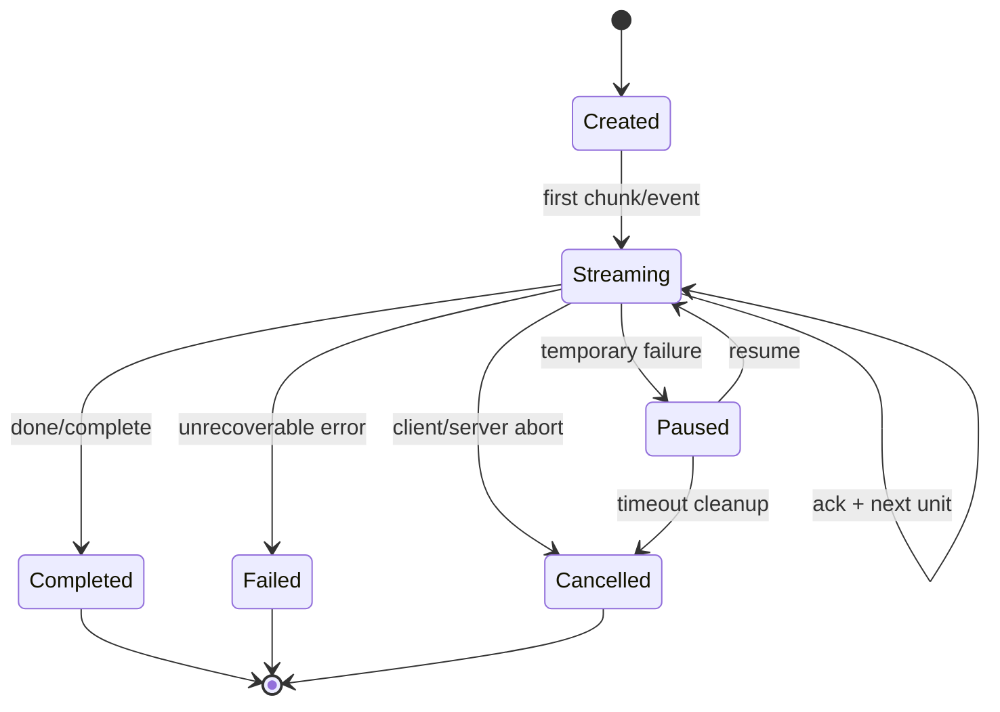

+++
title = "Streaming Design: Why The Application Layer Still Matters"
date = 2026-06-17T10:00:00+08:00
tags = ["networking", "streaming", "distributed-systems", "backend"]
categories = ["notes"]
draft = false
image = "/images/posts/streaming-application-layer-design/streaming-cover.svg"
libraries = ["mermaid"]
description = "A practical model for upload-side and download-side streaming: transport moves bytes, while the application layer defines boundaries, progress, recovery, idempotency, backpressure, and business meaning."
+++

When people first design a streaming interface, the natural question is:

**If TCP already provides a reliable ordered byte stream, and HTTP/2 or HTTP/3 already supports long-lived multiplexed streams, why do we still need application-layer streaming design?**

Because the transport layer only promises to move bytes. Real systems care about higher-level facts: which file do these bytes belong to? Is this chunk number 17? Can this operation be retried? What if the same chunk arrives twice? Can a download resume after disconnecting halfway through? Who slows down when the consumer cannot keep up?

Those are not transport-layer decisions.

This post uses two small objects throughout:

- upload side: upload a `1GB` file as `4MB` chunks.
- download side: stream LLM tokens, log lines, or media fragments from a server to a client.

The directions are opposite, but the application-layer problem is similar: **a byte stream must be split into meaningful messages, messages must be attached to state, and state must be acknowledged, resumed, and cancelled.**



## Start With A Tiny Example {#toy-example}

Suppose a client needs to upload a `1GB` file and the network may disconnect halfway through. The simplest design is to put the whole file in one HTTP request body:

```text
POST /upload

[1GB raw bytes...]
```

This can work on a perfect network, but its system semantics are fragile:

- if the connection breaks at `740MB`, how much did the server save?
- should the client retry the full `1GB`, or continue from `740MB`?
- if the server receives the second half again, how does it know this is a retry, not a new file?
- should integrity be checked with one whole-file checksum, or per chunk?

A practical application-layer design usually turns the upload into a stateful session:

```text
create upload session
  -> upload_id = u_123

PUT /uploads/u_123/chunks/0000  bytes 0..4MB-1   checksum=a1
PUT /uploads/u_123/chunks/0001  bytes 4MB..8MB-1 checksum=b2
PUT /uploads/u_123/chunks/0002  bytes 8MB..12MB-1 checksum=c3

complete upload u_123
  -> verify chunk list + total checksum
  -> commit object
```

Now the application layer has introduced objects the transport layer cannot know about:

| Object | Purpose |
|---|---|
| `upload_id` | group multiple requests into one upload session |
| `chunk_index` / byte range | create retryable byte boundaries |
| `checksum` | distinguish reliable delivery from content correctness |
| `complete` | commit temporary state into a final object |
| idempotency key | make repeated requests safe |

This is the core of upload-side streaming: **split one large object into independently confirmable smaller objects, while still committing them as one consistent business object.**

## Download Streaming Is Not Just Upload In Reverse {#download-side}

Download streaming has a different shape. On the upload side, the client usually owns the complete input. On the download side, the server may generate output while the request is still running.

A typical example is an LLM token stream:

```text
event: delta
data: {"index":0,"content":"stream"}

event: delta
data: {"index":1,"content":"ing"}

event: done
data: {}
```

This can be carried by HTTP chunked responses, Server-Sent Events, WebSocket, or HTTP/2 streams. But no matter which transport API is used, the application layer still has to define:

- where does each event begin and end?
- what do `delta`, `error`, and `done` mean?
- can the client resume from `index=37` after reconnecting?
- how does the server send heartbeats so intermediaries do not treat the connection as idle?
- when the user cancels, how does the server stop backend computation instead of merely closing a socket?

So the download-side problem is not “keep writing to the socket.” It is **expose a continuously produced computation as a consumable, terminable, observable event sequence**.



The important thing in this diagram is not the arrows. It is the `request_id` and event numbering. Without them, the system can only say “the connection closed.” With them, it can say which business task stopped, how much output was delivered, and whether backend work should be aborted.

## What The Transport Layer Already Does {#transport-layer}

To be fair, the transport layer already solves hard problems.

TCP provides:

- ordered byte delivery: the receiver sees bytes in the order the sender wrote them.
- reliable retransmission: lost packets are resent.
- congestion control: the sender adapts to network conditions.
- flow control: the receiver window prevents the sender from overflowing receive buffers.

QUIC / HTTP/3 moves parts of this machinery into user space and improves connection migration and head-of-line blocking behavior under multiplexing. HTTP/2 can also carry multiple streams over one connection.

So the application layer should not reimplement packet retransmission, congestion control, or byte ordering. That is transport-layer work.

But the transport abstraction has a clear boundary: it sees connections, packets, streams, and byte offsets. It does not see these facts:

| Transport layer knows | Application layer knows |
|---|---|
| byte offset | which chunk or event this is |
| connection closed | user cancelled, network failed, or server completed |
| bytes delivered | content passed business validation |
| receiver window full | UI is slow, disk is slow, or downstream service is slow |
| stream id | which file, task, or session this stream belongs to |

So the sharper version of “isn’t the transport layer enough?” is:

**If the system only needs to move bytes reliably, the transport layer is enough. If it needs to advance business state reliably, the application layer needs a design.**

## What The Application Layer Must Design {#application-layer}

Application-layer streaming design has six recurring dimensions.

### 1. Message Boundaries {#message-boundary}

TCP is a byte stream. It does not preserve the message boundaries from application writes. If you call `write()` three times, the peer may receive the bytes in one `read()`. If you call `write()` once, the peer may receive it across multiple `read()` calls.

The application layer therefore needs framing:

```text
[length=1048576][chunk bytes...][checksum]
[length=932144 ][chunk bytes...][checksum]
```

Or it can reuse existing formats:

- HTTP multipart
- SSE `event:` / `data:` frames
- WebSocket message frames
- gRPC streaming messages
- custom length-prefixed frames

Boundaries are not formatting trivia. They are the unit of state management. Without a boundary, there is no “chunk 17 succeeded” or “event 38 was consumed.”

### 2. Idempotency And Retry {#idempotency}

The hardest part of network failure is not that a request failed. It is that the client often does not know whether the server processed it.

For an upload chunk:

```text
client -> server: PUT chunk 17
server: write chunk 17 ok
network: response lost
client: timeout
```

The client should retry. But if retrying makes the server append chunk 17 twice, the file is corrupted. The application layer needs to make the operation idempotent:

```text
PUT /uploads/u_123/chunks/17
Idempotency-Key: u_123:17:sha256:...
```

When the server sees the same key, it can return “already received” instead of writing the data again. TCP cannot infer this. TCP knows whether bytes entered a connection; it does not know whether this request is a replay of a business action.

### 3. Progress And Resume {#resume}

A common resumable-upload protocol looks like this:

```text
client: which chunks do you have for upload u_123?
server: 0..184 are committed, 185 is missing
client: continue from chunk 185
```

Download streaming can have a similar mechanism:

```text
client: resume stream s_456 from event id 37
server: replay 38..latest if retained, then continue live stream
```

But the download side has an extra constraint: does the server retain historical events? If events are generated in memory and never stored, reconnecting cannot precisely resume. The server may need to regenerate, or state explicitly that the stream is not resumable. That is part of the application contract.

### 4. Backpressure {#backpressure}

The transport layer has flow control, but application-layer backpressure is still needed because “receive buffer is full” is not the only kind of slowness.

On the download side:

- browser JavaScript may process events slowly.
- the client may write to disk slowly.
- the UI may only need refreshes every 50ms, not every token immediately.
- a downstream consumer may be slow while the socket buffer is still fine.

On the upload side:

- server disk writes may be slow.
- the server may scan, decode, or index data while receiving it.
- object storage or a database may be the bottleneck.

The application layer can express backpressure in several ways:

- limit the number of in-flight chunks.
- return `429` / `503` with `Retry-After`.
- adjust chunk size or concurrency based on ACK latency.
- merge, sample, or batch-flush download events.

Transport flow control protects connection buffers. Application backpressure protects the business processing pipeline.

### 5. Completion, Error, And Cancellation {#completion-error-cancel}

A streaming protocol should make “end” a first-class event.

Download streams should distinguish at least:

```text
event: done
data: {"finish_reason":"stop"}

event: error
data: {"code":"quota_exceeded","message":"..."}

event: cancelled
data: {"by":"client"}
```

If the protocol only relies on socket close, the client cannot tell whether the close means normal completion, network failure, server crash, or user cancellation. Uploads have the same problem: `complete upload` is an explicit commit point. Without it, the server cannot reliably distinguish “still uploading” from “abandoned.”

### 6. Observability And Cleanup {#observability}

Streaming connections are often long-lived, cross multiple components, and fail in several ways. The application layer needs stable identities:

```text
request_id = req_abc
upload_id  = up_123
stream_id  = s_456
chunk_id   = 17
event_id   = 38
```

These ids connect logs, metrics, retries, cancellation, and cleanup jobs. If a download stream disconnects, the API layer needs to find the backend worker and stop computation. If an upload session has not completed after 24 hours, a cleanup job needs to delete temporary chunks.

Without application-layer identity, the system can only clean up connections. With it, the system can clean up business resources.

## The Shared Pattern Behind Upload And Download {#common-pattern}

Compressed into one model, upload and download streaming share the same state machine:



The difference is what “unit” means:

| Direction | Unit | Progress checkpoint | Resume condition |
|---|---|---|---|
| Upload | chunk / byte range | server persisted or validated the chunk | server can list received chunks |
| Download | event / token / frame | client stored the last event id, or the protocol has explicit ACKs | server can replay history, or recompute |

This state machine is also a checklist for evaluating a streaming design:

- can a stream be explicitly created?
- does every unit have a boundary and identifier?
- is success or progress acknowledged per unit, or only at the end?
- after failure, can both sides know the last consistent point?
- does cancellation release backend resources?
- is completion separate from connection close?

## Choosing SSE, WebSocket, gRPC, Or A Custom Protocol {#protocol-choice}

Application-layer design does not mean inventing a new protocol. Most systems should reuse mature carriers.

| Option | Good fit | Watch out |
|---|---|---|
| HTTP chunked response | simple download streams, continuous server output | carries bytes but does not define event semantics |
| SSE | server-to-browser text events, LLM token streams | one-way; has `id` and reconnect support, but awkward for binary |
| WebSocket | bidirectional low-latency messages, collaborative editing, realtime control | you define message types, reconnect, heartbeat, and auth refresh |
| gRPC streaming | typed service-to-service streaming with schemas | browser support is less direct; backend-oriented ecosystem |
| resumable upload protocol | large file uploads and weak-network recovery | the core is session, chunk, checksum, and commit |

The real design question is not “which transport API should we use?” It is:

**What is the business unit? Where is the acknowledgment point? Where can recovery resume? How are duplicate messages handled? How are completion and cancellation expressed?**

The transport choice carries those answers.

## A Practical Design Template {#template}

When designing a streaming interface, start by filling this table.

| Question | Upload-side example | Download-side example |
|---|---|---|
| stream identity | `upload_id` | `stream_id` / `request_id` |
| unit boundary | `chunk_index + byte_range` | `event_id + event_type` |
| ordering | chunk index is monotonic; chunks may upload concurrently and be sorted later | event id is monotonic |
| integrity | per-chunk checksum + final checksum | event schema validation, optional checksum |
| idempotency | `upload_id:chunk_index:checksum` | dedupe by `event_id`, or resume cursor |
| ack / progress | chunk persisted | last event id stored, or explicit app-level ACK |
| resume | query received chunks | replay from last event id |
| completion | explicit `complete` + commit | explicit `done` event |
| cancellation | abort upload session and delete temporary chunks | abort backend job |
| cleanup | TTL cleanup for unfinished sessions | stop producer after disconnect or keep short replay buffer |

If this table cannot be filled, the system probably does not have a streaming design yet. It is only sending data in pieces.

## Summary {#summary}

The transport layer answers “how do bytes cross the network?” The application layer answers “how do these bytes advance business state?”

The upload side needs sessions, chunks, checksums, idempotency, commit, and cleanup. The download side needs events, done/error/cancel semantics, heartbeats, resume cursors, and producer lifecycle. Both rely on the transport layer for reliable, ordered, controlled byte movement, but neither can ask the transport layer to guess business meaning.

So the core of streaming is not “use a long connection.”

More precisely, streaming is a state-machine design: split a large object or long-running process into named, confirmable, recoverable, cancellable steps, and give every step clear application-layer semantics.
