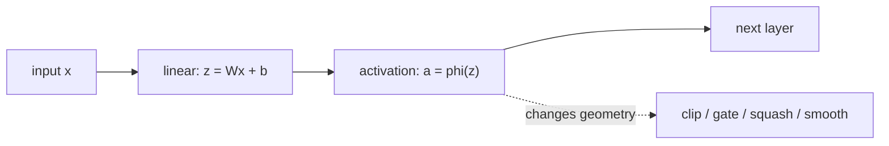

+++
title = "Activation Function：神经网络里那个很小但很关键的非线性"
date = 2026-06-18T10:00:00+08:00
tags = ["deep-learning", "activation-function", "neural-network", "gradient-descent"]
categories = ["AI"]
draft = false
image = "/images/posts/activation-functions-neural-networks/activation-function-icon.svg"
libraries = ["mathjax", "mermaid"]
description = "从机制出发总结 activation function：为什么神经网络需要非线性，sigmoid、tanh、ReLU、GELU、SiLU 各自解决什么问题，以及为什么 400 个 activation 的综述更适合作为地图而不是菜单。"
+++

Activation function 看起来只是神经网络层里一个很小的函数。真正重的计算通常是矩阵乘法：

$$z = Wx + b$$

然后逐元素套一个函数：

$$a = \phi(z)$$

很容易把 \\(\phi\\) 当成一个可以随便替换的名字：sigmoid、tanh、ReLU、GELU、SiLU、Mish，或者几百个变体。但 activation function 不是装饰。它决定了多层网络能不能表达非线性函数，梯度能不能传下去，hidden value 的分布是否稳定，以及为了很小的精度收益是否要付出明显的运行成本。

Kunc 和 Klema 在 2024 年的综述 [*Three Decades of Activations*](https://arxiv.org/abs/2402.09092) 里整理了大约 400 个 real-valued activation functions。这个数字本身就说明了一件事：这个领域里有很多命名、变体和重复发明。对一篇博客来说，把 400 个函数逐个列出来只会掩盖真正重要的问题。更好的切入点是：

> activation function 到底在解决什么问题？每一类函数的 tradeoff 是什么？

## 为什么必须有非线性 {#why-nonlinearity}

先看一个两层网络，但把 activation 去掉：

$$h = W_1 x + b_1$$

$$y = W_2 h + b_2$$

把 \\(h\\) 代入第二个式子：

$$y = W_2(W_1x + b_1) + b_2 = (W_2W_1)x + (W_2b_1 + b_2)$$

整个两层网络等价于一层线性层。继续堆更多线性层也没有本质区别，因为线性/仿射变换的复合仍然是仿射变换。

Activation function 打破了这个坍缩。加入：

$$h = \phi(W_1x + b_1)$$

之后，第二层看到的就不再是 \\(x\\) 的简单仿射变换，而是被截断、门控、压缩、弯折或平滑重加权后的特征。这就是 activation function 存在的核心原因。

看一个很小的标量例子。令：

$$h_1 = \phi(2x - 1),\quad h_2 = \phi(-2x - 1),\quad y = h_1 + h_2$$

如果 \\(\phi(z)=z\\)，那么：

$$y = (2x - 1) + (-2x - 1) = -2$$

输入 \\(x\\) 直接消失了。但如果 \\(\phi(z)=\max(0,z)\\)，那么：

$$y = \max(0,2x-1) + \max(0,-2x-1)$$

这个函数在中间是平的，在两侧增长。两个 rectifier 造出了一个 piecewise-linear 的“弯折”，而单个线性层无法表达这个形状。

## 一个实用分类 {#taxonomy}

2024 年那篇综述把 activation function 分成两大类：**fixed activation functions** 和 **adaptive activation functions**。fixed function 没有可训练的 activation 参数；adaptive activation function 会把某些形状参数也放进训练过程。为了理解主线，我们还可以换一个更实用的分类：这个函数到底怎样改变信号和梯度？

| 家族 | 例子 | 代表公式 | 主要 tradeoff |
| --- | --- | --- | --- |
| Step-like | binary step, sign | \\(1[z\ge0]\\), \\(\operatorname{sign}(z)\\) | 有历史意义，但几乎没有可用梯度 |
| Saturating smooth | sigmoid, tanh | \\(\sigma(z)=1/(1+e^{-z})\\), \\(\tanh(z)\\) | 输出范围稳定，但深层梯度弱 |
| Rectified | ReLU, Leaky ReLU, PReLU | \\(\max(0,z)\\), \\(\max(\alpha z,z)\\) | 便宜、稀疏，但可能 dead unit |
| Smooth rectified / gated | GELU, SiLU/Swish, Mish | \\(z\Phi(z)\\), \\(z\sigma(z)\\) | 现代网络常用，但计算更贵 |
| Normalizing / output-layer | softmax | \\(e^{z_i}/\sum_j e^{z_j}\\) | 适合分类 logits，不是普通隐藏层替代品 |
| Adaptive / learned | PReLU, trainable splines, rational activations | 例如 \\(\max(\alpha z,z)\\)，其中 \\(\alpha\\) 可训练 | 参数更多，实现和泛化风险更高 |

重点不是哪一行永远最好，而是每一行把 activation 的预算花在不同地方：硬阈值换来离散决策但失去梯度；sigmoid/tanh 换来有界输出但会饱和；ReLU 换来便宜的梯度通道但丢掉负半轴；GELU/SiLU 换来更平滑的 gate，但计算更贵。



如果只看 family，很多细节会被压扁。例如 sigmoid 和 tanh 都会饱和，但 tanh 是 zero-centered；ReLU 和 Leaky ReLU 都是 rectified family，但负半轴梯度完全不同；GELU 和 SiLU 都像 smooth gate，但曲线在负半轴的形状也不完全一样。上图的目的不是覆盖 400 个函数，而是把最常见的选择放到同一个视觉坐标系里。

## Sigmoid 和 Tanh：有界，但会饱和 {#sigmoid-tanh}

logistic sigmoid 是：

$$\sigma(z) = \frac{1}{1 + e^{-z}}$$

它把任意输入映射到 \\((0,1)\\)。当输出需要像概率时，这很自然。它的导数是：

$$\sigma^{\prime}(z) = \sigma(z)(1-\sigma(z))$$

导数在 \\(z=0\\) 附近最大；当 \\(z\\) 很大或很小时，导数会变得很小。这就是 saturation problem：如果一个神经元落在左侧或右侧的平坦区域，backprop 传回来的学习信号几乎没有。

Tanh 可以看作 sigmoid 的平移和缩放：

$$\tanh(z) = 2\sigma(2z) - 1$$

它把值映射到 \\((-1,1)\\)，并且以 0 为中心，所以作为 hidden activation 往往比 sigmoid 更舒服。但它仍然会饱和。这就是为什么在深层 feed-forward network 里，sigmoid 和 tanh 通常不是默认 hidden activation；不过它们在 gate、recurrent network 和概率输出头里仍然很重要。



有界 activation 可以控制 hidden value 的范围，但有界通常意味着尾部变平。尾部变平，就是梯度消失的位置。



## ReLU：稀疏、便宜，而且很有效 {#relu}

ReLU 是：

$$\operatorname{ReLU}(z) = \max(0,z)$$

它的导数很简单：

$$\operatorname{ReLU}^{\prime}(z) = \begin{cases} 1, & z > 0 \\\\ 0, & z < 0 \end{cases}$$

相比 sigmoid 和 tanh，ReLU 在正半轴不会饱和。只要 \\(z>0\\)，梯度就可以原样通过。它也很便宜：没有指数、没有除法、没有查表。

ReLU 的弱点也很直接。负半轴输出精确为 0，梯度也是 0。如果某个 unit 被推到几乎永远为负的区域，它就可能变成 **dead ReLU**。Leaky ReLU 把负半轴从 0 改成一个小斜率：

$$\operatorname{LeakyReLU}(z) = \begin{cases} z, & z > 0 \\\\ \alpha z, & z \le 0 \end{cases}$$

PReLU 则让 \\(\alpha\\) 变成可训练参数。这就是 fixed 和 adaptive 区别的一个小例子：非线性的形状不再完全由研究者手动指定，其中一部分交给训练过程学习。

## GELU 和 SiLU：从硬门控到平滑门控 {#gelu-silu}

现代 Transformer 风格模型经常使用 smooth rectified 或 gated activation。两个常见例子是 GELU 和 SiLU。

SiLU，有些论文在带参数形式下也叫 Swish，是：

$$\operatorname{SiLU}(z) = z\sigma(z)$$

它不是硬截断负值，而是用一个 \\((0,1)\\) 之间的平滑 gate 乘上输入。大的正值几乎原样通过；大的负值大多被抑制；0 附近的值被平滑混合。

GELU 常写成：

$$\operatorname{GELU}(z) = z\Phi(z)$$

其中 \\(\Phi\\) 是标准正态分布的 CDF。直觉类似：输入被一个平滑的、类似概率的 gate 加权。

很多 LLM 的 MLP block 里，用的甚至不只是 GELU/SiLU 本身，而是 SwiGLU 这样的 gated feed-forward 形式：

$$\operatorname{SwiGLU}(x) = (xW_1) \odot \operatorname{SiLU}(xW_2)$$

activation 此时已经是 learned gate 的一部分：一个 projection 产生 value，另一个 projection 产生平滑 gate，再通过逐元素乘法决定哪些 feature 继续向前传。

代价是系统层面的：sigmoid、tanh、erf 或近似计算都比一个 max 操作更贵。在 GPU 上，这个成本可能被 fused kernel 掩盖，但实现仍然重要。

## 怎么选择 Activation Function {#how-to-choose}

不存在永远最好的 activation。实际选择应该先看这一层承担什么角色。

| 场景 | 默认选择 | 原因 |
| --- | --- | --- |
| 简单 MLP/CNN baseline | ReLU 或 Leaky ReLU | 便宜、稳定、容易 debug |
| Transformer MLP | GELU、SiLU 或 SwiGLU-style gate | smooth gating 在现代架构里常见且有效 |
| 二分类概率输出 | sigmoid | 输出落在 \\((0,1)\\) |
| 多分类 logits | 在 loss/output 边界使用 softmax | 把 logits 转成相互耦合的类别概率 |
| 带 normalization 的深层网络 | 跟随架构默认选择 | initialization、normalization、activation 通常一起调过 |
| 硬件受限推理 | ReLU 或常见 fused activation | runtime cost 和 kernel support 很重要 |
| 做 activation 研究 | 把 400-function survey 当地图 | 避免重复发明已有变体 |

比函数名字更重要的是两条工程规则。

第一，**activation、initialization 和 normalization 是耦合的**。一个配合 BatchNorm 或 LayerNorm 表现好的函数，去掉 normalization 后可能完全不同。一个均值不为 0 的函数，会改变下一层看到的分布。一个强饱和函数，需要输入尽量停留在敏感区域。

第二，**不要孤立 benchmark activation 后过度泛化**。小型 CIFAR 实验、Transformer language model、physics-informed network 和嵌入式推理模型的瓶颈都不同。accuracy、gradient flow、memory bandwidth、vectorization、kernel fusion 可能会指向不同选择。

## 怎么读 400 个 Activation 的综述 {#reading-survey}

Kunc 和 Klema 的综述很有价值，因为它让 activation-function space 变得可搜索。它也提醒我们一个研究实践问题：很多函数只是 slope、shift、gate、learned parameter 或 smooth approximation 的不同组合，有些想法会被换个名字重新发明。

对实践者来说，这篇 paper 最适合这样读：

- **当字典用**：遇到陌生 activation 名字时，先查它属于哪一类。
- **看 fixed/adaptive 分割**：判断它是否有可训练的 shape 参数。
- **把 400 这个数量当提醒**：声称“新 activation”的论文需要非常仔细的 baseline 和 ablation。

日常建模时，真正有用的 mental model 小得多：

| 维度 | 要问的问题 |
| --- | --- |
| Nonlinearity | 多层网络能不能组合出需要的弯折和门控？ |
| Gradient flow | backprop 传回来的信号会不会在饱和区或截断区消失？ |
| Value distribution | 下一层看到的 activation 分布是否稳定、是否偏移太多？ |
| Compute and kernel support | 这个函数的指数、erf、查表或分支成本是否会影响推理？ |

Activation function 是一个局部标量函数，但它改变的是全局的优化行为和表示能力。正确的问题不是“400 个里面哪个最好”，而是：

> 这个网络需要什么样的几何形状、梯度行为和系统成本？

[^fn:survey]: Vladimír Kunc and Jiří Kléma, [*Three Decades of Activations: A Comprehensive Survey of 400 Activation Functions for Neural Networks*](https://arxiv.org/abs/2402.09092), arXiv:2402.09092, 2024.
