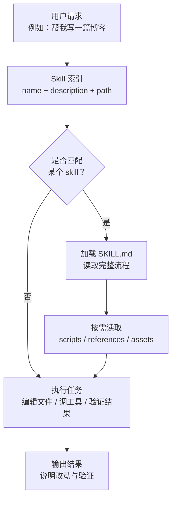
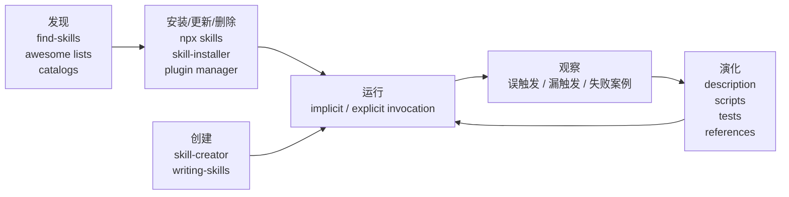
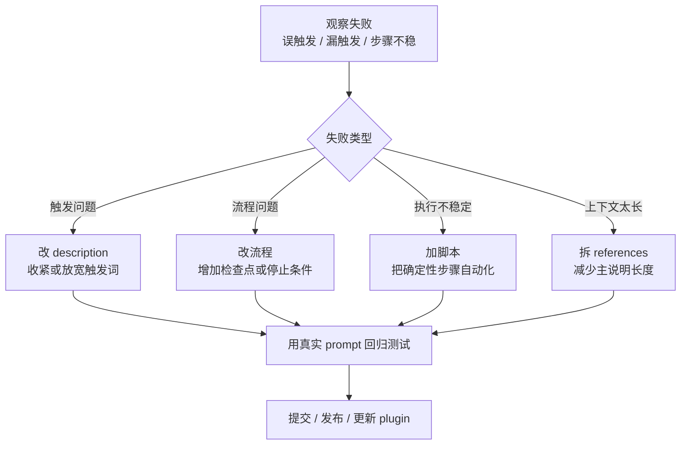

+++
title = "Agent Skill Management：把 AI 助手从聪明变成稳定"
date = 2026-05-23T10:30:00+08:00
tags = ["agent", "codex", "skills", "workflow"]
categories = ["notes"]
draft = true
image = "/images/icons/terminal.png"
libraries = ["mermaid"]
description = "一篇关于 agent skill 管理的实践笔记：如何安装、创建、删除、禁用、更新和演化 skill，以及哪些元 skill 最值得先装。"
+++

## 为什么需要 Skill {#why-skills-matter}

用 coding agent 一段时间后，我发现真正影响效率的不是“模型今天够不够聪明”，而是它能不能稳定地复用经验。

比如同一个仓库里，测试命令是什么、哪些文件不能随便改、生成图片应该放在哪个目录、发布前要跑什么检查、遇到 bug 应该先定位根因还是先补丁。人可以靠记忆和习惯处理这些隐性流程，但 agent 每次启动时并不天然知道这些约定。把所有规则都塞进一份巨大的 `AGENTS.md` 也不是好办法：上下文会膨胀，触发边界会模糊，最后变成“什么都写了，但关键时刻不一定用”。

skill 的价值就在这里：它把一类任务的工作流打包成一个可复用、可触发、可演化的小模块。好的 skill 不只是 prompt 模板，而是带边界的操作手册：什么时候用、什么时候不用、需要读哪些资料、可以运行哪些脚本、完成前如何验证。

这篇文章讨论的不是某个单独 skill 怎么写，而是 **agent skill management**：如何增加 skill、删除或禁用 skill、用工具管理 skill、推荐先装哪些元 skill，以及 skill 如何在真实使用中进化。

## Skill 的最小模型 {#skill-model}

在 Codex 的语境里，一个 skill 本质上是一个目录，里面至少有一个 `SKILL.md`。这个文件通常包含两层信息：

- metadata：`name` 和 `description`，用来告诉 agent 这个 skill 是什么、什么时候应该触发；
- instructions：真正的工作流说明，告诉 agent 触发后应该怎么做。

目录里还可以放辅助材料：

- `scripts/`：确定性脚本，比如格式转换、校验、生成文件；
- `references/`：长文档、规范、示例，避免把所有内容都塞进主说明；
- `assets/`：模板、图片、配置片段、脚手架资源。

最重要的机制是 **progressive disclosure**。agent 启动时不应该一次性读完所有 skill 的全部内容，而是先看到 skill 的名称、描述和路径；只有当任务匹配某个 skill 时，才加载完整的 `SKILL.md`。这和程序里的 lazy loading 很像：常驻的是索引，按需加载的是实现。



这个模型决定了 skill 管理的第一条原则：**description 是入口，不是简介**。它不是给人看的营销文案，而是给 agent 做触发判断的路由规则。description 写得太宽，会导致误触发；写得太窄，agent 又想不起来用。

一个好的 description 应该回答三个问题：

- 这个 skill 解决哪类任务？
- 用户通常会怎么表达这类任务？
- 哪些相邻任务不应该触发它？

比如“写博客”类 skill 的描述应该明确触发词包括 `write a post`、`create a blog entry`、`draft an article`，同时说明它适用于某个具体 Hugo 博客结构，而不是所有 Markdown 写作。

## Skill 的生命周期 {#skill-lifecycle}

skill 管理不是一次性的安装动作，而是一套生命周期：从可信来源添加，放到合适作用域，持续更新，最后在不再有用时禁用或删除。

更好的类比是依赖管理：谨慎安装，按作用域隔离，更新前 review，定期清理。

### 谨慎增加 Skill {#adding-skills}

增加 skill 有三种常见路径：从已有生态安装、从仓库挑选、自己创建。

### 从官方或社区安装 {#install-from-catalog}

如果只是想给本地环境增加一个常用能力，优先用安装工具，而不是手动复制文件。我的默认建议是：**日常用 `skills` CLI 管理，Codex-only 的官方 curated skill 再用 `$skill-installer`。**

`vercel-labs/skills` 这种 CLI 更像“包管理器”。它支持 GitHub shorthand、完整 URL、GitLab、任意 git URL、本地路径，也能指定安装到哪个 agent。对于同时使用 Codex、Claude Code、Cursor、Gemini CLI 等多个 agent 的人来说，用它统一安装、列表、更新、删除，会比在每个 agent 里各管一套更清楚：

```shell
# 列出仓库里的 skill
npx skills add vercel-labs/agent-skills --list

# 只安装指定 skill
npx skills add vercel-labs/agent-skills \
  --skill frontend-design \
  --skill skill-creator

# 安装到特定 agent
npx skills add vercel-labs/agent-skills \
  --agent codex \
  --agent claude-code
```

Codex 的 `$skill-installer` 更适合当作原生兜底入口：当官方文档或 Codex UI 直接告诉你安装某个 curated skill，或者你只想在当前 Codex 会话里临时试一个 Codex-only skill，可以直接用它：

```text
$skill-installer linear
```

所以两者不是互斥关系：`skills` CLI 负责日常 inventory 和跨 agent 管理，`$skill-installer` 负责 Codex 原生 curated 入口。长期分发时，plugin 通常又比散落的 skill 文件更可控，因为 plugin 可以把多个 skill、MCP 配置、app integration 和展示元数据打包在一起。

这里需要注意一个现实问题：skill 生态还很新，仓库质量差异很大。不要看到 “1000+ skills” 就全装。skill 不是 VS Code extension，装多了会增加触发噪声，也会挤占初始 skill 列表预算。更好的做法是：先列出候选，再按任务频率和来源可信度安装。

### 从网上找 Skill {#find-skills-online}

找 skill 可以从几个入口开始：

- 官方 catalog：例如 `openai/skills`；
- 跨 agent 工具仓库：例如 `vercel-labs/skills`；
- curated list：例如 `awesome-agent-skills`；
- 成体系的方法论仓库：例如 `obra/superpowers`。

挑选时我会看五个信号：

| 信号 | 为什么重要 |
| --- | --- |
| 来源是否可信 | 官方、知名团队、真实项目自用的 skill 通常更可靠 |
| description 是否清楚 | 触发边界不清楚的 skill 会污染工作流 |
| 是否有脚本或测试 | 复杂 skill 只靠自然语言容易漂移 |
| 最近是否维护 | agent 工具链变化很快，过旧说明可能失效 |
| 是否过度索权 | 会运行网络、写大范围文件、改配置的 skill 要谨慎 |

`find-skills` 这类元 skill 的价值就在于帮你做第一轮发现，但最终仍然要人工判断质量。我的经验是：先安装少量“流程型”和“元管理型” skill，再按项目需求补专业 skill。

### 自己创建 Skill {#create-your-own}

当你发现自己第三次向 agent 解释同一套流程时，就该考虑写 skill 了。

可以用 `$skill-creator` 交互式创建。它通常会问：

- 这个 skill 做什么？
- 什么时候触发？
- 是 instruction-only，还是需要脚本？
- 是否需要示例、模板、参考文件？

最小版本可以手写：

```markdown
---
name: my-blog-writer
description: Write Hugo posts for this repository when the user asks to draft, edit, or publish a blog post.
---

# My Blog Writer

Use this skill when writing posts for this Hugo blog.

Workflow:

1. Inspect existing post structure.
2. Create a post bundle under `content/zh/posts/<slug>/`.
3. Use TOML front matter.
4. Prefer Mermaid for diagrams.
5. Run `hugo --minify` before claiming completion.
```

这已经是一个可用 skill。但真正让它稳定的是后续迭代：增加反例、写清楚不要触发的场景、把可确定的步骤搬进脚本、补充验证命令。

### Skill 放在哪里 {#where-to-store-skills}

Codex 会从多个位置读取 skill。粗略可以分成四类：

| 作用域 | 适合放什么 |
| --- | --- |
| repo skill | 某个仓库或模块专属流程，比如博客发布、固件编译、内部测试命令 |
| user skill | 个人长期使用的通用习惯，比如写简历、画图、调研网页 |
| admin skill | 团队或机器级默认 skill，比如公司内部 SDK、基础自动化 |
| system skill | Codex 自带或平台提供的基础能力 |

我的建议是：

- 和仓库强绑定的流程放 repo 里，比如 `.agents/skills/`；
- 个人偏好和跨 repo 工作流放用户目录；
- 要共享给多人、还要带 MCP/app 配置时，做成 plugin；
- 不要把所有个人 skill 都塞进某个项目仓库，否则团队成员会被你的私人习惯影响。

### 如何删除、禁用、更新 Skill {#remove-disable-update}

skill 管理里最容易被忽略的是删除。很多人只会安装，不会清理，最后 agent 每次启动都面对一堆过时规则。

我建议把清理分成三档：禁用、删除、归档。

### 先禁用，不急着删 {#disable-first}

如果一个 skill 偶尔误触发，或者你怀疑它和另一个 skill 冲突，优先禁用。Codex 可以在 `~/.codex/config.toml` 里用 `[[skills.config]]` 禁用指定 skill：

```toml
[[skills.config]]
path = "/path/to/skill/SKILL.md"
enabled = false
```

禁用的好处是可逆。你可以观察一段时间：没有它之后，agent 是否更稳定？是否少了误触发？如果只是 description 太宽，就改 description；如果工作流本身已经过时，再删除。

### 确认不用后再删除 {#delete-skills}

删除方式取决于来源：

| 来源 | 删除方式 |
| --- | --- |
| 本地手写 skill | 删除对应目录 |
| repo skill | 从仓库删除并提交 |
| symlink 安装 | 删除 symlink 或源目录，注意不要误删共享源 |
| plugin 提供 | 用对应 plugin 管理方式卸载或禁用 plugin |
| CLI 安装 | 用该 CLI 的 remove/update 流程，或检查安装目录后清理 |

删除前最好先回答两个问题：

- 有没有其他 skill 引用它作为 required background 或 sub-skill？
- 有没有脚本、模板、MCP 配置依赖它？

skill 之间如果有依赖关系，删除一个“基础流程 skill”可能会让上层 skill 变得含糊。比如删除 `verification-before-completion` 之后，很多“完成前验证”的指令会失去共同语义。

### 更新要看来源 {#update-skills}

更新也不能一概而论：

- plugin skill：优先用 plugin manager 更新；
- git repo skill：拉取上游后 review diff；
- copied skill：手动对比上游，避免覆盖本地定制；
- 自己写的 skill：像代码一样走 review 和验证。

对重要 skill，我不建议自动无脑更新。skill 是 agent 的行为规则，更新一次等于改变工作方式。尤其是会运行命令、改文件、调用外部服务的 skill，更新后至少要用几个真实 prompt 做回归测试。

## 管理工具 {#management-tools}

skill 管理大致有三类工具。

第一类是 **安装器 / 包管理器**。日常主力可以是 `vercel-labs/skills` 的 `npx skills add/list/update/remove`：它解决“从哪里来、装到哪里去、装给哪个 agent、以后怎么更新或删除”的问题。Codex 的 `$skill-installer` 则更像 Codex 原生入口，适合官方 curated skill、Codex-only 临时试用，或者 `skills` CLI 不知道具体来源路径时兜底。

第二类是 **发现器**。例如 `find-skills`。它们解决“有没有现成 skill”的问题。但发现器不能替你判断质量，只能缩小搜索范围。

第三类是 **作者工具**。例如 `skill-creator`、Superpowers 里的 `writing-skills`。它们解决“如何把经验变成可复用 skill”的问题。



如果只推荐一个起步组合，我会选：

- `skills` CLI：负责日常安装、列表、更新、删除；
- `skill-installer`：负责 Codex curated / Codex-only 兜底；
- `find-skills`：负责发现；
- `skill-creator`：负责创建；
- `verification-before-completion`：负责完成前证据；
- `systematic-debugging`：负责 bug 调查；
- `requesting-code-review`：负责变更审查。

这几个 skill 的共同点是：它们不是某个技术栈的技巧，而是改善 agent 工作方式的元能力。

## 运行策略 {#operating-strategy}

真正的问题不是“最多能装多少 skill”，而是“哪一小组 skill 能让 agent 在真实工作里更可预测”。

我的建议是：先装元 skill，再装工程流程 skill，最后按实际项目边界补领域 skill。

### 推荐安装哪些 Skill {#recommended-skills}

下面是我会优先考虑的 skill 类型。

### 第一批：元 Skill {#meta-skills}

这些 skill 不直接写业务代码，而是管理 agent 的工作方法。

| Skill | 用途 |
| --- | --- |
| `skill-creator` | 把重复流程变成新 skill |
| `skills` CLI | 日常安装、列出、更新、删除 skill，尤其适合跨 agent 管理 |
| `skill-installer` | Codex 官方 curated skill 或 Codex-only 临时安装的兜底入口 |
| `find-skills` | 搜索已有 skill，减少重复造轮子 |
| `writing-skills` | 按更严格的方法写和测试 skill |
| `using-superpowers` | 强制 agent 在任务前检查相关 skill |

### 第二批：工程流程 Skill {#engineering-workflow-skills}

这些 skill 对大多数代码仓库都有价值。

| Skill | 用途 |
| --- | --- |
| `systematic-debugging` | 遇到 bug 时先定位根因，避免拍脑袋修 |
| `test-driven-development` | 用 RED-GREEN-REFACTOR 管住实现节奏 |
| `verification-before-completion` | 完成前必须跑验证，避免“看起来修了” |
| `requesting-code-review` | 以 review 视角找风险和遗漏 |
| `receiving-code-review` | 处理 review feedback 时先验证再改 |
| `using-git-worktrees` | 做较大变更时隔离工作区 |

`obra/superpowers` 值得单独看，因为它不是一个单点 skill，而是一套组合式方法论。它把 brainstorming、plan、TDD、debugging、review、verification、finishing branch 串成完整开发流程。即使你不完全照它的强约束执行，也可以从里面学习“流程 skill 应该怎样互相连接”。

### 第三批：领域 Skill {#domain-skills}

领域 skill 要按你的工作内容安装。比如：

- 前端：design system、Figma、可访问性、Playwright 检查；
- 文档：Hugo、Docusaurus、Markdown lint、diagram；
- 后端：框架约定、数据库 migration、API contract；
- 运维：Docker Compose、Kubernetes、Terraform；
- 研究：论文阅读、实验记录、benchmark 分析。

领域 skill 的判断标准不是“看起来很强”，而是“它是否知道你的项目边界”。一个通用 frontend skill 可能帮你做漂亮界面，但如果它不知道当前项目的组件库、色彩规范、路由结构，就容易创造额外风格。repo-scoped skill 往往比泛用 skill 更值钱。

### Skill 如何进化 {#skill-evolution}

skill 不是一次写完的文档，而是一个会被真实使用校准的系统。每次 agent 用错 skill，都是一次训练数据。

我会用下面这个循环维护 skill：



几个经验很关键。

第一，先修 description。很多 skill 问题不是正文写得不够多，而是入口写错了。description 应该像路由表，不像介绍页。

第二，给 skill 写“不要做什么”。agent 特别容易把相邻任务合并。比如写博客 skill 应该说明它不负责发布、部署、生成营销图，除非用户明确要求。

第三，把确定性操作放进脚本。凡是“每次都一样”的步骤，最好不要让 agent 重新解释。比如解析文件、生成图表、格式化输出、校验 front matter，都适合脚本化。

第四，保留失败案例。不要只写 happy path。一个成熟 skill 应该包含常见误区、停止条件、需要向用户确认的边界。

第五，控制 skill 数量。装太多 skill 会让初始索引变吵，也会增加隐式触发的不确定性。skill 管理不是收藏，而是修剪。

### 一个实用的 Skill 管理策略 {#practical-strategy}

如果从零开始，我会按这个顺序做：

1. 用 `skills` CLI 作为日常管理入口，先保证自己能 `list`、安装指定 skill、更新和删除。
2. 先装元 skill：`find-skills`、`skill-creator`，并保留 `$skill-installer` 作为 Codex curated 兜底入口。
3. 再装工程流程 skill：debugging、verification、code review、TDD。
4. 观察一周真实任务，把重复解释超过三次的流程写成 repo skill。
5. 对每个新增 skill 写清楚触发词和反触发场景。
6. 每月清理一次：禁用误触发 skill，删除不用的 skill，更新关键 skill。
7. 对重要 skill 建立回归 prompt：至少覆盖应该触发、不能触发、边界任务三类。

最后形成的结构大概是：

```text
~/.agents/skills/
  skill-creator/
  find-skills/
  star-resume/
  diagram-tools/

repo/.agents/skills/
  project-build/
  project-release/
  project-blog-writer/
  project-code-review/
```

个人目录放长期习惯，repo 目录放项目事实。两者分开，skill 才不会互相污染。

## 结语 {#conclusion}

skill management 的核心不是安装更多能力，而是让 agent 的行为更可预测。

一个好 skill 应该像一个小而清楚的接口：输入是什么、什么时候调用、内部怎么做、失败时如何停、完成时如何验证。安装 skill 是开始，删除和禁用 skill 是治理，持续演化 skill 才是长期收益。

如果把 agent 看作一个会使用工具的协作者，那么 skill 就是团队流程的可执行版本。它把“我通常会怎么做”变成“agent 下次也能稳定这么做”。这一步做好之后，AI 助手不只是更聪明，而是更可靠。

### Further Reading {#further-reading}

- [Agent Skills - Codex](https://developers.openai.com/codex/skills)
- [openai/skills](https://github.com/openai/skills)
- [vercel-labs/skills](https://github.com/vercel-labs/skills)
- [obra/superpowers](https://github.com/obra/superpowers)
- [VoltAgent/awesome-agent-skills](https://github.com/VoltAgent/awesome-agent-skills)
- [Agent Skills Specification](https://agentskills.io/specification)
