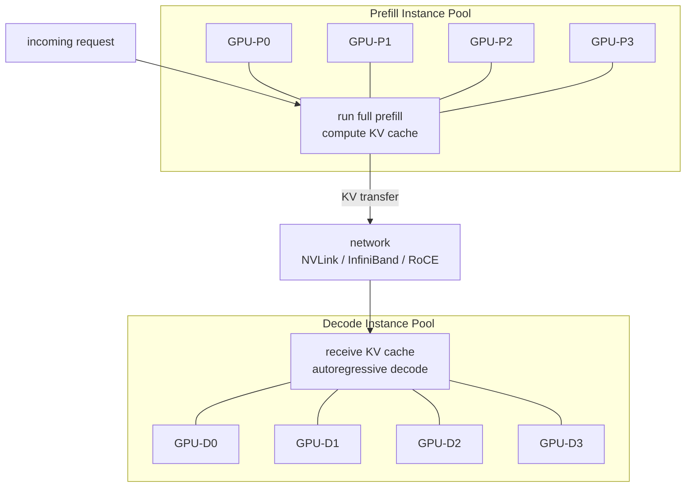
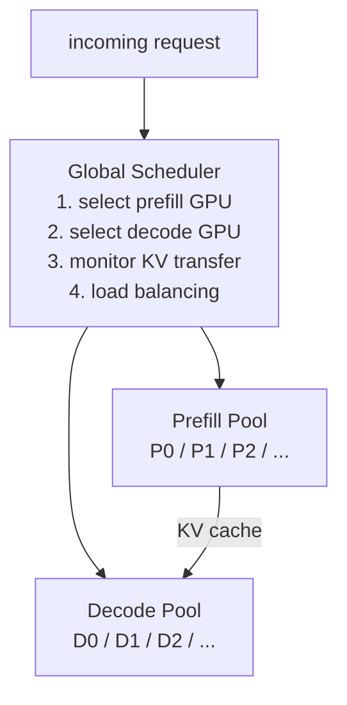

+++
title = "Disaggregated Prefill：把计算拆到不同机器上"
date = 2026-04-22T12:00:00+08:00
tags = ["llm", "inference", "systems", "distributed", "scheduling"]
categories = ["AI"]
series = ["LLM Inference Internals"]
draft = false
image = "/images/posts/disaggregated-prefill/cover.svg"
libraries = ["mathjax", "mermaid"]
description = "把 prefill 和 decode 路由到不同 GPU 池，可以彻底消除两者的资源干扰，让 TTFT 与 TPOT 分开扩容；代价是必须跨机器迁移 KV cache。"
+++

## 为什么同一张 GPU 上的共存有上限 {#ceiling}

[chunked prefill]() 通过把 prefill 切成小块，让 prefill 和 decode 在同一张 GPU 上共存得更平滑。但即使 chunk 切得再好，prefill 和 decode 仍然在*共享同一张 GPU*。它们会竞争：

- **HBM 带宽**：每一次迭代里，两者都要从 GPU 显存读写数据
- **计算单元**：prefill 的 GEMM 和 decode 的 GEMV 会争用同一组 tensor cores
- **KV cache 空间**：prefill 会临时占用本来可以服务 decode 请求的 cache blocks

在中等规模下，这种共存通常可以接受。到了大规模场景，比如每秒数千请求、严格 SLO、多 GPU 集群，资源竞争就会变成 chunking 本身无法解决的瓶颈。

先把视角拉远，看 prefill 和 decode 分别想从硬件里得到什么：

| 属性 | prefill | decode |
|---|---|---|
| 操作类型 | GEMM：matrix × matrix | GEMV：vector × matrix |
| 计算瓶颈 | compute-bound，受 tensor cores 限制 | memory-bandwidth-bound，受显存带宽限制 |
| 算术强度 | 高，\\(\sim O(L \cdot d)\\) FLOP/byte | 很低，\\(\sim O(1)\\) FLOP/byte |
| 理想 GPU MFU（model FLOP utilization） | 50–70% | 5–15% |
| KV cache 生命周期 | 短暂：算出来后立刻交给 decode | 持久：每生成一个 token 都继续增长 |
| 对 batch size 的敏感度 | 较低：吞吐已经能随 \\(L\\) 放大 | 很高：更大的 batch 能摊薄每步带宽成本 |

这两个 workload 想要的东西几乎相反。prefill 想在大矩阵上激进地使用计算单元，也不太关心自己的 KV cache 占用，因为它很快就会把 KV 交出去。decode 想维持一个大的并发 batch 来摊薄带宽成本，而且需要稳定、长期驻留的 KV cache。

**强行让它们共享同一张 GPU，结果就是两边都拿不到自己最想要的运行环境。**

## disaggregated prefill 架构 {#architecture}

解法是：把 prefill 和 decode 路由到*不同的* GPU 实例。

单个请求的流程是：

1. prefill 实例接收请求，对完整 prompt 做一次 forward pass，产出 KV cache 和第一个生成 token
2. KV cache 通过网络传给某个 decode 实例
3. decode 实例接管请求，并持续做自回归生成直到 EOS

从 decode 实例的视角看，它收到的是已经可用的 KV cache，因此可以立即开始生成；它后面再也不会碰到 prefill workload。

### 为什么两边都会受益 {#benefits}

**prefill 实例**现在可以：

- 在没有 decode 流量干扰显存带宽的情况下，尽可能提高计算利用率
- 处理更长的 prompt，而不用担心 KV cache 的长期驻留成本，因为 KV 会立刻交出去
- 更激进地使用 tensor parallelism，因为 prefill 在 prompt tokens 维度上天然适合并行

**decode 实例**现在可以：

- 维持更大的并发 batch，因为所有驻留请求都是 decode-only
- 让 KV cache layout 更稳定、更紧凑，不再和短生命周期的 prefill KV blocks 混在一起
- 在 decode pool 内使用 [prefix caching]()，并且不被 prefill 干扰

**两个 SLO 指标被解耦了：**

| 指标 | 混合架构（chunked prefill） | disaggregated 架构 |
|---|---|---|
| TTFT | 受共享 GPU 上的 prefill queue 限制 | 由 prefill pool 的规模控制 |
| TPOT | 会受到 prefill chunks 共享 iteration 的影响 | 隔离：decode 不再看到 prefill |

一旦做了 disaggregation，TTFT 可以通过增加 prefill 实例优化，TPOT 可以通过增加 decode 实例优化。两个旋钮不再互相打架。

## 工程难点：KV cache 迁移 {#migration}

真正麻烦的地方是：从 prefill 实例把 KV cache 传给 decode 实例，这件事很贵。

### 要搬多少数据？ {#data-volume}

对于一个有 \\(L\\) 层、\\(n_h\\) 个 KV heads、head dim 为 \\(d_h\\)、使用 BF16 精度的模型：

$$
\text{KV bytes per token} = 2 \times L \times n_h \times d_h \times 2
$$

以 LLaMA-3 70B 为例（GQA：\\(L = 80\\)，\\(n_h = 8\\)，\\(d_h = 128\\)）：

$$
2 \times 80 \times 8 \times 128 \times 2 = 327{,}680 \text{ bytes} \approx 320 \text{ KB per token}
$$

| prompt 长度 | 需要传输的 KV cache |
|---|---|
| 1K tokens | ~320 MB |
| 8K tokens | ~2.5 GB |
| 32K tokens | ~10 GB |

注意这是*每个请求*的代价。如果系统每秒有 100 个请求，并且 prompt 平均 4K tokens，那么集群需要持续承载大约 100 GB/s 的 KV 传输。

### 网络带宽要求 {#bandwidth}

假设 prefill pool 的吞吐是 10K tokens/second：

$$
\text{required bandwidth} = 10{,}000 \times 320 \text{ KB} = 3.2 \text{ GB/s}
$$

不同互联方式大致如下：

| interconnect | 带宽 | 是否足够？ |
|---|---|---|
| NVLink（同节点多 GPU） | ~900 GB/s | 轻松足够，不是瓶颈 |
| InfiniBand HDR（200 Gb/s） | ~25 GB/s | 足够，并且有余量 |
| RoCE（100 GbE） | ~12.5 GB/s | 高并发下比较紧张 |
| 普通 Ethernet（10 GbE） | ~1.25 GB/s | 不足 |

实际结论是：**同节点内通过 NVLink 做 disaggregation 基本免费；跨节点 disaggregation 需要 InfiniBand 或带 RDMA 的 RoCE**。普通以太网支撑不了生产规模下的 KV 传输速率。

### 传输流水线化 {#pipelining}

最朴素的做法是：prefill 实例先跑完所有 \\(L\\) 层，然后再一次性传输完整 KV cache。decode 实例必须等完整传输结束后，才能生成第一个 token。

这会把 \\(T_{\text{transfer}}\\) 加到 TTFT 里：

$$
\text{TTFT} = T_{\text{prefill}} + T_{\text{transfer}} + T_{\text{decode\_queue}}
$$

优化方式是：**按层做传输流水线**。prefill 实例一旦完成第 \\(l\\) 层，就立刻传输这一层的 KV slice；同时继续计算后面的 \\(l+1, \ldots, L\\) 层：



如果流水线完全理想，\\(T_{\text{transfer}}\\) 会被 \\(T_{\text{prefill}}\\) 覆盖，只剩下很小的尾部延迟。实际系统里重叠不会完美，因为 RDMA 建连、调度、每层粒度都会带来开销，但只要能部分重叠，TTFT 的有效传输成本就会明显下降。

## 两个池子的调度与扩容 {#scheduling-scaling}

disaggregated 架构需要一个**全局 scheduler** 来协调两个池子：

### scheduler 需要做的决策 {#scheduler}

**prefill 实例选择**：把请求路由到 queue 最短的 prefill 实例。prefill 吞吐比较可预测，因为它大致和 prompt length 成正比，所以调度器可以提前估算负载。

**decode 实例选择**：选择 KV cache 空间最充足的 decode 实例，同时它还应该和被选中的 prefill 实例在拓扑上足够近，从而减少传输距离。

**KV cache affinity**：如果某个 decode 实例已经有和当前 prompt 匹配的 cached prefix，就优先把请求路由到那里复用 cache blocks，避免再次传输这部分 KV。

### 独立扩容 {#scaling}

disaggregation 最核心的经济价值，是可以弹性地、独立地扩容。

在混合架构里，如果 prefill 或 decode 任意一侧负载增加 2×，你往往要扩整个集群，即使真正的瓶颈只在其中一侧。

在 disaggregated 架构里，每个池子可以单独扩：

| 负载模式 | 最优配置 |
|---|---|
| 长 prompt，短输出 | 更多 prefill 实例，更少 decode 实例 |
| 短 prompt，长输出 | 更少 prefill 实例，更多 decode 实例 |
| 比较均衡 | 两个池子大致相等 |
| 新请求突发 | 临时扩 prefill |

**生产系统里的观测比例**：Microsoft 2024 年的 Splitwise 论文分析了真实 Azure LLM 流量，发现最优 prefill:decode 实例比例大约是 **1:3**。一个 prefill 实例可以服务三个 decode 实例后才成为瓶颈，这反映了典型生成长度下 decode 阶段通常更长。

## 真实系统与背后的原则 {#real-systems}

### DistServe（2024）

DistServe 系统分析了两个池子各自适合的并行策略：

- **prefill 实例**更适合 **tensor parallelism**：单个长 prompt 能从把 attention 计算拆到多张 GPU 上受益
- **decode 实例**更适合 **pipeline parallelism**：大量并发的短 decode steps 可以沿 GPU stage 流水线执行，降低每个 token 的 all-gather 通信成本

DistServe 的核心结论是：两个阶段的最优并行策略不同；让它们共享同一张 GPU，会迫使系统接受一个两边都不最优的折中。

### Mooncake（Kimi，2024）

Mooncake 提出了 **KVCache-centric** 架构，把 KV cache 当成一等公民的分布式对象来管理：

- prefill 实例把 KV 写入一个通过 RDMA 访问的分布式 KV store
- decode 实例直接从这个 store 读取 KV，绕过 CPU
- prefix caching 可以跨分布式 store 生效：P0 上算出的 cached prefix，可以被路由到 P1 的请求复用，而不需要重新传输

Mooncake 本质上把 KV cache 管理变成了一个分布式存储问题，因此也会自然引入一致性、局部性、放置策略这些存储系统里的优化。

### Splitwise（Microsoft，2024）

Splitwise 在 Microsoft Azure 的真实生产流量上验证了 disaggregation：

- 对长 prompt workload：TTFT 降低 **90%+**
- 对长生成 workload：吞吐提升 **2×+**
- 最优 prefill:decode 比例大约是 **1:3**

### 关注点分离 {#separation}

这里还有一个更深层的系统原则：在计算机系统里，强行让异构 workload 共享同一组资源，往往会导致互相拖累。常见解法都是先识别不同 workload 的资源需求，然后把每个 workload 放到更匹配的资源上。

- 数据库：read replicas vs. write-primary
- CPU pipeline：in-order vs. out-of-order execution units
- 网络：control plane vs. data plane separation
- LLM serving：prefill（compute-bound）vs. decode（memory-bound）

disaggregated prefill 就是这个原则在 LLM inference 上的应用。它的成本是协调：KV cache 必须被序列化、传输、再被 decode 端接管，这会引入新的失败模式和新的延迟项。但当集群足够大、网络足够快时，协调开销会小于把两个 workload 分别运行在最优状态下带来的收益。

### 总结 {#summary}

disaggregated prefill 是 [chunked prefill]() 之后自然的下一步：不再把 prefill 和 decode 交错放在同一张 GPU 上，而是把它们拆到专用池子里。

收益是：

- **TTFT 和 TPOT 解耦**：每个指标都由对应池子的规模独立控制
- **每个池子运行在自己的最优点**：prefill 追求高计算利用率，decode 用大 batch 饱和 HBM 带宽
- **独立、经济地扩容**：长 prompt 多加 prefill，长输出多加 decode，互不绑定

代价是：

- **跨网络迁移 KV cache**：生产规模的跨节点传输需要 InfiniBand 或 RDMA
- **全局 scheduler 更复杂**：要协调两个池子，管理 KV affinity，并处理传输失败
- **运维复杂度上升**：两个池子要分别监控、调参和 autoscale

在中等规模下，chunked prefill 仍然是更务实的选择。到了严格 SLO 和大规模集群场景，disaggregation 正在成为越来越明确的工业方向；Kimi 的 Mooncake、Azure 的 Splitwise，以及生产 serving stack 里的更广泛采用，都指向了这个趋势。
