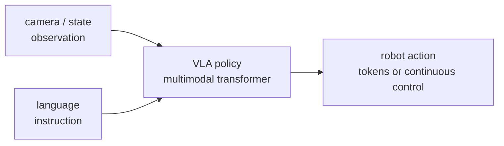
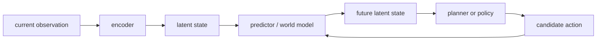
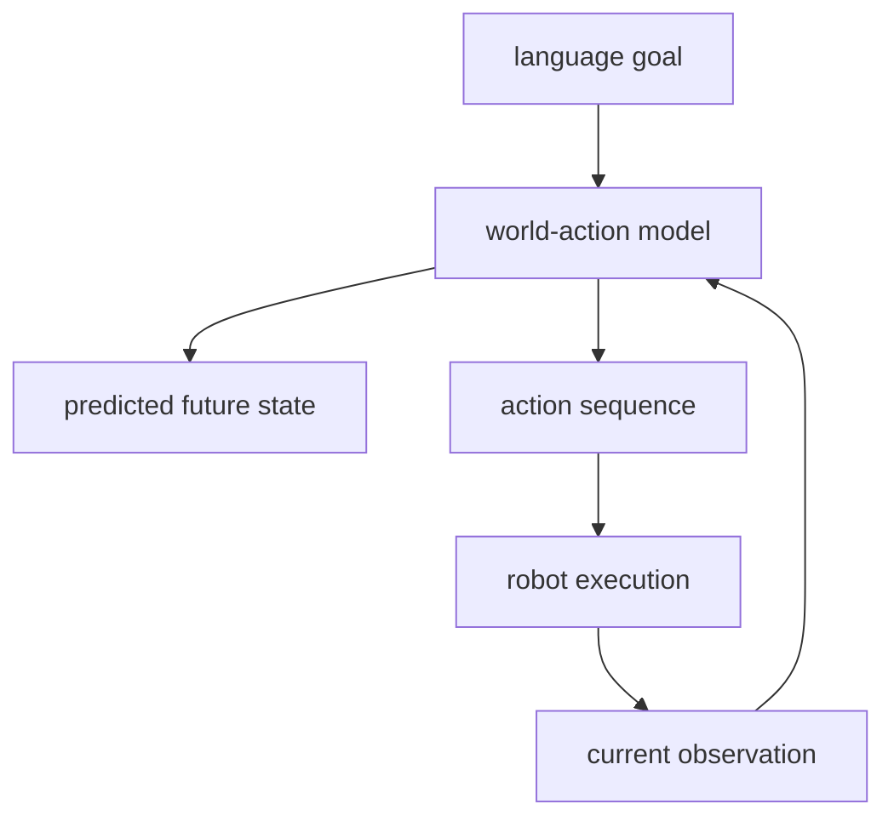
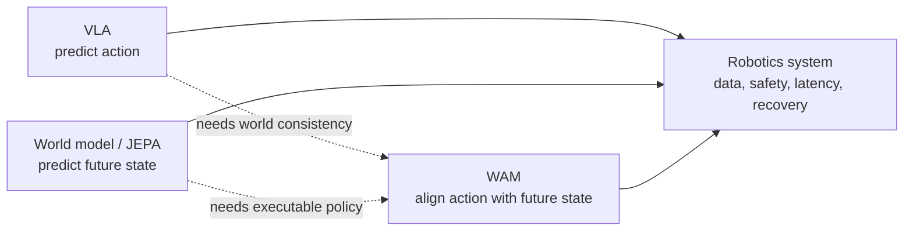

+++
title = "具身智能模型的三条路线：VLA、世界模型与 WAM"
date = 2026-06-18T10:00:00+08:00
tags = ["embodied-ai", "robotics", "vla", "world-model", "jepa"]
categories = ["notes"]
draft = false
image = "/images/posts/embodied-models-vla-jepa-wam/embodied-models-cover.svg"
libraries = ["mathjax", "mermaid"]
description = "从一个桌面机器人例子出发，梳理具身智能里 VLA、JEPA-style world model 与 WAM 三类模型的预测目标、训练信号和系统边界。"
+++

如果大语言模型只需要回答一句话，那么具身智能模型要多回答一个问题：**这句话接下来要变成什么动作？**

比如你对桌面机器人说：“把红色杯子推到盘子旁边。”模型不只要识别杯子、理解“旁边”，还要决定机械臂下一步往哪里移动、夹爪什么时候闭合、动作失败后如何修正。这里的难点不是多模态本身，而是语言、视觉、物理状态和连续动作之间有闭环：动作会改变世界，新的世界又会改变下一步动作。

这篇文章把近期具身领域的模型发展整理成三条路线：

- **VLA（Vision-Language-Action）**：把视觉和语言直接接到动作输出上，像给机器人训练一个多模态策略。
- **JEPA / world model**：先学习世界如何变化，尤其是在 latent space 里预测未来状态，再把它用于规划或控制。
- **WAM（World Action Model）**：把“预测世界”和“产生动作”放到同一个生成模型里，让动作成为对未来世界变化的解释。

这不是严格互斥的分类。更准确地说，它们是在问同一个问题：**模型到底应该预测 action，预测 future state，还是同时预测两者的关系？**

这里要先澄清一个容易混淆的层级：**world model 不是和 VLA、JEPA、WAM 完全并列的第四类**。它更像一个总问题：模型是否显式学习“行动之后世界会怎样变化”。JEPA 是一种偏 representation-learning 的 world-model 路线；WAM 则把 world model 和 action model 绑得更紧。VLA 也可以隐式学到一部分 world model，但它通常不把“预测未来世界”作为显式训练目标。



## 先把问题写成一个小闭环 {#closed-loop}

先不用机器人术语，把一次控制循环写成四个变量：

- \\(o_t\\)：当前观察，比如相机图像、深度图、关节位置。
- \\(g\\)：任务条件，比如一句自然语言指令。
- \\(a_t\\)：下一步动作，比如末端执行器位姿增量或离散动作 token。
- \\(s_{t+1}\\)：动作之后的世界状态，通常不能被完整观测，只能从未来图像或传感器里间接看到。

普通多模态问答大多学的是：

$$p(\text{answer} \mid o, g)$$

具身控制至少要学：

$$p(a_t \mid o_{\le t}, g)$$

但这还不够。因为好动作不是孤立标签，它的意义来自动作之后世界是否朝目标变化：

$$o_t, g \rightarrow a_t \rightarrow o_{t+1} \rightarrow a_{t+1}$$

所以不同模型路线的分歧，主要在于把学习压力放在哪里。

| 路线 | 主要预测目标 | 优点 | 典型风险 |
| --- | --- | --- | --- |
| VLA | 直接预测动作 | 简单、端到端、容易利用大规模机器人轨迹 | 容易把物理因果关系藏进策略黑箱 |
| JEPA-style world model | 预测未来 latent state | 更像“理解世界会怎样变”，可用于规划 | latent 是否足够支持控制，需要额外验证 |
| WAM | 同时建模未来世界与动作 | 把动作解释成改变世界的方式 | 训练目标和数据要求更复杂 |

## VLA：把机器人策略做成多模态模型 {#vla}

VLA 的直觉很直接：既然 transformer 可以把文字、图像、音频都变成 token 序列，那么机器人动作也可以 token 化，或者通过连续 action head 输出。输入是视觉和语言，输出是动作。

代表性脉络大致是：

- **RT-1** 把真实机器人数据组织成序列建模问题，用 Transformer 输出离散化动作。它证明了“scale robot data + sequence model”这条路可行。[^rt1]
- **PaLM-E** 把 embodied observations 注入大语言模型，让语言模型能处理多模态传感输入和具身任务。[^palme]
- **RT-2** 更进一步，把 web-scale vision-language model 的知识迁移到机器人控制，动作也用类似文本 token 的方式表达。[^rt2]
- **Open X-Embodiment / RT-X** 把多个机器人、多个实验室的数据合在一起，推动“跨 embodiment 泛化”。[^rtx]
- **OpenVLA** 和 **Octo** 代表了开源通用机器人策略方向：前者强调 open-source VLA，后者强调跨机器人数据训练的 generalist policy。[^openvla][^octo]
- **\\(\pi_0\\)** 把 action chunk 作为连续轨迹来生成，用 flow matching 让 VLA 更自然地输出高频连续控制。[^pi0]

从机制上看，VLA 像是把机器人控制转成一个条件生成问题：

$$a_{t:t+k} = \text{Policy}(o_{\le t}, g)$$

这里的 \\(k\\) 很关键。只预测单步动作，模型很容易抖动；一次预测一个 action chunk，能让控制更平滑，也让策略学到短时间尺度的技能片段。

VLA 的核心优势是工程上清晰：有数据就训练 policy，有机器人就 roll out，有失败就继续收数据。它的核心边界也很清楚：**模型可能会做对很多动作，却没有显式学到“这个动作会怎样改变世界”的因果模型**。当环境分布、物体物理属性或任务组合方式变化时，端到端策略可能突然失效。

## JEPA / world model：先学世界怎样变 {#jepa}

JEPA（Joint-Embedding Predictive Architecture）关心的不是像素级重建，而是在 representation space 里预测被遮住或未来的部分。I-JEPA 从图像开始，V-JEPA 扩展到视频，核心思想是：不要生成每个像素，而是预测一个抽象表征，让模型学到更稳定的世界结构。[^ijepa][^vjepa]

对具身智能来说，这条路线很诱人。因为机器人真正需要的不是漂亮视频，而是一个能回答“如果我这样动，世界会怎样变”的内部状态。

这里有一个重要差别：

- VLA 直接学 \\(p(a_t \mid o_{\le t}, g)\\)。
- world model 更像学 \\(p(z_{t+1} \mid z_t, a_t)\\)，其中 \\(z_t\\) 是观察的 latent state。

如果模型知道 action 对 future latent 的影响，那么控制就可以变成搜索：尝试几个候选动作，预测未来状态，选最接近目标的那一个。这和自动驾驶、强化学习里的 model-based planning 是同一个思想，只是 representation 由大规模自监督视频学习提供。

V-JEPA 2 把这条线往物理理解和机器人规划推进：用视频自监督学习世界表征，再在 latent space 里做预测和规划。[^vjepa2] 它没有把每件事都端到端塞进一个 action head，而是强调“可预测的物理表征”本身。

这条路线的系统边界是：**好的 representation 不等于好的控制器**。一个 latent 可能很适合视频理解，却不一定保留抓取、接触、摩擦、遮挡恢复所需的信息。因此 JEPA/world model 常常还需要 policy、planner、reward/goal representation 或额外机器人数据来闭环。

## WAM：让动作成为未来世界的解释 {#wam}

WAM 可以理解成对 VLA 和 world model 的折中：不要只预测动作，也不要只预测未来状态，而是把两者绑在一起。一个动作之所以合理，是因为它解释了当前观察如何变成目标中的未来观察。

可以把它写成：

$$p(a_{t:t+k}, z_{t+1:t+k} \mid o_{\le t}, g)$$

也就是说，模型既产生动作，也产生或约束未来 latent。这样做的直觉是：如果机器人说“我要把杯子推到盘子旁边”，那么动作序列和未来画面应该互相一致。

这类想法在 2025-2026 年的论文和 survey 里越来越常见，常被放在 “world models for robotics” 或 “world action models” 的标题下讨论。[^wamsurvey][^worldmodelsurvey] 它背后的趋势很明确：单纯扩大 VLA 参数和数据当然有用，但如果模型内部没有可操作的 future model，长程任务、失败恢复和新组合任务会很吃力。

WAM 的难点也正是在这里：训练目标更复杂。未来状态可以是视频、latent、object-centric state、language subgoal，动作可以是离散 token、连续轨迹、diffusion/flow 生成的 chunk。不同选择会改变数据需求、推理延迟和部署方式。

## 三条路线其实在共享一个原则 {#principle}

把这些模型放在一起看，会发现它们不是互相替代，而是在不同位置加入结构。

更一般地说，具身模型有三个必须同时满足的约束：

- **语义约束**：动作要符合语言目标，比如“红色杯子”不能拿错。
- **几何约束**：动作要符合空间结构，比如机械臂路径不能穿过桌面。
- **物理约束**：动作要符合世界动力学，比如推杯子会滑动，抓太轻会掉。

VLA 最擅长把语义和示范动作连接起来；JEPA/world model 更关注几何和物理状态的可预测性；WAM 试图让动作生成天然受未来世界约束。

这也解释了为什么具身智能很难只靠一个“机器人版 GPT”解决。语言模型的 token 预测发生在相对稳定的符号空间里，而机器人的 action token 会立刻改变数据分布。**具身智能的核心不是多模态输入，而是行动后的反馈闭环。**

## 读论文时可以用的检查清单 {#reading-checklist}

看一篇新的具身模型论文时，我会先问这几个问题：

- 它预测的是 action、future observation、latent state，还是几者一起？
- action 是离散 token、连续控制、diffusion trajectory，还是 flow-generated chunk？
- 训练数据来自单机器人、多机器人、仿真、视频，还是 web-scale VLM 预训练？
- 模型有没有显式 world model？如果没有，它如何处理失败恢复和 long-horizon task？
- evaluation 是语言理解成功，还是真实机器人上的 task success？
- 部署时推理频率、延迟、安全约束在哪里处理？

如果只记一个判断标准，可以记这个：**真正的具身模型不只是看懂世界，而是要预测自己的动作会怎样改变世界。**

[^rt1]: Anthony Brohan et al., [RT-1: Robotics Transformer for Real-World Control at Scale](https://arxiv.org/abs/2212.06817), 2022.
[^palme]: Danny Driess et al., [PaLM-E: An Embodied Multimodal Language Model](https://arxiv.org/abs/2303.03378), 2023.
[^rt2]: Anthony Brohan et al., [RT-2: Vision-Language-Action Models Transfer Web Knowledge to Robotic Control](https://arxiv.org/abs/2307.15818), 2023.
[^rtx]: Open X-Embodiment Collaboration, [Open X-Embodiment: Robotic Learning Datasets and RT-X Models](https://arxiv.org/abs/2310.08864), 2023.
[^openvla]: Moo Jin Kim et al., [OpenVLA: An Open-Source Vision-Language-Action Model](https://arxiv.org/abs/2406.09246), 2024.
[^octo]: Octo Model Team et al., [Octo: An Open-Source Generalist Robot Policy](https://arxiv.org/abs/2405.12213), 2024.
[^pi0]: Physical Intelligence, [\\(\pi_0\\): A Vision-Language-Action Flow Model for General Robot Control](https://www.physicalintelligence.company/download/pi0.pdf), 2024.
[^ijepa]: Mahmoud Assran et al., [Self-Supervised Learning from Images with a Joint-Embedding Predictive Architecture](https://arxiv.org/abs/2301.08243), 2023.
[^vjepa]: Adrien Bardes et al., [Revisiting Feature Prediction for Learning Visual Representations from Video](https://arxiv.org/abs/2404.08471), 2024.
[^vjepa2]: Meta AI, [V-JEPA 2](https://ai.meta.com/research/publications/v-jepa-2-self-supervised-video-models-enable-understanding-prediction-and-planning/), 2025.
[^wamsurvey]: Siyin Wang et al., [World Action Models: The Next Frontier in Embodied AI](https://arxiv.org/abs/2605.12090), 2026.
[^worldmodelsurvey]: Peng-Fei Zhang et al., [A Step Toward World Models: A Survey on Robotic Manipulation](https://arxiv.org/abs/2511.02097), 2025.
