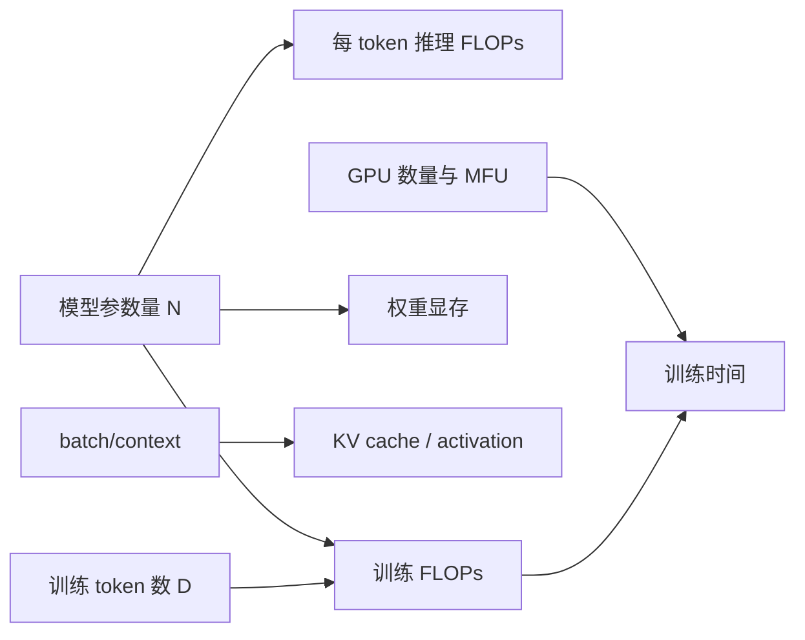

+++
title = "如何估算 LLM 训练和推理需要多少算力与显存"
date = 2026-05-27T22:00:00+08:00
tags = ["llm", "训练", "推理", "flops", "显存", "transformer"]
categories = ["AI"]
draft = false
image = "/images/posts/llm-flops-memory-estimation/flops-memory-icon.svg"
libraries = ["mathjax", "mermaid"]
description = "从矩阵乘法出发，推导 LLM 训练 FLOPs、推理 FLOPs、权重显存、KV cache 和训练显存的可手算估算方法。"
+++

## 引言 {#introduction}

如果我要训练一个 7B 模型，需要准备多少 GPU？训练 1T tokens 大概要多久？如果只是部署推理，一张 24GB 显卡能不能跑？上下文长度从 4K 增加到 32K，显存为什么突然不够了？

这些问题看起来像工程配置问题，但背后其实有一套很稳定的估算框架。只要知道几个核心量：

- 模型参数量 \\(N\\)
- 训练 token 数 \\(D\\)
- batch size \\(B\\)
- 序列长度 \\(S\\)
- 隐藏维度、层数、KV head 数
- 数据类型，例如 FP32、BF16、FP16、INT8、INT4

我们就能对训练和推理需要的**计算量（FLOPs）与显存量**做一阶估算：只保留决定量级的主项，先忽略框架开销、通信、padding、kernel 实现差异等二阶因素。

这篇文章的目标不是精确模拟某个训练框架的 profile，而是建立一个可以手算的 mental model：

读完之后，我们应该能回答两类问题：

- **训练**：总计算量是多少？多久能训完？显存主要花在哪里？
- **推理**：模型能不能放进显存？每个 token 要多少计算？长上下文和并发为什么吃显存？

## 估算前的基本单位 {#estimation-units}

先不要急着区分训练和推理。所有资源估算都需要先统一两个单位：计算量看 FLOPs，显存看 bytes。本节先把 FLOPs 的数量级讲清楚，后面所有公式都从这个积木往上搭。

### FLOPs：矩阵乘法是底层积木 {#what-are-flops}

FLOPs 是 floating point operations 的缩写，即浮点运算次数。深度学习里最重要的运算是矩阵乘法。

假设有两个矩阵：

$$
A \in \mathbb{R}^{m \times k}, \quad B \in \mathbb{R}^{k \times n}
$$

它们相乘得到：

$$
C = AB, \quad C \in \mathbb{R}^{m \times n}
$$

\\(C\\) 里每个元素都需要 \\(k\\) 次乘法和 \\(k-1\\) 次加法。工程估算里通常把一次乘法和一次加法算作 2 FLOPs，所以矩阵乘法的计算量近似为：

$$
\text{FLOPs}(A B) \approx 2mkn
$$

这就是整篇文章的底层积木。Transformer 里的线性层、QKV 投影、MLP、输出投影，本质上都主要由矩阵乘法组成。



如果只记一个规则：矩阵乘法 \\((m \times k) \cdot (k \times n)\\) 的计算量约为 \\(2mkn\\) FLOPs。



## 训练：从总 FLOPs 到训练时间 {#training-compute-time}

训练资源估算的主线是：先算总计算量，再用有效算力换算时间，最后检查显存瓶颈。也就是从 \\(N\\) 和 \\(D\\) 出发，得到 \\(6ND\\)，再把它落到 GPU 数量、MFU 和训练显存上。

### 训练 FLOPs：为什么常用 6ND {#training-flops}

训练比推理贵很多，因为训练不仅要做 forward，还要做 backward。

对 dense Transformer，训练总计算量通常用下面的公式估算：

$$
\text{Training FLOPs} \approx 6ND
$$

其中：

- \\(N\\)：模型参数量
- \\(D\\)：训练 token 数

这个公式的直觉是：

| 阶段 | FLOPs / token | 说明 |
| --- | ---: | --- |
| forward | \\(2N\\) | 用参数计算输出 |
| backward for activations | \\(2N\\) | 把梯度传回上一层 |
| backward for weights | \\(2N\\) | 计算参数梯度 |
| total | \\(6N\\) | 每个 token 的训练成本 |

所以，训练 \\(D\\) 个 token，总计算量就是：

$$
6N \times D = 6ND
$$

### 例子：7B 模型训练 1T tokens {#example-7b-1t}

假设：

- 模型参数量 \\(N = 7 \times 10^9\\)
- 训练 token 数 \\(D = 10^{12}\\)

总训练计算量：

$$\begin{aligned} \text{FLOPs} &\approx 6ND \\\\ &= 6 \times 7 \times 10^9 \times 10^{12} \\\\ &= 4.2 \times 10^{22} \end{aligned}$$

也就是 42 ZFLOPs，其中：

$$
1\ \text{ZFLOP} = 10^{21}\ \text{FLOPs}
$$

这个数字本身很大，不直观。更有用的是把它换成训练时间。

### 从 FLOPs 到训练时间 {#flops-to-time}

训练时间可以用下面的公式估算：

$$
\text{Training time} =
\frac{\text{Total FLOPs}}
{\text{GPU count} \times \text{Peak FLOPs per GPU} \times \text{MFU}}
$$

这里的 MFU 是 Model FLOPs Utilization，即模型实际用上的有效算力占理论峰值的比例。

为什么需要 MFU？因为 GPU 理论峰值只是上限。真实训练会受到很多因素影响：

- kernel 不是永远满载
- attention、normalization、通信、数据加载都有开销
- 多卡训练需要 gradient all-reduce、tensor parallel 通信、pipeline bubble
- batch size 太小时 GPU 利用率低
- activation checkpointing 会增加额外 forward 计算

假设我们用 64 张 GPU 训练 7B 模型，每张 GPU 的 BF16 峰值为 300 TFLOPs，MFU 取 40%：

$$\begin{aligned} \text{Effective FLOPs/s} &= 64 \times 300 \times 10^{12} \times 0.4 \\\\ &= 7.68 \times 10^{15} \end{aligned}$$

训练 1T tokens 的时间：

$$\begin{aligned} \text{Time} &= \frac{4.2 \times 10^{22}}{7.68 \times 10^{15}} \\\\ &\approx 5.47 \times 10^6\ \text{s} \\\\ &\approx 63.3\ \text{days} \end{aligned}$$

所以这个估算告诉我们：7B + 1T tokens + 64 张 300 TFLOPs GPU + 40% MFU，大约是两个月级别的训练任务。



这个结果不是承诺值，而是容量规划的一阶估算。真实时间还会受 checkpoint 保存、故障恢复、数据管道、并行策略、集群调度和训练稳定性影响。



#### 7B 和 70B 的数量级对比 {#size-comparison}

同样训练 1T tokens，参数量增加 10 倍，训练 FLOPs 也近似增加 10 倍：

| 模型规模 | 训练 tokens | 训练 FLOPs | 相对 7B |
| --- | ---: | ---: | ---: |
| 7B | 1T | \\(4.2 \times 10^{22}\\) | \\(1\times\\) |
| 70B | 1T | \\(4.2 \times 10^{23}\\) | \\(10\times\\) |

如果 GPU 数量、单卡峰值和 MFU 都不变，训练时间也近似增加 10 倍。反过来，如果想让 70B 在相同时间内训完，就需要约 10 倍的有效算力。

### 训练 token 数和参数量的关系 {#tokens-vs-parameters}

公式 \\(6ND\\) 说明训练成本同时受参数量和 token 数影响。模型变大一倍，训练成本约翻倍；训练 token 数变大一倍，训练成本也约翻倍。

这解释了一个重要现象：同样的训练预算下，不能只盲目增大模型，也不能只盲目增加数据。参数量和 token 数之间存在取舍。

一种常见的经验是：训练 token 数可以取参数量的十几到几十倍。例如 7B 模型如果按 20 tokens / parameter 的比例训练：

$$
D \approx 20N = 20 \times 7 \times 10^9 = 1.4 \times 10^{11}
$$

也就是约 140B tokens。

如果训练到 1T tokens，则是：

$$
\frac{10^{12}}{7 \times 10^9} \approx 143
$$

也就是约 143 tokens / parameter。这可能是为了让较小模型在更多数据上继续变强，也可能是因为高质量数据、训练目标和下游需求使得最优比例不同。

这里的关键不是背一个固定比例，而是理解：\\(N\\) 和 \\(D\\) 共同决定训练预算。

### 训练显存：不只是模型权重 {#training-memory}

训练显存比推理复杂得多，因为训练不只需要保存权重，还要保存梯度、优化器状态和中间激活。

一个粗略拆分是：

$$\text{Training memory} \approx \text{parameters} + \text{gradients} + \text{optimizer states} + \text{activations} + \text{temporary buffers}$$

#### 参数、梯度和优化器状态 {#params-gradients-optimizer}

以 Adam / AdamW 混合精度训练为例，常见状态包括：

| 项目 | 典型精度 | bytes / parameter |
| --- | --- | ---: |
| 模型参数 | BF16 / FP16 | 2 |
| 参数梯度 | BF16 / FP16 | 2 |
| FP32 master weights | FP32 | 4 |
| Adam 一阶矩 \\(m\\) | FP32 | 4 |
| Adam 二阶矩 \\(v\\) | FP32 | 4 |
| 合计 | - | 16 |

所以只看参数相关状态，训练一个 7B 模型就可能需要：

$$
7 \times 10^9 \times 16 = 112\ \text{GB}
$$

这还没有算 activation。

不同框架和优化器实现会有差异。例如有的实现不保留 FP32 master weights，有的优化器状态可以量化，有的 ZeRO/FSDP 会把参数、梯度和优化器状态切分到多张 GPU 上。

但这个估算足够说明一个关键事实：**训练显存不能按推理显存估算。** 7B FP16 推理权重约 14GB，但训练时仅参数相关状态就可能超过 100GB。

#### Activation 显存 {#activation-memory}

反向传播需要用到前向传播中的中间结果，所以训练时还要保存 activation。

activation 显存大致随下面几个量增长：

$$
\text{Activation memory} \propto B \times S \times L \times d_{model}
$$

其中：

- \\(B\\)：micro-batch size
- \\(S\\)：序列长度
- \\(L\\)：层数
- \\(d_{model}\\)：隐藏维度

这解释了为什么训练时增大 context length 很贵。序列长度变长，不仅 attention 更贵，activation 也会变大。

为了降低 activation 显存，常用 activation checkpointing。它的思路是：前向传播时不保存所有中间结果，反向传播时再重新计算一部分 activation。

这是一种典型的计算-显存权衡：

| 策略 | 显存 | 计算量 |
| --- | --- | --- |
| 不 checkpoint | 高 | 低 |
| activation checkpointing | 低 | 高 |

所以启用 checkpointing 后，\\(6ND\\) 的训练 FLOPs 估算会偏低，因为反向传播期间需要额外重算 forward。

## 推理：从单 token FLOPs 到显存 {#inference-compute-memory}

推理资源估算的主线不同：它更关心单 token 的前向计算、模型权重能不能放进显存，以及上下文和并发带来的 KV cache 成本。也就是从 \\(2N\\) 出发，再检查 weights 和 KV cache。

### 推理 FLOPs：为什么约等于 2N 每 token {#inference-flops}

对于一个 dense Transformer，前向传播时大部分参数都会被用一次。每个参数通常参与一次乘加，因此可以用一个非常简单的公式估算：

$$
\text{Forward FLOPs per token} \approx 2N
$$

其中 \\(N\\) 是模型参数量。

例如 7B 模型：

$$
2N = 2 \times 7 \times 10^9 = 14 \times 10^9
$$

也就是说，7B dense 模型每生成 1 个 token，大约需要 14 GFLOPs 的前向计算。

如果生成 1000 个 token：

$$
14 \times 10^9 \times 1000 = 1.4 \times 10^{13}
$$

也就是约 14 TFLOPs。

这个估算抓住了推理计算量的主项：参数越多，每个 token 的 forward 越贵；生成 token 越多，总计算量线性增长。

#### Prefill 和 decode 的差别 {#prefill-vs-decode}

但 LLM 推理不能只看总 FLOPs，因为推理分成两个阶段：

| 阶段 | 输入形态 | 主要瓶颈 | 特点 |
| --- | --- | --- | --- |
| prefill | 一次处理整段 prompt | 算力 | prompt token 可以并行计算 |
| decode | 每次生成一个 token | 显存带宽 / KV cache | 自回归生成，天然串行 |

例如 prompt 有 4096 tokens，模型会先做一次 prefill，把这 4096 个 token 的 hidden states 和 KV cache 计算出来。这个阶段矩阵乘法规模大，GPU 比较容易吃满。

之后每次 decode 只生成一个 token。虽然每个 token 仍然要过完整模型，但 attention 需要读取越来越长的 KV cache。这个阶段经常不是 FLOPs 不够，而是显存带宽和 KV cache 管理成为瓶颈。

这也是为什么两个请求的总 token 数相同，速度可能差很多：

- 一个请求：4000 prompt + 100 output
- 另一个请求：100 prompt + 4000 output

前者 prefill 重，后者 decode 重。decode 更串行，也更容易被 KV cache 读取拖住。

### 推理显存：权重 + KV cache + 临时 buffer {#inference-memory}

推理时显存主要由三部分组成：

$$\text{Inference memory} \approx \text{weights} + \text{KV cache} + \text{temporary buffers}$$

#### 权重显存 {#weight-memory}

权重显存最容易估算：

$$
\text{Weight memory} = N \times \text{bytes per parameter}
$$

常见数据类型：

| 数据类型 | bytes / parameter |
| --- | ---: |
| FP32 | 4 |
| BF16 / FP16 | 2 |
| INT8 | 1 |
| INT4 | 0.5 |

以 7B 模型为例：

| 数据类型 | 权重显存 |
| --- | ---: |
| FP16 / BF16 | \\(7B \times 2 \approx 14\\) GB |
| INT8 | \\(7B \times 1 \approx 7\\) GB |
| INT4 | \\(7B \times 0.5 \approx 3.5\\) GB |

这解释了为什么 7B FP16 模型通常不能舒服地放进 8GB 显卡，但 INT4 量化后可以在消费级显卡上运行。

#### KV cache 显存 {#kv-cache-memory}

自回归推理中，之前 token 的 key 和 value 会被缓存起来，避免每步重新计算。KV cache 的显存可以估算为：

$$
\text{KV cache} =
2 \times L \times B \times S \times H_{kv} \times d_{head} \times \text{bytes}
$$

其中：

- \\(2\\)：key 和 value 两份缓存
- \\(L\\)：层数
- \\(B\\)：batch size，或者同时服务的序列数
- \\(S\\)：上下文长度
- \\(H_{kv}\\)：KV head 数
- \\(d_{head}\\)：每个 head 的维度
- \\(\text{bytes}\\)：每个元素占用字节数

如果是传统 MHA，\\(H_{kv}\\) 等于 query head 数；如果是 GQA/MQA，\\(H_{kv}\\) 会更小，KV cache 也会显著变小。

假设一个 7B 模型：

- \\(L = 32\\)
- \\(H_{kv} = 32\\)
- \\(d_{head} = 128\\)
- BF16/FP16，每元素 2 bytes
- \\(B = 1\\)
- \\(S = 4096\\)

则：

$$\begin{aligned} \text{KV cache} &= 2 \times 32 \times 1 \times 4096 \times 32 \times 128 \times 2 \\\\ &= 2,147,483,648\ \text{bytes} \\\\ &\approx 2\ \text{GB} \end{aligned}$$

如果 batch size 变成 8：

$$
2\ \text{GB} \times 8 = 16\ \text{GB}
$$

如果上下文从 4K 增加到 32K：

$$
2\ \text{GB} \times 8 = 16\ \text{GB}
$$

如果 batch size 也是 8、上下文也是 32K：

$$
2\ \text{GB} \times 8 \times 8 = 128\ \text{GB}
$$

这就是长上下文和高并发推理非常吃显存的根本原因：KV cache 随 \\(B\\) 和 \\(S\\) 线性增长。

关于 KV cache 的机制，可以参考我之前写的[《LLM 推理中为什么 K、V 可以被缓存》](/zh/posts/kv-cache/)。

## 修正项：长上下文、MoE 和工程折扣 {#correction-terms}

前面的公式故意只抓主项，因为这样才能快速建立数量级。但真实模型不是永远处在这些主项假设里：长上下文会放大 attention 成本，MoE 会改变“参数量”的含义，工程实现也会引入额外折扣。本节就是把这些修正项放回 mental model。

### Attention 的二次项什么时候重要 {#attention-quadratic-term}

前面用 \\(2N\\) 和 \\(6ND\\) 估算，是因为 dense Transformer 的大头通常来自参数矩阵乘法。但 attention 还有一个随序列长度二次增长的项。

对于长度为 \\(S\\) 的序列，自注意力里需要计算：

$$
QK^T
$$

如果忽略 batch 和 head 的细节，它的规模随：

$$
S^2 d
$$

增长。

当序列长度不太大时，MLP 和线性投影通常占主导；当上下文很长时，attention 的 \\(S^2\\) 项会变得不可忽略。

FlashAttention 的价值在这里很容易被误解。它不是把数学上的 \\(S^2\\) attention 变成 \\(S\\)，而是通过分块和在线 softmax，避免把完整 attention matrix 写入显存，显著降低显存读写和中间显存占用。

换句话说：

- 标准 attention 的数学关系仍然是每个 token 关注其他 token
- FlashAttention 优化的是内存访问和中间存储
- 长上下文下，attention 仍然是需要认真估算的成本项

### MoE 模型要看激活参数量 {#moe}

前面的公式默认模型是 dense 的：每个 token 都经过几乎所有参数。

MoE（Mixture of Experts）模型不同。它可能有很大的总参数量，但每个 token 只激活其中一部分 expert。

因此 MoE 要区分：

- 总参数量：决定权重存储和分布式加载压力
- 激活参数量：决定每个 token 的实际 forward/backward 计算量

对于 MoE，推理 FLOPs 不能简单用 \\(2 \times \text{总参数量}\\)，而应该更接近：

$$
\text{Forward FLOPs/token} \approx
2 \times \text{active parameters per token}
$$

训练 FLOPs 也类似，要用每 token 实际激活的参数量估算主计算成本。但总参数量仍然影响显存、通信、checkpoint 保存和加载。

## 资源估算 checklist {#checklist}

最后，把训练和推理分别整理成 checklist。

### 训练估算 {#training-checklist}

第一步，估算总计算量：

$$
\text{Training FLOPs} \approx 6ND
$$

第二步，估算训练时间：

$$
\text{Time} =
\frac{6ND}
{\text{GPU count} \times \text{Peak FLOPs/GPU} \times \text{MFU}}
$$

第三步，检查显存：

- parameters
- gradients
- optimizer states
- activations
- temporary buffers
- communication buffers

第四步，考虑修正项：

- activation checkpointing 会增加计算、降低显存
- ZeRO/FSDP 会切分参数、梯度、优化器状态
- tensor parallel / pipeline parallel 会引入通信和 bubble
- 长上下文会增加 attention 和 activation 成本
- MoE 要区分总参数量和激活参数量

### 推理估算 {#inference-checklist}

第一步，估算权重显存：

$$
\text{Weight memory} = N \times \text{bytes per parameter}
$$

第二步，估算每 token forward 计算：

$$
\text{Forward FLOPs/token} \approx 2N
$$

第三步，估算 KV cache：

$$
\text{KV cache} =
2 \times L \times B \times S \times H_{kv} \times d_{head} \times \text{bytes}
$$

第四步，区分 prefill 和 decode：

- prefill 更看算力吞吐
- decode 更看显存带宽、KV cache 和调度

第五步，考虑工程修正：

- 量化会降低权重显存，但不一定等比例提高速度
- GQA/MQA 会显著降低 KV cache
- batch size 提高吞吐，但增加 KV cache
- 长上下文提高容量需求，也可能降低 decode 性能

## 总结 {#summary}

LLM 资源估算可以先抓住四个核心公式：

$$\begin{aligned} \text{Forward FLOPs/token} &\approx 2N \\\\ \text{Training FLOPs} &\approx 6ND \\\\ \text{Weight memory} &= N \times \text{bytes per parameter} \\\\ \text{KV cache} &= 2 L B S H_{kv} d_{head} \times \text{bytes} \end{aligned}$$

它们分别回答：

- 推理每生成一个 token 要多少计算？
- 训练整个语料要多少总计算？
- 模型权重本身占多少显存？
- 长上下文和高并发为什么吃显存？

真实系统当然更复杂。训练会受到 MFU、并行策略、checkpointing、通信和数据管道影响；推理会受到 prefill/decode 比例、KV cache 管理、显存带宽和量化实现影响。

但这些复杂性不是用来否定估算公式的，而是作为修正项叠加在 mental model 上。先用 \\(2N\\)、\\(6ND\\)、权重显存和 KV cache 建立数量级，再根据具体模型结构和系统实现做校正，这就是规划训练资源和推理资源最实用的方法。

## 参考资料 {#references}

- Kaplan et al., [Scaling Laws for Neural Language Models](https://arxiv.org/abs/2001.08361)
- Hoffmann et al., [Training Compute-Optimal Large Language Models](https://arxiv.org/abs/2203.15556)
- Narayanan et al., [Efficient Large-Scale Language Model Training on GPU Clusters Using Megatron-LM](https://arxiv.org/abs/2104.04473)
- Dao et al., [FlashAttention: Fast and Memory-Efficient Exact Attention with IO-Awareness](https://arxiv.org/abs/2205.14135)
