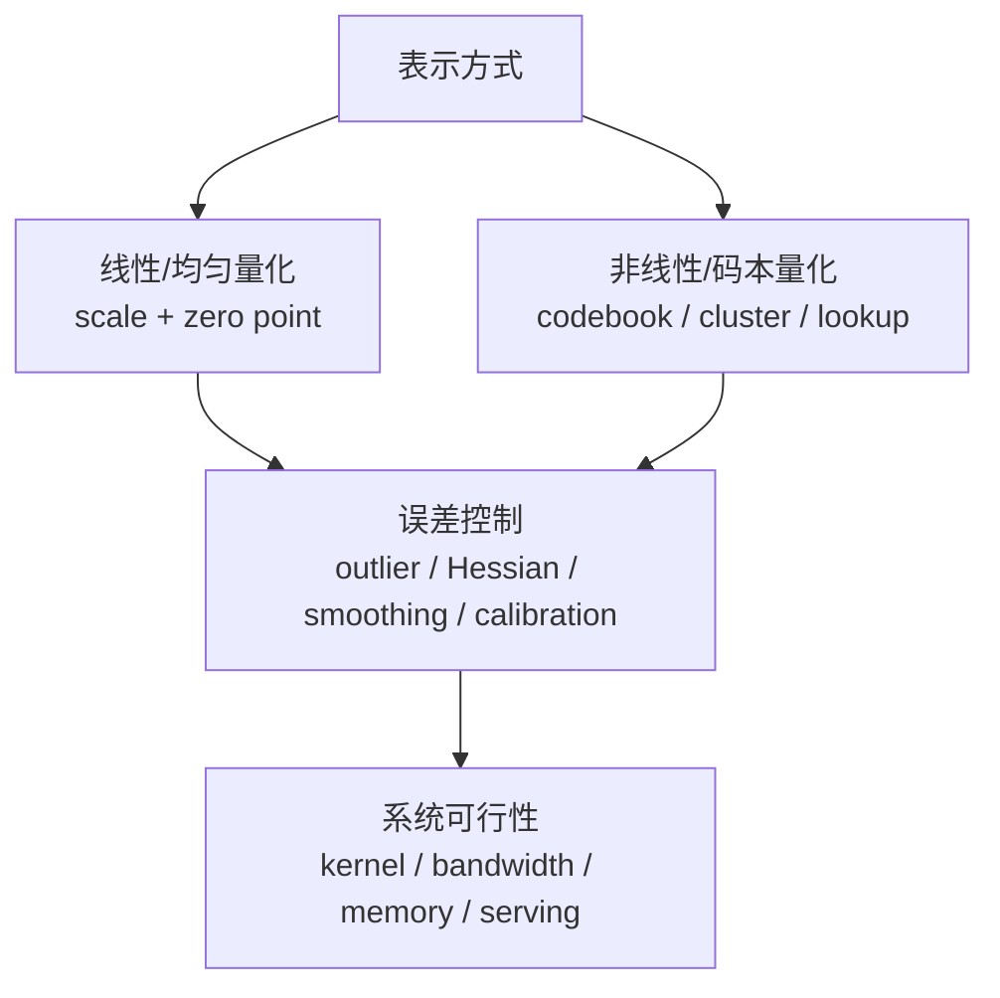
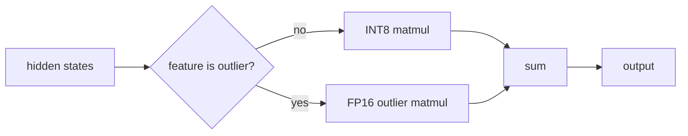

+++
title = "大模型量化综述：从线性量化到码本量化"
date = 2026-06-01T21:00:00+08:00
tags = ["llm", "量化", "推理", "显存", "int8", "int4", "fp8"]
categories = ["AI"]
draft = false
image = "/images/posts/llm-quantization/quantization-buckets-icon.svg"
libraries = ["mathjax", "mermaid"]
description = "从线性量化、非均匀量化和码本量化出发，系统梳理 LLM.int8()、SmoothQuant、GPTQ、AWQ、NF4、AQLM、KV cache 量化和 FP8 的数学原理、可行性与优缺点。"
+++

## 引言 {#introduction}

一个 7B 模型如果用 FP16 存权重，光参数就需要：

$$7 \times 10^9 \times 2\ \text{bytes} \approx 14\ \text{GB}$$

这还没有算 KV cache、activation、临时 workspace、CUDA graph、batching 和运行时碎片。到了 70B，FP16 权重约 140 GB，单卡部署基本不现实。

量化（quantization）的直接目标很朴素：**用更少的 bit 表示模型里的数**。FP16 每个权重 16 bit，INT8 是 8 bit，INT4 是 4 bit。如果一切理想，权重显存可以分别缩小到原来的 \\(1/2\\) 和 \\(1/4\\)。

但问题也在这里：大模型不是压缩包。权重、activation、KV cache 都参与矩阵乘法，数值被压小以后，误差会进入每一层，再通过残差、归一化、attention 和 MLP 传播。量化真正要回答的问题不是“能不能把 FP16 存成 INT4”，而是：

- 哪些数值得量化，哪些最好保留高精度？
- scale 应该按 tensor、按 channel，还是按 group 计算？
- 误差会集中在哪些 outlier 上？
- 为什么有些模型 INT8 几乎不掉点，INT4 却需要 GPTQ、AWQ 这类校准方法？
- 在推理系统里，量化省下的是显存、带宽，还是计算？

这篇文章的目标是做一个可读的量化综述。我们先从最基本的分类开始：**线性量化**和**非线性量化**。其中，聚类量化、码本量化、NF4、AQLM 都属于非线性/码本路线；LLM.int8()、SmoothQuant、GPTQ、AWQ 则大多建立在线性量化之上，再用 outlier 处理、缩放迁移或二阶误差补偿提高可用性。

读完后，我们应该能回答：

- 线性量化和聚类/码本量化到底差在哪里？
- 为什么 LLM 量化最怕 activation outlier？
- GPTQ、AWQ、SmoothQuant 分别在优化什么误差？
- 为什么 NF4、AQLM 这类方法能在更低 bit 下继续压缩？
- 一个具体场景应该选择 INT8、INT4、FP8、NF4，还是 KV cache 量化？

## 综述框架：先分表示方式，再看误差控制 {#framework}

量化很容易被讲成一堆格式名：INT8、INT4、NF4、FP8、GPTQ、AWQ、SmoothQuant。更好的切入方式是先分两层。

**第一层：用什么表示数值？** 线性量化把数值放到等间距格点上，公式简单，硬件友好；非线性量化把数值映射到一组不等间距代表值，误差更小，但查表、码本和 kernel 更复杂。

**第二层：怎么控制误差？** 最朴素的 round-to-nearest 只控制单个数的舍入误差；LLM.int8() 单独处理 outlier；SmoothQuant 把 activation outlier 迁移到 weight；GPTQ 用近似二阶信息最小化层输出误差；AWQ 用 activation 统计保护重要权重通道。

**第三层：硬件能否吃到收益？** 只把权重存在磁盘上的 INT4，不等于矩阵乘法真的以 INT4 跑。很多 weight-only 方法的主要收益来自减少 HBM 读取，而 W8A8/FP8 这类方法更可能触发低精度 Tensor Core 路径。

后面的所有技术都可以放回这个框架里理解。

## 数学基础：线性量化、非线性量化与误差 {#math-model}

### 线性量化：scale、zero point 与舍入 {#linear-quantization}

先看最常见的 affine quantization，也就是线性量化。给定浮点数 \\(x\\)，我们用整数 \\(q\\) 表示它：

$$q = \text{clip}\left(\text{round}\left(\frac{x}{s}\right) + z,\ q_{\min},\ q_{\max}\right)$$

反量化时再还原为近似浮点数：

$$\hat{x} = s(q - z)$$

这里：

- \\(s\\) 是 scale，决定整数格点之间对应多大的浮点间隔；
- \\(z\\) 是 zero point，用来让浮点 0 精确落到某个整数；
- \\([q_{\min}, q_{\max}]\\) 是整数范围，例如 INT8 通常是 \\([-128,127]\\) 或 \\([0,255]\\)。



如果使用 symmetric quantization，通常令 \\(z=0\\)，只保留 scale：

$$q = \text{clip}\left(\text{round}\left(\frac{x}{s}\right), -Q, Q\right), \quad \hat{x} = sq$$

这更适合权重，因为许多权重分布大致以 0 为中心。activation 往往不完全对称，asymmetric quantization 有时更合适。

线性量化的优势是简单。反量化只需要一次整数减法和一次乘法，矩阵乘法 kernel 也容易优化：

$$\hat{X}\hat{W} = s_x s_w (Q_x - z_x)(Q_w - z_w)$$

这就是为什么主流推理硬件最先支持 INT8、FP8 这类规则格式。代价是格点等间距：如果数据分布很不均匀，很多格点会浪费在几乎没有数值的区域，而密集区域的分辨率不够。

### 非线性/码本量化：lookup table 与聚类 {#nonlinear-codebook-quantization}

非线性量化不要求格点等间距。它先准备一个码本：

$$\mathcal{C} = \\{c_{0}, c_{1}, \ldots, c_{K-1}\\}$$

每个浮点数 \\(x\\) 不再存 scale 后的整数，而是存最近码字的索引：

$$i^\* = \arg\min_i |x - c_i|^2,\quad \hat{x}=c_{i^\*}$$

如果码本来自 k-means，那么这就是聚类量化：把权重分布聚成 \\(K\\) 个簇，每个权重只保存“属于哪个簇”的 index。4-bit 码本有 16 个码字，2-bit 码本有 4 个码字。



它和线性量化的差别可以这样看：

| 维度 | 线性量化 | 聚类/码本量化 |
| --- | --- | --- |
| 表示 | scale + integer | codebook + index |
| 格点 | 等间距 | 不等间距，可学习 |
| 优点 | 硬件友好，kernel 成熟 | 更贴合权重分布，低 bit 精度潜力高 |
| 缺点 | 容易被 outlier 拉大 scale | 查表和码本开销更复杂 |
| 典型例子 | INT8、INT4、GPTQ、AWQ、SmoothQuant | k-means quantization、NF4、AQLM |

NF4 可以理解成一种特殊码本：它不是通过每层 k-means 学出任意码字，而是为近似正态分布的权重设计一组 4-bit 非均匀码字。AQLM 则更进一步，用多个码本的加和近似一个权重向量：

$$\hat{w} = c^{(1)}[a] + c^{(2)}[b] + \cdots + c^{(M)}[m]$$

这类方法的直觉是：当 bit 数降到 3-bit、2-bit 甚至更低时，等间距标量格点太粗，必须用更灵活的码本结构来保留信息。

### scale 怎么选 {#scale-choice}

最简单的 scale 来自 min-max：

$$s = \frac{x_{\max} - x_{\min}}{q_{\max} - q_{\min}}$$

对于 symmetric INT8，如果浮点范围是 \\([-a,a]\\)，可以写成：

$$s = \frac{a}{127}$$

这看似合理，但有一个明显问题：**一个极端 outlier 会拉大整个 scale**。scale 变大后，整数格点变粗，主体区域的大量小权重会被更粗糙地表示。

举个一维例子。假设一组权重大多数在 \\([-1,1]\\)，但有一个值是 8。如果用 INT4 symmetric，整数范围是 \\([-7,7]\\)，为了覆盖 8，需要：

$$s = \frac{8}{7} \approx 1.14$$

这意味着 0.3、0.4、0.5 这些数可能都落到相邻甚至相同格点上。为了照顾一个 outlier，主体区域损失了很多分辨率。



量化误差的核心矛盾是：动态范围越大，scale 越大，格点越粗；动态范围越小，格点越密，但更容易 clip 掉 outlier。



### 误差从哪里来 {#error-sources}

量化误差主要有两类：

$$x - \hat{x} = e_{\text{round}} + e_{\text{clip}}$$

其中：

$$e_{\text{round}} = x - s\cdot \text{round}(x/s)$$

**rounding error** 来自舍入。即使没有 clip，每个值也只能落在最近格点上。均匀量化时，单个值的误差大约被限制在 \\([-s/2, s/2]\\)。

**clipping error** 来自范围截断。如果某个值超过可表示范围，它会被压到边界。少量 clip 不一定坏，因为换来更密的主体格点；但关键权重或 activation outlier 被截断，可能直接破坏某些 head 或 channel。

这解释了为什么量化不是单纯选择 bit 数，而是选择一个误差分配策略：我们要把有限格点花在哪里。

### 更高层视角：量化、剪枝和置零都是受约束扰动 {#constrained-perturbation}

量化看起来是在“换一种数字格式”，剪枝看起来是在“删掉一些连接”，但从 loss 的角度看，它们有同一个数学骨架：**把原参数 \\(w\\) 改成受约束的新参数 \\(\hat{w}\\)，并希望 loss 增加尽量小**。

令扰动为：

$$\Delta w = \hat{w} - w$$

训练好的模型通常在一个局部低损失区域附近，梯度项 \\(\nabla L(w)^T\Delta w\\) 较小。于是 loss 变化可以用二阶近似理解：

$$L(w+\Delta w)-L(w) \approx \frac{1}{2}\Delta w^T H \Delta w$$

这里 \\(H\\) 是 Hessian，它描述 loss 对不同参数方向的敏感度。这个式子给出一个很重要的直觉：**不是所有同样大小的误差都一样伤模型**。如果扰动落在低曲率、不敏感的方向上，loss 增加可能很小；如果扰动落在高曲率方向上，即使数值误差不大，也可能破坏输出。

剪枝或权重置 0 是这个视角下的特例。把第 \\(i\\) 个权重删掉，相当于：

$$\hat{w}_i=0,\quad \Delta w_i=-w_i$$

如果忽略参数间耦合，loss 增量近似为：

$$\Delta L \approx \frac{1}{2}H_{ii}w_i^2$$

所以“能不能剪掉一个权重”不只看 \\(|w_i|\\) 小不小，还要看 \\(H_{ii}\\) 小不小。小权重如果位于高敏感方向，也可能不能随便删；稍大的权重如果位于低敏感方向，反而可能可以安全剪掉。

量化只是把约束集合换成了离散格点：

$$\hat{w}^{(i)} \in \\{s(q-z): q\in[q^{\mathrm{lo}},q^{\mathrm{hi}}]\\}$$

RTN 选择最近格点，相当于只让 \\(|\Delta w_i|\\) 尽量小；GPTQ 这类方法进一步问：这个 \\(\Delta w\\) 经过 \\(H\\) 或 \\(X^TX\\) 加权后，会不会明显增加层输出误差？这就是为什么低 bit 量化不能只看 rounding error，还要看误差落在哪些方向上。

可以把几类压缩统一成一个约束优化问题：

$$\min_{\hat{w}\in\mathcal{C}} L(\hat{w})$$

剪枝的 \\(\mathcal{C}\\) 是稀疏参数集合，量化的 \\(\mathcal{C}\\) 是离散格点集合，码本量化的 \\(\mathcal{C}\\) 是 codebook 可表示的集合。它们真正共享的问题是：**模型函数有冗余，但冗余不是均匀分布的；好方法要找到模型不敏感的方向来安排误差。**

### 粒度：per-tensor、per-channel 与 group-wise {#granularity}

scale 可以服务一个大 tensor，也可以服务更小的切片。粒度越细，越能适应局部分布，但 metadata 和 kernel 复杂度也会上升。

| 粒度 | scale 数量 | 优点 | 缺点 | 常见用途 |
| --- | ---: | --- | --- | --- |
| per-tensor | 1 个 tensor 1 个 scale | 简单，metadata 少 | 容易被 outlier 污染 | activation INT8 |
| per-channel | 每个输出 channel 1 个 scale | 权重量化精度好 | kernel 需要按列/行处理 scale | INT8 权重 |
| group-wise | 每组若干权重 1 个 scale | INT4 精度和开销折中 | group size 是额外超参 | weight-only INT4 |

对线性层：

$$Y = XW$$

如果 \\(W \in \mathbb{R}^{d_\text{in} \times d_\text{out}}\\)，per-channel quantization 通常给每个输出 channel 一个 scale。直觉是：不同输出 channel 的权重分布可能很不一样，强行共用一个 scale 会让小范围 channel 被大范围 channel 牺牲。

INT4 常用 group-wise quantization，比如每 128 个连续权重共享一个 scale。group size 越小，误差越低，但 scale metadata 越多，反量化开销也越高。很多 weight-only INT4 的实际效果，正是在 group size、scale 精度、反量化 kernel 之间找平衡。

## 方法谱系：每种量化方法到底在解决什么 {#methods}

有了三本账，再看常见名词会清楚很多。下面这张图先给出总览：所有方法都围绕同一个矩阵乘法 \\(Y=XW\\)，但它们选择处理的误差位置不同。



### 方法总表：先定位再展开 {#method-taxonomy}

| 大类 | 方法 | 主要对象 | 代表格式 | 关键问题 |
| --- | --- | --- | --- | --- |
| 线性标量量化 | RTN / min-max | W/A/KV | INT8/INT4 | scale 怎么选，outlier 怎么办 |
| 线性 + outlier 分离 | LLM.int8() | W + A | INT8 + FP16 | 少量 activation outlier 不能粗暴 INT8 |
| 线性 + 缩放迁移 | SmoothQuant | W + A | W8A8 | activation 难量化，weight 相对好量化 |
| 线性 + 二阶补偿 | GPTQ | W | INT4/INT3 | 量化误差要按层输出影响加权 |
| 线性 + 显著通道保护 | AWQ | W | INT4 | 少量重要 weight channel 需要保护 |
| 非线性/码本 | k-means / VQ | W | codebook + index | 低 bit 下等间距格点太浪费 |
| 非线性/固定码本 | NF4 | W | 4-bit codebook | 权重近似正态分布时更高效 |
| 非线性/多码本 | AQLM | W | additive codebooks | 极低 bit 下用多个码本组合表达 |
| 运行时缓存量化 | KV cache quant | KV | INT8/INT4/codebook | 长上下文服务的动态显存瓶颈 |

### RTN：round-to-nearest 是基线 {#rtn}

RTN（round-to-nearest）就是按 scale 直接舍入到最近整数。它属于最基础的**线性标量量化**：每个权重独立落到等间距格点上。它几乎不需要校准数据，速度快，是最朴素的 post-training quantization。

INT8 RTN 往往已经不错，因为格点足够密；INT4 RTN 则更容易掉点，因为每组只有十几个可用格点，outlier 和重要权重会更明显地相互争夺分辨率。

**矩阵例子**：一个 weight group 是 \\([0.03,0.07,0.09,1.40]\\)。INT4 symmetric 覆盖最大值时 \\(s=1.40/7=0.20\\)，于是

$$q=\text{round}(w/s)=[0,0,0,7],\quad \hat{w}=[0,0,0,1.40]$$

前三个小权重都被压成 0。RTN 只按当前 scale 取最近格点，不知道这些小权重在真实输入里是否重要。

RTN 的优点是简单、快、不依赖校准数据。缺点也很直接：它默认每个权重的误差同样重要，既不关心真实 activation 分布，也不关心误差对层输出的影响。因此 RTN 更适合作为 baseline，而不是低 bit 量化的终点。

### LLM.int8()：把 outlier 维度单独拿出来 {#llm-int8}

普通 INT8 量化在小模型上通常工作良好，但在大模型上会遇到一个特殊问题：hidden state 里会出现少量极端 outlier feature。它们数量很少，却对注意力和 MLP 输出非常重要。如果为了覆盖这些 outlier 而放大 scale，大量普通值会失去分辨率；如果 clip 掉 outlier，模型质量会明显下降。

LLM.int8() 的核心思想是 **mixed-precision decomposition**：把矩阵乘法按 feature 维度拆成两部分，普通维度用 INT8，outlier 维度保留 FP16。

对线性层：

$$Y = XW$$

把输入维度集合拆成普通维度 \\(\mathcal{N}\\) 和 outlier 维度 \\(\mathcal{O}\\)：

$$Y = X_{\mathcal{N}} W_{\mathcal{N}} + X_{\mathcal{O}} W_{\mathcal{O}}$$

LLM.int8() 对第一项使用 vector-wise INT8 量化，对第二项使用 FP16：

$$Y \approx \text{dequant}\left(Q_8(X_{\mathcal{N}}) Q_8(W_{\mathcal{N}})\right) + X_{\mathcal{O}}^{\text{fp16}} W_{\mathcal{O}}^{\text{fp16}}$$

这个分解的可行性来自一个关键观察：outlier feature 很重要，但数量很少。因此把少量 outlier 留在 FP16，不会毁掉整体显存和速度收益，却能避免 INT8 量化最致命的误差。

**矩阵例子**：用几条校准样本的 hidden states 组成

$$X_{\text{calib}}= \begin{bmatrix} 1.2 & 0.4 & 58 \\\\ -0.7 & 1.1 & 62 \\\\ 0.3 & -0.8 & 55 \end{bmatrix}$$

按 feature 维度看列最大值：

$$\max |X_{\text{calib}}[:,j]|=[1.2,1.1,62]$$

如果阈值 \\(\tau=6\\)，第 3 列就是 outlier 维度。于是对 \\(Y=XW\\)，第 1、2 列走 INT8 matmul，第 3 列保留 FP16：

$$XW=X_{[:,1:2]}W_{[1:2,:]}+X_{[:,3]}W_{[3,:]}$$

**优点**：对大模型 INT8 推理非常稳，能处理 activation outlier，比朴素 W8A8 更可靠。

**缺点**：需要混合精度路径，kernel 和调度复杂；它主要是 INT8 推理方案，不解决 INT4 weight-only 的极限压缩问题。

### SmoothQuant：把 activation 的难题迁移给 weight {#smoothquant}

LLM.int8() 的路线是“发现 outlier，然后单独处理”。SmoothQuant 的路线不同：它试图在数学上把 activation 变得更好量化，从而让所有矩阵乘法都可以走 W8A8 INT8。

对线性层：

$$Y = XW$$

插入一个按 channel 的对角缩放矩阵 \\(D\\)：

$$Y = XW = (X D^{-1})(D W)$$

这是一个等价变换，未量化时输出完全不变。但量化时，\\(XD^{-1}\\) 的 activation outlier 被压小，\\(DW\\) 的权重动态范围变大。SmoothQuant 的判断是：**activation 难量化，weight 相对好量化，所以把量化难度从 activation 平滑迁移到 weight。**

常见写法会用一个平滑系数 alpha 控制迁移强度。简化理解是：

$$s_j = \frac{\max |X_j|^\alpha}{\max |W_j|^{1-\alpha}}$$

然后对第 \\(j\\) 个 channel 做：

$$X_{j}^{\prime} = \frac{X_{j}}{s_{j}}, \quad W_{j}^{\prime} = s_{j} W_{j}$$

alpha 越大，越强调压平 activation；alpha 越小，越保护 weight。这个超参体现了 SmoothQuant 的核心取舍：把 outlier 从一个张量搬到另一个张量，不是让误差凭空消失。

**矩阵例子**：假设校准后发现第 2 个 activation channel 很大：

$$X= \begin{bmatrix} 1 & 80 \end{bmatrix},\quad W= \begin{bmatrix} 2 \\\\ 0.25 \end{bmatrix}$$

原输出是 \\(XW=1\cdot2+80\cdot0.25=22\\)。选 \\(D=\operatorname{diag}(1,10)\\) 后：

$$XD^{-1}=[1,8],\quad DW= \begin{bmatrix} 2 \\\\ 2.5 \end{bmatrix}$$

输出仍是 \\((XD^{-1})(DW)=22\\)，但 activation 的最大值从 80 降到 8，更容易做 W8A8。

**优点**：适合 W8A8，能真正利用 INT8 GEMM，推理吞吐和显存都有收益；对超大模型有较好的通用性。

**缺点**：需要校准数据估计 activation 范围；缩放系数和硬件 kernel 要配合；它主要面向 INT8，不是最激进的显存压缩方案。

### GPTQ：让权重量化少影响输出 {#gptq}

GPTQ 也是 post-training quantization，但它不只看单个权重的误差，而是看量化后对层输出的影响。对线性层 \\(Y=XW\\)，权重误差 \\(\Delta W\\) 带来的输出误差是：

$$\Delta Y = X \Delta W$$

如果校准数据告诉我们某些输入方向更常见、更重要，那么这些方向上的权重误差应该更小。把平方误差写出来：

$$E = \lVert X(W-\hat{W}) \rVert^2$$

这里的 \\(E\\) 是层输出误差。最小化它等价于让权重误差在输入协方差 \\(X^T X\\) 加权下尽量小。GPTQ 使用近似 Hessian 信息逐列量化并补偿误差，本质是在问：**哪些权重误差对当前层输出最伤？**

所以 GPTQ 常用于 weight-only INT4：它试图在极低 bit 下保住层输出，而不是只做机械舍入。

一个直观类比是：RTN 把每个权重都独立四舍五入；GPTQ 每量化一列权重后，会估计这次误差如何影响后续列，并把一部分误差补偿到还没量化的权重里。这样总体输出误差更小。

**矩阵例子**：校准输入

$$X= \begin{bmatrix} 3 & 0 \\\\ 2 & 1 \\\\ 3 & 0 \end{bmatrix}$$

则 \\(X^T X=\begin{bmatrix}22&2\\\\2&1\end{bmatrix}\\)，第一维输入远比第二维常见。若量化误差是 \\(\Delta w=[0.1,0.1]^T\\)，输出误差为 \\(X\Delta w=[0.3,0.3,0.3]^T\\)；若误差换成 \\([0,0.1]^T\\)，输出误差只有 \\([0,0.1,0]^T\\)。GPTQ 用这个 Hessian/协方差信息判断：同样大小的 weight error，落在第一维更伤。

**优点**：适合 4-bit/3-bit weight-only，压缩率高，通常比 RTN 明显稳；对本地部署和单机大模型很实用。

**缺点**：量化过程更慢，需要校准样本；主要量化 weight，activation 仍多为 FP16/BF16，所以计算路径未必是真正 INT4 GEMM；效果依赖 kernel 支持和 group size 设置。

### AWQ：保护显著权重通道 {#awq}

AWQ（activation-aware weight quantization）的出发点是：不是所有权重同样重要。某些 channel 在真实 activation 下更显著，量化它们会带来更大的输出误差。

AWQ 会用校准数据识别这些显著 channel，并通过缩放策略保护它们，让 INT4 权重量化时少伤关键路径。和 SmoothQuant 类似，它也利用了线性层中的缩放自由度；不同之处在于 AWQ 更关注 weight-only 低 bit 场景下哪些权重值得保护。

对线性层 \\(Y=XW\\)，如果某个输入 channel 的 activation 幅度经常很大，那么这个 channel 上的权重误差会被放大到输出里。AWQ 的经验观察是：保护少量显著 channel，就能显著降低 INT4 量化损伤。

数学上也可以用缩放自由度理解。对某个 channel 做：

$$Y = XW = (X S^{-1})(S W)$$

AWQ 选择 \\(S\\) 的目标不是让所有 activation 都适合 INT8，而是让重要权重通道在 group-wise INT4 量化中获得更好的表示。换句话说，SmoothQuant 偏向“让 activation 好量化”，AWQ 偏向“让重要 weight 不被低 bit 伤到”。

**矩阵例子**：校准样本给出每个输入 channel 的平均幅度：

$$\operatorname{mean}|X_{\text{calib}}[:,j]|=[0.4,7.5,0.6]$$

第 2 个 channel 是 salient channel。若某行权重是 \\([0.08,0.12,0.10]\\)，朴素 group-wise INT4 可能把它们放在同一组里平均处理；AWQ 会给第 2 个 channel 一个缩放保护，让 \\(0.12\\) 在量化前被放大、量化后再缩回。这样做不是因为 \\(0.12\\) 数值最大，而是因为它乘上的 activation 经常最大。

**优点**：适合 INT4 weight-only，校准成本相对可控，部署友好，常用于端侧或单机推理。

**缺点**：仍主要省权重显存和权重带宽；activation 和 KV cache 不会自动变小；如果 workload 的瓶颈不是权重读取，速度收益可能有限。

### KV cache 量化：服务长上下文和高并发 {#kv-cache-quantization}

前面的 GPTQ、AWQ 主要处理权重。但在在线推理中，KV cache 可能比权重更快成为瓶颈。KV cache 的显存随 batch size 和上下文长度线性增长：

$$\text{KV bytes} = 2 \times L \times B \times S \times H_\text{kv} \times d_h \times \text{bytes}$$

其中 2 表示 K 和 V，\\(L\\) 是层数，\\(B\\) 是 batch size，\\(S\\) 是序列长度，\\(H_\text{kv}\\) 是 KV head 数，\\(d_h\\) 是 head dim。

如果从 FP16 降到 INT8，KV cache 显存约减半；降到 INT4，约变成四分之一。对长上下文服务，这可能比权重量化更重要，因为权重是固定成本，KV cache 是随在线请求增长的动态成本。

但 KV cache 量化也更敏感。K 的误差会改变 softmax 前的 attention score：

$$\text{score}_{t,i} = \frac{q_t \cdot k_i}{\sqrt{d_h}}$$

V 的误差会改变最终聚合内容：

$$o_t = \sum_i \text{softmax}(\text{score}_{t,i}) v_i$$

所以 KV cache 量化的常见策略不是简单全局 INT4，而是 per-head/per-channel scale、K/V 分开量化、保留 recent tokens 高精度，或者只在长上下文场景启用。

**矩阵例子**：对一个 head，当前 query 和两条历史 key 是

$$q=[1,1],\quad K= \begin{bmatrix} 1 & 0 \\\\ 0.9 & 0.9 \end{bmatrix}$$

score 是 \\([1,1.8]/\sqrt{2}\\)，第二个 token 更重要。如果把 K 量化得太粗，\\([0.9,0.9]\\) 可能变成 \\([1,1]\\)，score 变成 \\([1,2]/\sqrt{2}\\)；如果被压成 \\([1,0.5]\\)，score 又变成 \\([1,1.5]/\sqrt{2}\\)。KV cache 量化省的是历史 K/V 的存储，但误差会直接进入 attention 分数。

**优点**：直接扩大 batch size 和上下文容量，对服务端吞吐很有价值。

**缺点**：误差进入 attention 路径，任务和上下文长度越复杂越需要实测；收益依赖 serving engine 是否支持高效的量化 KV 读写。

### 聚类量化：用码本替代等间距格点 {#cluster-quantization}

聚类量化是最直观的非线性量化。以权重量化为例，先把一组权重 \\(w_1,\ldots,w_n\\) 聚成 \\(K\\) 个中心：

$$\min_{c_1,\ldots,c_K}\sum_{i=1}^n \min_j \|w_i-c_j\|^2$$

量化后，每个权重只保存最近中心的编号：

$$\hat{w}[i] = \mathcal{C}[\operatorname{index}(i)]$$

如果 \\(K=16\\)，每个 index 只需要 4 bit。和 INT4 的差别在于：INT4 的 16 个格点等间距，k-means 的 16 个中心会集中在权重分布更密集的地方。

**矩阵例子**：一个小权重块是

$$W= \begin{bmatrix} -0.12 & -0.08 & 0.02 & 0.09 \\\\ 0.11 & 0.95 & -0.90 & 0.04 \end{bmatrix}$$

如果只用 2-bit codebook，线性格点可能是 \\([-1,-0.33,0.33,1]\\)，很多接近 0 的权重都会变成 0.33 或 -0.33。k-means 可能学到 \\([-0.9,-0.1,0.05,0.95]\\)，把码字放在真实权重密集的位置。

这类方法的优点是低 bit 误差潜力更好，尤其当权重分布明显不均匀时，码本能把有限表示能力花在高概率区域。缺点是硬件不如线性量化友好：矩阵乘法前往往需要查表、解码或特殊 kernel，而且码本本身也要存储。



聚类量化不是和 INT4 同一级别的概念。INT4 是 bit 宽或存储格式；聚类量化是选择 16 个代表值的方法。一个 4-bit 量化方案可以是线性 INT4，也可以是 16-codeword 的码本量化。



### NF4 与 QLoRA：为正态权重设计的 4-bit 码本 {#nf4-qlora}

NF4（NormalFloat 4-bit）可以看成固定码本量化：它假设预训练权重经过归一化后接近正态分布，于是把 16 个码字放在更适合正态分布的位置，而不是均匀铺开。

它的思想接近 Lloyd-Max quantization：如果数值大多集中在 0 附近，就应该在 0 附近放更多码字，在尾部放更少码字。这样同样是 4 bit，NF4 能比均匀 INT4 更贴合正态权重。

QLoRA 使用 NF4 存储冻结的 base model，再训练 LoRA adapter。关键点是：NF4 主要压缩的是冻结权重，不是把整个训练过程都变成 4-bit 反向传播。训练时仍然需要把量化权重反量化到计算 dtype，再参与前向/反向。

**矩阵例子**：归一化后的冻结权重可能像

$$[-0.08,0.03,0.11,-0.20,1.7]$$

均匀 4-bit 会把 16 个码字平均铺在中心和尾部；NF4 的码字在 0 附近更密，所以前四个常见小权重能得到更细的表示，尾部的 1.7 用较稀疏的码字表示。QLoRA 保持这个 base model 冻结，只训练额外的 LoRA 矩阵。

**优点**：适合参数高效微调，显存收益大；固定码本实现比每层 k-means 更规则。

**缺点**：假设权重分布适合 NF4；主要服务于冻结基座 + adapter 训练，不等同于通用低 bit 推理加速。

### AQLM：多个码本相加，提高极低 bit 表达力 {#aqlm}

单个码本的表达能力有限。AQLM（Additive Quantization of Language Models）走的是加法码本路线：不是用一个 codeword 表示一组权重，而是用多个 codeword 的和表示：

$$\hat{w} = c^{(1)}[a] + c^{(2)}[b] + \cdots + c^{(M)}[m]$$

如果每个码本提供少量候选，多个码本组合起来就能形成更丰富的表示空间。直觉上，这类似“用几个基础积木拼一个更精细的向量”，比单个 2-bit/3-bit 标量格点更灵活。

**矩阵例子**：要近似一个 2 维权重向量 \\(w=[0.7,0.2]\\)。单个 2-bit 码本只能从 4 个向量里选一个，比如最接近的是 \\([0.5,0.0]\\)。AQLM 可以用两个码本相加：

$$[0.5,0.0] + [0.2,0.2] = [0.7,0.2]$$

多个小码本组合后，极低 bit 下仍能表达更细的方向。

AQLM 这类方法主要面向极低 bit 权重量化。它的优势是压缩率很高，同时质量可能优于简单标量量化。缺点是编码、解码和 kernel 都更复杂，工程部署门槛高于 GPTQ/AWQ 这种更常见的 weight-only INT4 路线。

### QAT：训练时就让模型适应量化 {#qat}

QAT（quantization-aware training）在训练或微调时模拟量化误差，让模型提前适应低精度表示。它通常比 PTQ（post-training quantization）成本更高，但在更激进的 bit 数、更小模型或精度要求很高的场景里更稳。

可以把 PTQ 理解为“训练完再压缩”，把 QAT 理解为“训练时就知道未来要住进更小的房间”。后者更麻烦，但模型有机会调整参数分布来适应格点。

**矩阵例子**：训练中某层输出是 \\(h=XW=[0.13,0.27,1.8]\\)。目标硬件只支持 INT4 activation，QAT 会在前向里插入 fake quant：

$$\hat{h}=s\cdot\text{round}(h/s)$$

后续层看到的是 \\(\hat{h}\\)，不是理想 FP16 的 \\(h\\)。如果 1.8 经常造成 scale 过大，训练会通过梯度调整前后层参数，让中间 activation 更适合目标格点。

**优点**：在极低 bit、强精度约束或专用硬件部署中更可靠。

**缺点**：需要训练流程和数据，成本远高于 PTQ；对开源已训好的 LLM，很多用户并不具备完整 QAT 条件。

### FP8 和 INT8/INT4 的区别 {#fp8-vs-int}

INT8/INT4 是定点量化：一个 scale 加一组整数格点。FP8 则是低 bit 浮点格式，仍然有 exponent 和 mantissa，例如 E4M3、E5M2。

定点格式的特点是：在一个 scale 范围内，格点间距均匀。它适合分布范围明确、可以分组缩放的数值。

浮点格式的特点是：越靠近 0 越密，绝对值越大间距越粗。它适合动态范围更大的场景，尤其是训练或 activation 这类分布变化明显的张量。

**矩阵例子**：activation 矩阵可能是

$$X= \begin{bmatrix} 0.2 & -1.5 \\\\ 3.0 & 80 \end{bmatrix}$$

INT8 定点量化若用同一个 scale 覆盖 80，小值 \\(0.2\\) 的分辨率会变差。FP8 有 exponent，能用更自然的方式同时表示小值和大值，所以常见于训练、prefill GEMM 和 activation 路径；但是否更快、更准仍取决于硬件格式和 kernel。

| 格式 | 表示方式 | 优点 | 典型场景 |
| --- | --- | --- | --- |
| INT8 | scale + 8-bit integer | kernel 成熟，精度稳定 | W8A8 推理 |
| INT4 | scale + 4-bit integer | 显存压缩强 | weight-only 推理 |
| FP8 | 低 bit 浮点 | 动态范围更自然 | 训练、推理 GEMM、activation |
| NF4 | 非均匀 4-bit codebook | 贴合正态分布权重 | QLoRA / adapter 训练 |

所以不要把 FP8 简单理解成“另一种 INT8”。它解决的是另一类数值账：在 bit 数很低时，仍然保留一定动态范围表达能力。

## 可行性评估：优缺点、显存账和选择路径 {#feasibility}

### 方法对比：优缺点和可行性 {#method-comparison}

先用一张短表定位每个方法解决什么问题：

| 方法 | 大类 | 对象 | 格式 | 校准 |
| --- | --- | --- | --- | --- |
| RTN / min-max | 线性标量 | W / A | INT8 / INT4 | 否 |
| LLM.int8() | 线性 + outlier | W + A | INT8 + FP16 | 弱 |
| SmoothQuant | 线性 + 缩放迁移 | W + A | W8A8 | 是 |
| GPTQ | 线性 + 二阶补偿 | W | INT4 / INT3 | 是 |
| AWQ | 线性 + 通道保护 | W | INT4 | 是 |
| k-means / VQ | 码本 | W | codebook + index | 是 |
| NF4 / QLoRA | 固定码本 | W | 4-bit codebook | 通常否 |
| AQLM | 多码本 | W | additive codebooks | 是 |
| KV cache quant | 缓存量化 | KV | INT8 / INT4 | 视方法 |
| QAT | 训练感知 | W / A / KV | 多种 | 训练数据 |

再看每个方法的核心取舍：

| 方法 | 核心思想 | 优点 | 局限 |
| --- | --- | --- | --- |
| RTN / min-max | 最近格点舍入 | 简单、快、baseline 好做 | 不知道哪些误差重要，低 bit 容易掉点 |
| LLM.int8() | 普通维度 INT8，outlier 维度 FP16 | 大模型 INT8 稳，处理 outlier 明确 | 混合精度 kernel 复杂，不追求 INT4 压缩 |
| SmoothQuant | 用 \\(XW=(XD^{-1})(DW)\\) 迁移量化难度 | 可走 INT8 GEMM，吞吐收益明确 | 依赖校准和 kernel，主要面向 INT8 |
| GPTQ | 最小化层输出误差 | weight-only 低 bit 精度好 | 离线量化较慢，activation/KV 不省 |
| AWQ | 用 activation 统计保护显著 channel | INT4 部署友好，校准成本可控 | 仍是 weight-only，速度收益看瓶颈 |
| k-means / VQ | 学习非均匀代表值 | 低 bit 表达更灵活 | 查表和 kernel 更复杂 |
| NF4 / QLoRA | 为正态权重设计 4-bit 码本 | 微调显存收益大 | 主要压缩冻结权重 |
| AQLM | 多个码本相加近似权重 | 极低 bit 质量潜力高 | 编解码和部署复杂 |
| KV cache quant | 控制 attention 中 K/V 误差 | 长上下文、高并发收益大 | 对 attention 精度敏感，必须按 workload 测 |
| QAT | 训练时模拟量化误差 | 精度上限高 | 成本高，流程复杂 |

这张表也说明了一个容易忽略的事实：**“INT4”不是一种方法，而是一种目标格式。** RTN INT4、GPTQ INT4、AWQ INT4、NF4 都是 4-bit 左右的压缩，但它们安排误差的方式不同：有的用等间距 scale，有的用二阶补偿，有的用固定非均匀码本。

### 一个手算例子：7B 模型量化后省多少 {#worked-example}

假设 7B 模型，权重数量 \\(N=7\times 10^9\\)。

| 权重格式 | bytes / parameter | 权重显存 |
| --- | ---: | ---: |
| FP16 / BF16 | 2 | 14 GB |
| INT8 | 1 | 7 GB |
| INT4 | 0.5 | 3.5 GB |

实际会比表格略大，因为还要存 scale、zero point、group metadata，有些层也可能保持 FP16。例如 group-wise INT4，group size 为 128，每组一个 FP16 scale：

$$\text{scale overhead} = \frac{2}{128} = 0.015625\ \text{bytes / parameter}$$

相对 INT4 的 0.5 bytes / parameter，metadata 约增加：

$$\frac{0.015625}{0.5} = 3.125\\%$$

所以 7B 的 INT4 权重不是精确 3.5 GB，而是大约 3.6 GB 再加上一些实现相关开销。这个数量级已经足够解释为什么 INT4 能让消费级显卡跑更大的模型。

但如果服务端 batch 很大、上下文很长，权重不一定是唯一瓶颈。以 \\(L=32\\)、\\(H_\text{kv}=8\\)、\\(d_h=128\\)、\\(B=32\\)、\\(S=8192\\)、FP16 KV cache 为例：

$$2 \times 32 \times 32 \times 8192 \times 8 \times 128 \times 2 \approx 34.4\ \text{GB}$$

这时即使权重已经 INT4，KV cache 仍可能吃掉大量显存。量化策略必须和服务形态一起看。

### 如何选择量化方案 {#decision-guide}

可以用下面的顺序做判断。

**如果目标是单机跑更大模型**，优先考虑 GPTQ/AWQ 这类 weight-only INT4。它们对推理框架支持友好，显存收益最大，精度通常比朴素 RTN INT4 稳。

**如果目标是尽可能低 bit 的权重压缩**，码本量化值得关注。NF4 更适合 QLoRA 这类 adapter 微调；AQLM、多码本或向量量化更适合研究或专门部署场景，但要确认推理引擎是否真的支持高效 kernel。

**如果目标是稳定 INT8 推理**，LLM.int8() 和 SmoothQuant 是两条典型路线。前者保留 outlier 的 FP16 路径，稳但系统复杂；后者把 activation outlier 平滑迁移到 weight，更适合 W8A8 INT8 GEMM。

**如果目标是在线服务吞吐**，先看瓶颈是权重带宽、KV cache 显存，还是 prefill GEMM。decode 受带宽限制时，weight-only 有帮助；长上下文和高并发下，KV cache 量化、PagedAttention 和调度策略可能更关键；prefill 占比高时，SmoothQuant W8A8 或 FP8 GEMM 才更直接。

**如果目标是低风险上线**，INT8 通常比 INT4 稳。尤其是 W8A8，需要认真校准 activation outlier；如果没有校准集，先做 weight-only 或只量化部分层更稳。

**如果目标是训练或微调省显存**，要区分“量化基座权重”和“低精度训练计算”。QLoRA 中常见的 NF4 主要是为了压缩冻结的 base model，训练 LoRA adapter；它不是把整个反向传播都变成 4-bit 训练。FP8 训练则是另一条路线，需要硬件、框架和 loss scaling 等配套。



量化方案不能只按 bit 数排序。一个成熟 INT8 kernel 可能比某个 INT4 格式更快；一个 INT4 模型可能省了权重显存，却被 KV cache 限制住 batch size。



## 常见误区 {#pitfalls}

**误区一：模型文件变小就等于推理变快。** 不一定。文件大小影响加载和权重存储，但推理速度取决于 kernel 是否利用低精度、瓶颈是不是 HBM 带宽、batch/prefill/decode 比例是什么。

**误区二：所有层都应该同样量化。** embedding、lm head、某些 attention/MLP 层对误差更敏感，实践中常保留部分层高精度，或者给不同层不同 bit/group size。

**误区三：per-token benchmark 可以代表服务性能。** 单请求 decode、长 prompt prefill、高并发 continuous batching、长上下文 KV cache 的瓶颈不同。量化方案要放到真实 workload 里测。

**误区四：低 bit 一定意味着低质量。** 质量取决于模型规模、校准数据、量化粒度、是否保护 outlier、任务敏感度和解码策略。INT4 不是魔法，但也不是必然不可用。

**误区五：LLM.int8()、SmoothQuant、GPTQ、AWQ 只是名字不同。** 它们处理的误差源不同：LLM.int8() 处理 activation outlier，SmoothQuant 迁移 activation 量化难度，GPTQ 最小化层输出误差，AWQ 保护显著权重通道。

**误区六：聚类量化和线性量化只是实现细节。** 它们的数值假设不同：线性量化假设等间距格点足够好，码本量化则认为应该把有限码字放到更有概率、更重要的位置。

## 总结 {#summary}

量化的主线可以压缩成一句话：**用有限格点近似模型中的连续数值，并把误差安排在模型最能承受的位置。**

从数值上看，核心是表示方式：线性量化用 scale 和 zero point，码本量化用 index 查代表值；从方法上看，关键是不同算法如何处理 outlier、重要 channel、层输出误差和低 bit 码本设计；从系统上看，真正的收益取决于显存、带宽和 kernel 是否匹配。

因此，选择量化方案时不要先问“INT4 还是 INT8”，而要先问：

- 我现在的瓶颈是权重显存、KV cache、HBM 带宽，还是 GEMM 计算？
- 我的 workload 是单请求、本地聊天、批量 prefill，还是在线并发 decode？
- 我能不能准备有代表性的校准数据？
- 我能接受多少质量回退，哪些任务不能掉？

这些问题回答清楚以后，量化就不再是一组格式名，而是一套可推理的工程工具箱。

## 参考阅读 {#references}

- [LLM.int8(): 8-bit Matrix Multiplication for Transformers at Scale](https://arxiv.org/abs/2208.07339)
- [SmoothQuant: Accurate and Efficient Post-Training Quantization for Large Language Models](https://arxiv.org/abs/2211.10438)
- [GPTQ: Accurate Post-Training Quantization for Generative Pre-trained Transformers](https://arxiv.org/abs/2210.17323)
- [AWQ: Activation-aware Weight Quantization for LLM Compression and Acceleration](https://arxiv.org/abs/2306.00978)
- [QLoRA: Efficient Finetuning of Quantized LLMs](https://arxiv.org/abs/2305.14314)
- [AQLM: Extreme Compression of Large Language Models via Additive Quantization](https://arxiv.org/abs/2401.06118)
- [A Survey of Quantization Methods for Efficient Neural Network Inference](https://arxiv.org/abs/2103.13630)
- [The Art and Science of Quantizing Large-Scale Models](https://arxiv.org/abs/2409.11650)
