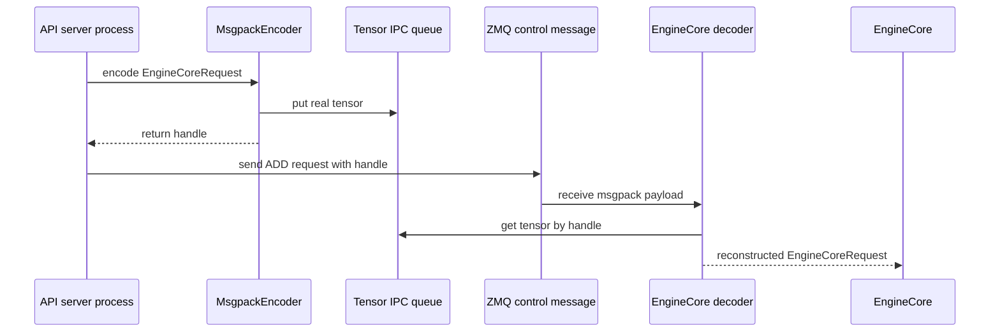

+++
title = "vLLM 请求生命周期：从 OpenAI API 到一次 Forward"
date = 2026-06-07T15:30:00+08:00
tags = ["llm", "推理", "vllm", "sglang", "源码阅读", "ai-infra"]
categories = ["AI"]
series = ["vLLM and SGLang Source Reading"]
draft = false
image = "/images/posts/vllm-sglang-source-reading/source-reading-code-path-icon.svg"
libraries = ["mermaid"]
description = "沿 vLLM V1 的 OpenAI-compatible server 源码追踪一次请求：HTTP 入口、serving render、AsyncLLM、EngineCore client、Tensor IPC、scheduler，以及 GPUModelRunner 的一次 forward。"
+++

从外部看，vLLM 像一个 OpenAI-compatible HTTP server：请求 `/v1/chat/completions`，返回 token stream。源码阅读时更关键的问题是：

**一个 JSON 请求什么时候变成 engine request？什么时候跨进程？什么时候进入 scheduler？什么时候才真正触发一次 model forward？**

本文只看 vLLM V1 的主线：OpenAI Chat Completions API、`AsyncLLM`、`EngineCore`、`Scheduler`、`GPUWorker` 和 `GPUModelRunner`。多模态部分只关注 `mm_tensor_ipc == "torch_shm"` 时，大 tensor 如何绕开 ZMQ/msgpack 主载荷。

## 总览：四条线用 request id 对齐 {#architecture}

请求生命周期不是一条简单队列，而是几条状态线用同一个 request id 对齐：

- API server 负责 HTTP、chat template、sampling params 和输出 stream；
- ZMQ 负责控制消息，例如 `ADD`、`ABORT`、`UTILITY`；
- Tensor IPC 只负责多模态大 tensor 的 payload 旁路；
- EngineCore/Scheduler/ModelRunner 负责调度和 GPU 执行。



展开成调用链，大致是：

```text
POST /v1/chat/completions
  -> api_router.py:create_chat_completion()
  -> OpenAIServingChat.create_chat_completion()
  -> render_chat_request()
  -> engine_client.generate(...)
  -> AsyncLLM.generate()
  -> input_processor.process_inputs()
  -> EngineCoreRequest
  -> EngineCoreClient.add_request_async()
  -> ZMQ ADD request
  -> EngineCore.add_request()
  -> Scheduler.add_request()
  -> EngineCore.step()
  -> Scheduler.schedule()
  -> model_executor.execute_model(scheduler_output)
  -> GPUWorker.execute_model()
  -> GPUModelRunner.execute_model()
  -> _prepare_inputs(), attention metadata, slot mapping
  -> _model_forward(...)
```

## API 进程：把 OpenAI 请求变成 engine work {#api-process}

OpenAI-compatible router 的入口在：

- `vllm/entrypoints/openai/chat_completion/api_router.py`
- `vllm/entrypoints/openai/chat_completion/serving.py`

`/v1/chat/completions` handler 很薄：找到 chat handler，调用 `handler.create_chat_completion()`，然后返回 JSON response 或 `StreamingResponse`。这里没有 scheduler，也没有 forward。

真正的 API-to-engine 翻译发生在 `OpenAIServingChat._create_chat_completion()`：messages 经过 chat template/rendering，`max_tokens`、`temperature`、`top_p` 等字段变成 `SamplingParams`，多模态内容也先进入 engine input。随后 `engine_client.generate()` 进入 `AsyncLLM.generate()`：

```python
self.output_processor.add_request(request, prompt, parent_req, index, queue)
await self.engine_core.add_request_async(request)
```

也就是说，API 进程一边登记 output stream，供 HTTP handler 异步吐 token；一边把 `EngineCoreRequest` 发给 engine 进程。输入和输出路径从这里分叉。

## 跨进程：ZMQ 传控制，Tensor IPC 传大 tensor {#transport}

`AsyncLLM` 里的 `self.engine_core` 是 EngineCore client。它不会直接调用 `EngineCore.add_request()`，更不会调用 `model.forward()`，而是发一个 typed control message：

```python
request.client_index = self.client_index
await self._send_input(EngineCoreRequestType.ADD, request)
self._ensure_output_queue_task()
```

V1 multi-process 路径里，控制路径使用 ZMQ；消息体由 `MsgpackEncoder` 编码，EngineCore input thread 再解码成 `EngineCoreRequest`。

多模态大 tensor 另走 payload 旁路。当 `mm_tensor_ipc == "torch_shm"` 时，API server 侧 encoder 把真实 tensor 放进 shared-memory queue，只在 ZMQ 主消息里放轻量 handle；EngineCore 侧 decoder 看到 handle 后，再通过 `TensorIpcReceiver` 取回真实 tensor。



边界很清楚：ZMQ 传控制消息，Tensor IPC 只传 request payload 里的大 tensor；输出 token 不走 Tensor IPC。

## EngineCore：schedule、execute、update 的循环 {#engine-process}

EngineCore input thread 解码出 `EngineCoreRequest` 后，最终进入：

```python
self.scheduler.add_request(request)
```

这一步仍然没有 forward，只是把 request 纳入 scheduler 状态。真正触发模型执行的是 `EngineCore.step()`：

```python
scheduler_output = self.scheduler.schedule()
future = self.model_executor.execute_model(scheduler_output, non_block=True)
...
engine_core_outputs = self.scheduler.update_from_output(
    scheduler_output, model_output
)
```

一个小例子：

```text
token budget = 6

A: 新请求，10-token prompt，本轮 chunked prefill 4 tokens
B: decode 中，本轮推进 1 token
C: prefix cache 命中前缀，本轮补 1 token

scheduled tokens = 4 + 1 + 1 = 6
```

这里 A 的 4 不是 prompt 总长度，而是本轮给它的 prefill chunk 大小。一次 forward 处理的是**本轮 token batch**，不是一个完整请求。

这些机制的分工可以先这样记：

| 机制 | scheduler 关心什么 | 是否改变模型公式 |
|---|---|---|
| continuous batching | 把不同 request 的本轮 token 合成 batch | 不改变 |
| chunked prefill | 长 prompt 每轮只放一段进 budget | 不改变 |
| prefix caching | 命中前缀不重复计算 | 不改变，但改变 positions/KV 视图 |
| paged attention | 分配、复用、释放 KV blocks | attention backend 的访存方式会变 |
| speculative decoding | draft/verify token 如何进入本轮工作 | 可能增加验证路径 |

GPU 路径进入 `GPUWorker.execute_model()`，再进入 `GPUModelRunner.execute_model()`。此时输入已经不是 OpenAI JSON，也不是完整 prompt 字符串，而是 scheduler/model runner 准备好的张量化 batch：

- `input_ids` / `inputs_embeds`：本轮要算的 token 或 embedding；
- `positions`：这些 token 的位置；
- `attn_metadata`：attention backend 需要的上下文；
- `slot_mappings`：KV cache 写入位置；
- `model_kwargs`：多模态、LoRA、spec decode、encoder-decoder 等额外输入。

## 返回路径和边界 {#return-path}

forward 之后还要采样和更新状态。`EngineCore.step()` 拿到 `model_output` 后调用：

```python
engine_core_outputs = self.scheduler.update_from_output(
    scheduler_output, model_output
)
```

这一步把 sampled token、logprobs、finished 状态、KV/cache 释放等结果合回 scheduler。随后 EngineCore outputs 回到 API server 进程，`AsyncLLM` 的 output handler 把结果推入 per-request collector，HTTP handler 继续向 SSE stream 吐 token。

闭环是：

```text
API request
  -> engine request
  -> scheduler state
  -> scheduled token batch
  -> one model forward
  -> sampled token / state update
  -> async output collector
  -> HTTP response stream
```

记住几个边界：

- OpenAI API 层不是 engine 层：`ChatCompletionRequest` 表达 API 语义，`EngineCoreRequest` 表达可调度的 engine work。
- `AsyncLLM.generate()` 不是 forward：它是 API server 进程里的 async facade。
- ZMQ 是控制路径，Tensor IPC 是 payload 旁路。
- [`SchedulerOutput`]() 是一次 forward 的直接上游：它决定本轮算哪些 token、用哪些 KV blocks。
- [`GPUModelRunner`]() 接过 `SchedulerOutput`，把它变成 tensor、attention metadata 和真正的 GPU forward。
- 一次 forward 是一次 engine iteration，不是一次请求。
