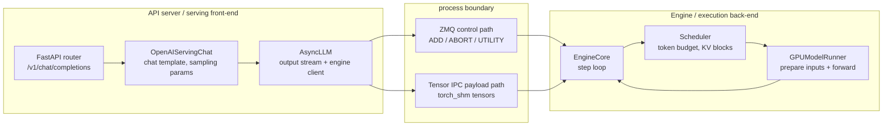
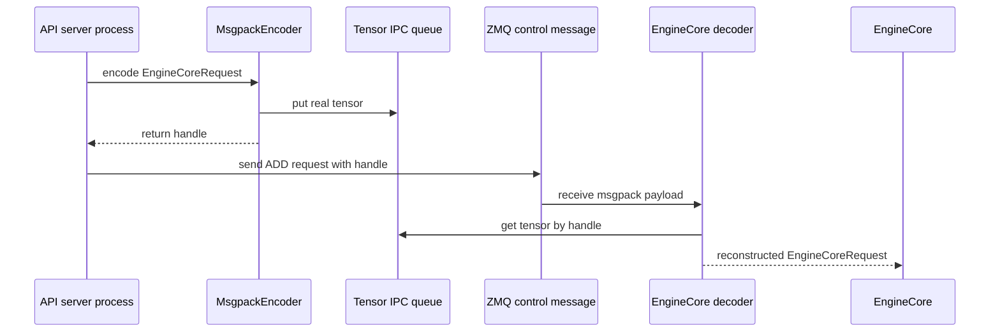

+++
title = "vLLM 请求生命周期：从 OpenAI API 到一次 Forward"
date = 2026-06-07T15:30:00+08:00
tags = ["llm", "推理", "vllm", "sglang", "源码阅读", "ai-infra"]
categories = ["AI"]
series = ["vLLM and SGLang Source Reading"]
draft = false
image = "/images/posts/vllm-sglang-source-reading/source-reading-code-path-icon.svg"
libraries = ["mermaid"]
description = "沿 vLLM V1 的 OpenAI-compatible server 源码追踪一次请求：HTTP 入口、serving render、AsyncLLM、EngineCore client、Tensor IPC、scheduler，以及 GPUModelRunner 的一次 forward。"
+++

从外部看，vLLM 像一个 OpenAI-compatible HTTP server：请求 `/v1/chat/completions`，返回 token stream。源码阅读时更关键的问题是：

**一个 JSON 请求什么时候变成 engine request？什么时候跨进程？什么时候进入 scheduler？什么时候才真正触发一次 model forward？**

本文只看 vLLM V1 的主线：OpenAI Chat Completions API、`AsyncLLM`、`EngineCore`、`Scheduler`、`GPUWorker` 和 `GPUModelRunner`。多模态部分只关注 `mm_tensor_ipc == "torch_shm"` 时，大 tensor 如何绕开 ZMQ/msgpack 主载荷。

## 先看分层 {#architecture}

这条路径可以先按 front-end / back-end 理解。这里的 front-end 不是浏览器，而是 API server 进程里的 OpenAI serving 层；back-end 是 EngineCore 进程和 GPU worker。



展开成调用链，大致是：

```text
POST /v1/chat/completions
  -> api_router.py:create_chat_completion()
  -> OpenAIServingChat.create_chat_completion()
  -> render_chat_request()
  -> engine_client.generate(...)
  -> AsyncLLM.generate()
  -> input_processor.process_inputs()
  -> EngineCoreRequest
  -> EngineCoreClient.add_request_async()
  -> ZMQ ADD request
  -> EngineCore.add_request()
  -> Scheduler.add_request()
  -> EngineCore.step()
  -> Scheduler.schedule()
  -> model_executor.execute_model(scheduler_output)
  -> GPUWorker.execute_model()
  -> GPUModelRunner.execute_model()
  -> _prepare_inputs(), attention metadata, slot mapping
  -> _model_forward(...)
```

核心心智模型是：**请求生命周期不是一个队列**。控制消息、tensor payload、scheduler 状态、output stream 是几条不同的线，只是用同一个 request id 对齐。

## API 进程做什么 {#api-process}

OpenAI-compatible router 的入口在：

- `vllm/entrypoints/openai/chat_completion/api_router.py`
- `vllm/entrypoints/openai/chat_completion/serving.py`

`/v1/chat/completions` handler 很薄：找到 chat handler，调用 `handler.create_chat_completion()`，然后返回 JSON response 或 `StreamingResponse`。

```python
handler = chat(raw_request)
generator = await handler.create_chat_completion(request, raw_request)

if isinstance(generator, ChatCompletionResponse):
    return JSONResponse(content=generator.model_dump(), ...)

return StreamingResponse(content=generator, media_type="text/event-stream")
```

这里没有 scheduler，也没有 forward。它只是 HTTP 边界：校验请求、处理 cancellation/load-aware wrapper、决定返回形态。

真正的 API-to-engine 翻译发生在 `OpenAIServingChat._create_chat_completion()`：

```python
result = await self.render_chat_request(request)
conversation, engine_inputs = result
...
generator = self.engine_client.generate(
    engine_input,
    sampling_params,
    sub_request_id,
    ...
)
```

这一层把 messages 经过 chat template/rendering，把 `max_tokens`、`temperature`、`top_p` 等字段变成 `SamplingParams`，再生成 engine input。多模态内容也先进入 engine input，后面才可能变成 tensor payload。

`engine_client.generate()` 在 V1 路径下进入 `AsyncLLM.generate()`。它同时做两件事：

```python
self.output_processor.add_request(request, prompt, parent_req, index, queue)
await self.engine_core.add_request_async(request)
```

也就是说，API 进程一边登记 output stream，供 HTTP handler 异步吐 token；一边把 `EngineCoreRequest` 发给 engine 进程。输入和输出路径从这里分叉。

## 跨进程边界：ZMQ 与 Tensor IPC {#transport}

`AsyncLLM` 里的 `self.engine_core` 是 EngineCore client。它不会直接调用 `EngineCore.add_request()`，更不会调用 `model.forward()`，而是发一个 typed control message：

```python
request.client_index = self.client_index
await self._send_input(EngineCoreRequestType.ADD, request)
self._ensure_output_queue_task()
```

V1 multi-process 路径里，这条控制路径使用 ZMQ；消息体由 `MsgpackEncoder` 编码，EngineCore input thread 再解码成 `EngineCoreRequest`。它传的是控制语义：`ADD`、`ABORT`、`UTILITY`、目标 engine identity、request object、output queue task。

多模态大 tensor 另走一条 payload 旁路。纯文本请求主要是 token ids 和参数，直接放进 msgpack/ZMQ 还可以；图片、音频、视频预处理后的 tensor 如果也塞进去，控制消息会变得很重。

当 `mm_tensor_ipc == "torch_shm"` 时，vLLM 在启动 EngineCore 时创建一个 `torch.multiprocessing.Queue`。API server 侧的 encoder 遇到 tensor 时，把真实 tensor 放进 shared-memory queue，只在 ZMQ 主消息里放一个轻量 handle：

```python
{
    "sender_id": ...,
    "message_id": ...,
    "tensor_id": ...,
}
```

EngineCore 侧 decoder 看到这个 handle，再通过 `TensorIpcReceiver` 从 queue 取回真实 tensor。



边界很清楚：ZMQ 传控制消息，Tensor IPC 只传 request payload 里的大 tensor；输出 token 不走 Tensor IPC。

## Engine 进程做什么 {#engine-process}

EngineCore input thread 解码出 `EngineCoreRequest` 后，最终进入：

```python
self.scheduler.add_request(request)
```

这一步仍然没有 forward，只是把 request 纳入 scheduler 状态。真正触发模型执行的是 `EngineCore.step()`：

```python
scheduler_output = self.scheduler.schedule()
future = self.model_executor.execute_model(scheduler_output, non_block=True)
...
engine_core_outputs = self.scheduler.update_from_output(
    scheduler_output, model_output
)
```

`Scheduler.schedule()` 基本和具体模型无关。它不关心 GPT-2、Llama、Qwen 的 layer 怎么写；它关心本轮 GPU 应该算哪些 token、这些 token 用哪些 KV block、哪些位置要写入 KV cache。

一个小例子：

```text
token budget = 6

A: 新请求，10-token prompt，本轮 chunked prefill 4 tokens
B: decode 中，本轮推进 1 token
C: prefix cache 命中前缀，本轮补 1 token

scheduled tokens = 4 + 1 + 1 = 6
```

这里 A 的 4 不是 prompt 总长度，而是本轮给它的 prefill chunk 大小。chunk 上限或 token budget 改了，它可以是 5、6，单请求场景也可能接近 10。这个例子只是说明：一次 forward 处理的是**本轮 token batch**，不是一个完整请求。

这些机制大多在 scheduler/cache 层体现：

| 机制 | scheduler 关心什么 | 是否改变模型公式 |
|---|---|---|
| continuous batching | 把不同 request 的本轮 token 合成 batch | 不改变 |
| chunked prefill | 长 prompt 每轮只放一段进 budget | 不改变 |
| prefix caching | 命中前缀不重复计算 | 不改变，但改变 positions/KV 视图 |
| paged attention | 分配、复用、释放 KV blocks | attention backend 的访存方式会变 |
| speculative decoding | draft/verify token 如何进入本轮工作 | 可能增加验证路径 |

## 一次 forward 在哪里发生 {#one-forward}

GPU 路径会进入 `GPUWorker.execute_model()`，再进入 `GPUModelRunner.execute_model()`。

`GPUWorker` 先判断本轮有没有实际 scheduled token：

```python
forward_pass = scheduler_output.total_num_scheduled_tokens > 0
```

通常有 request 就会有 scheduled token，但 worker 层还要处理 pipeline parallel 通信、profiling、异步状态修正、pooling/特殊 runner 等边界。真正进入 `GPUModelRunner` 输入准备时，代码会要求 scheduled token 数大于 0；否则这不是一次普通 transformer forward。

`GPUModelRunner.execute_model()` 可以压缩成三步：

1. 更新 batch 状态，准备 `input_ids`、`positions`、logits indices、spec decode metadata。
2. 准备 attention metadata 和 KV cache slot mapping。
3. 在 `set_forward_context(...)` 下调用 `_model_forward(...)`。

```python
with set_forward_context(
    attn_metadata,
    self.vllm_config,
    num_tokens=num_tokens_padded,
    ...
):
    model_output = self._model_forward(
        input_ids=input_ids,
        positions=positions,
        intermediate_tensors=intermediate_tensors,
        inputs_embeds=inputs_embeds,
        **model_kwargs,
    )
```

这才是标题里的 one forward pass。它的输入已经不是 OpenAI JSON，也不是完整 prompt 字符串，而是 scheduler/model runner 准备好的张量化 batch：

- `input_ids` / `inputs_embeds`：本轮要算的 token 或 embedding；
- `positions`：这些 token 的位置；
- `attn_metadata`：attention backend 需要的上下文；
- `slot_mappings`：KV cache 写入位置；
- `model_kwargs`：多模态、LoRA、spec decode、encoder-decoder 等额外输入。

`_model_forward()` 最后会调到具体 model class。这里有一个接口约定：模型类不只是任意 PyTorch module，它要能接受 model runner 传入的 token/embedding、position、pipeline intermediate tensors 和额外模型输入；attention metadata、KV slot mapping、CUDA graph/microbatch 等运行时信息则通过 `set_forward_context(...)` 进入 forward context，供 attention layer 读取。

所以，不同模型的 forward 优化不在 `Scheduler.schedule()` 里。scheduler 组织本轮 token batch；model runner 和 attention backend 准备执行环境；具体模型类和 kernel/backend 决定 GPT-2、Llama、Qwen、MoE 等结构差异如何执行。

## 返回路径 {#return-path}

forward 之后还要采样和更新状态。`EngineCore.step()` 拿到 `model_output` 后调用：

```python
engine_core_outputs = self.scheduler.update_from_output(
    scheduler_output, model_output
)
```

这一步把 sampled token、logprobs、finished 状态、KV/cache 释放等结果合回 scheduler。随后 EngineCore outputs 回到 API server 进程，`AsyncLLM` 的 output handler 把结果推入 per-request collector，HTTP handler 继续向 SSE stream 吐 token。

闭环是：

```text
API request
  -> engine request
  -> scheduler state
  -> scheduled token batch
  -> one model forward
  -> sampled token / state update
  -> async output collector
  -> HTTP response stream
```

这个闭环会重复很多次，直到 request finished。长 prompt 的 TTFT 之前可能经历多次 prefill/chunked-prefill forward；decode 阶段的每个 streamed token 通常对应一次调度迭代、一次模型执行和一次采样更新。

## 记住几个边界 {#boundaries}

- OpenAI API 层不是 engine 层：`ChatCompletionRequest` 表达 API 语义，`EngineCoreRequest` 表达可调度的 engine work。
- `AsyncLLM.generate()` 不是 forward：它是 API server 进程里的 async facade。
- ZMQ 是控制路径，Tensor IPC 是 payload 旁路。
- `SchedulerOutput` 是一次 forward 的直接上游：它决定本轮算哪些 token、用哪些 KV blocks。
- 一次 forward 是一次 engine iteration，不是一次请求。

下一篇继续往 scheduler loop 里读：waiting queue、running queue、token budget、preemption，以及为什么 vLLM scheduler 说它没有固定的 prefill/decode phase。
