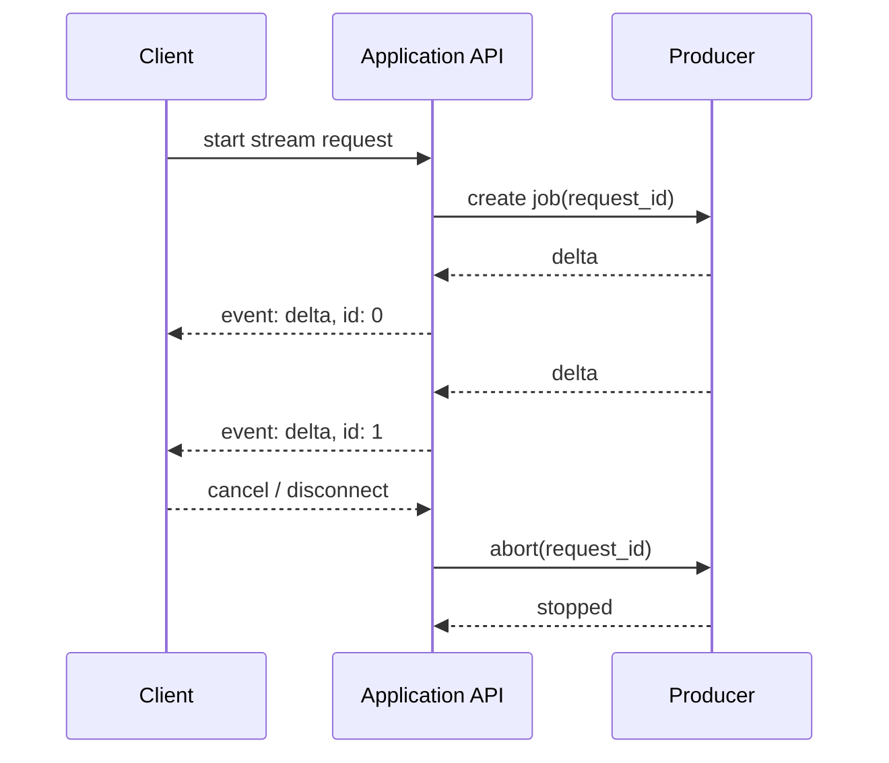
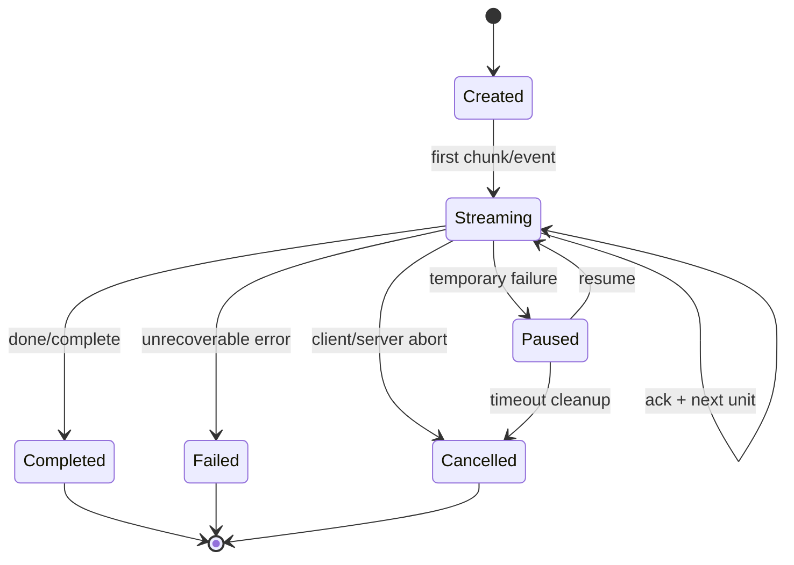

+++
title = "流式传输设计：为什么只靠传输层不够"
date = 2026-06-17T10:00:00+08:00
tags = ["networking", "streaming", "distributed-systems", "backend"]
categories = ["notes"]
draft = false
image = "/images/posts/streaming-application-layer-design/streaming-cover.svg"
libraries = ["mermaid"]
description = "从上传端和下载端两条路径理解流式传输：传输层负责可靠搬运字节，应用层负责边界、进度、恢复、幂等、背压和业务语义。"
+++

很多人第一次设计“流式传输”时，会自然地问一个问题：

**既然 TCP 已经是可靠有序的字节流，HTTP/2、HTTP/3 也已经支持长连接和多路复用，为什么还要在应用层重新设计一套 streaming 协议？**

答案是：传输层只承诺“把字节送到”。但真实系统关心的不是裸字节，而是更高层的事实：这一段字节属于哪个文件？是不是第 17 个 chunk？能不能重试？重复到达怎么办？下载端看到一半断线后能不能恢复？消费者处理不过来时谁降速？这些都不是传输层能替应用决定的。

本文用两个小对象贯穿全文：

- 上传端：把一个 `1GB` 文件切成 `4MB` chunk 上传。
- 下载端：服务端把 LLM token、日志行或视频片段连续推给客户端。

它们方向相反，但背后的应用层问题很像：**字节流必须被切成有意义的消息，消息必须绑定状态，状态必须能被确认、恢复和取消。**



## 从一个最小例子开始 {#toy-example}

假设客户端要上传一个 `1GB` 文件，网络中途可能断开。最朴素的做法是直接把整个文件放进一个 HTTP request body：

```text
POST /upload

[1GB raw bytes...]
```

这在理想网络里可以工作，但系统语义非常脆弱：

- 传到 `740MB` 时断线，服务端到底保存了多少？
- 客户端重试时，是重新传 `1GB`，还是从 `740MB` 继续？
- 服务端收到重复的后半段，如何知道这是 retry，而不是另一个文件？
- 如果文件内容损坏，应该检查整文件 checksum，还是每个 chunk 都检查？

于是应用层通常会把上传拆成一个带状态的会话：

```text
create upload session
  -> upload_id = u_123

PUT /uploads/u_123/chunks/0000  bytes 0..4MB-1   checksum=a1
PUT /uploads/u_123/chunks/0001  bytes 4MB..8MB-1 checksum=b2
PUT /uploads/u_123/chunks/0002  bytes 8MB..12MB-1 checksum=c3

complete upload u_123
  -> verify chunk list + total checksum
  -> commit object
```

注意这里已经不只是“发送字节”。应用层新增了几个传输层不知道的对象：

| 对象 | 作用 |
|---|---|
| `upload_id` | 把多次请求归到同一个上传会话 |
| `chunk_index` / byte range | 给字节建立可重试的边界 |
| `checksum` | 区分“可靠送达”与“内容正确” |
| `complete` | 把临时状态提交成最终对象 |
| idempotency key | 让重复请求不会重复创建结果 |

这就是流式上传设计的核心：**把一个大对象拆成可独立确认的小对象，但最终仍能合并成一个一致的业务对象。**

## 下载端的问题不是上传端的镜像 {#download-side}

下载端也有流式传输，但问题不完全对称。上传端的发送者通常是客户端，客户端知道完整输入；下载端的发送者通常是服务端，输出可能一边计算一边产生。

典型例子是 LLM token stream：

```text
event: delta
data: {"index":0,"content":"流"}

event: delta
data: {"index":1,"content":"式"}

event: done
data: {}
```

这可以用 HTTP chunked response、Server-Sent Events（SSE）、WebSocket 或 HTTP/2 stream 承载。但无论底层选什么，应用层仍然要定义：

- 每个事件的边界在哪里？
- `delta`、`error`、`done` 分别是什么意思？
- 客户端断线后能不能从 `index=37` 继续？
- 服务端如何发送 heartbeat，避免中间代理误判连接空闲？
- 用户取消时，服务端如何停止后端计算，而不只是关闭 socket？

也就是说，下载端的关键不是“持续写 socket”，而是**把一个不断生成的过程暴露成可消费、可终止、可观测的事件序列**。



这个图里最重要的不是箭头，而是 `request_id` 和事件编号。没有它们，系统只能说“连接断了”；有了它们，系统才能说“哪个业务任务断了、已经交付到哪一步、后端是否应该停止”。

## 传输层已经做了什么 {#transport-layer}

先公平一点：传输层确实已经解决了很多困难问题。

以 TCP 为例，它提供：

- 有序字节流：接收方看到的字节顺序和发送方写入顺序一致。
- 可靠重传：丢包后自动重传。
- 拥塞控制：根据网络状况调节发送速率。
- 流量控制：接收方窗口限制发送方，避免把接收缓冲区打爆。

QUIC / HTTP/3 又把一部分能力前移到用户态，并改善了连接迁移、多路复用下的 head-of-line blocking 等问题。HTTP/2 也能在一个连接上承载多个 stream。

所以应用层不应该重复实现丢包重传、拥塞控制、包排序。那是传输层擅长的工作。

但传输层的抽象边界很清楚：它看见的是连接、packet、stream、byte offset。它看不见下面这些事实：

| 传输层知道 | 应用层才知道 |
|---|---|
| byte offset | 这是第几个 chunk / event |
| connection closed | 是用户取消、网络断线，还是服务端完成 |
| bytes delivered | 内容是否通过业务校验 |
| receiver window full | 用户处理慢、磁盘慢，还是下游服务慢 |
| stream id | 这个 stream 对应哪个文件、任务或会话 |

因此“传输层够不够”这个问题的更精确版本是：

**如果系统只需要可靠传字节，传输层就够；如果系统需要可靠推进业务状态，应用层必须设计。**

## 应用层到底要设计什么 {#application-layer}

可以把应用层 streaming 设计拆成六个维度。

### 1. 消息边界 {#message-boundary}

TCP 是 byte stream，不保留应用写入时的消息边界。你 `write()` 三次，对端可能一次 `read()` 收到；你 `write()` 一次，对端也可能分多次 `read()`。

所以应用层必须定义 framing：

```text
[length=1048576][chunk bytes...][checksum]
[length=932144 ][chunk bytes...][checksum]
```

或者使用已有格式：

- HTTP multipart
- SSE 的 `event:` / `data:` frame
- WebSocket message frame
- gRPC streaming message
- 自定义 length-prefix frame

边界不是格式洁癖，而是状态管理的最小单位。没有边界，就没有“第几个 chunk 成功”“第几个 event 已消费”。

### 2. 幂等与重试 {#idempotency}

网络失败最麻烦的地方不是“请求失败”，而是“不知道服务端有没有处理成功”。

上传 chunk 时，客户端可能超时：

```text
client -> server: PUT chunk 17
server: write chunk 17 ok
network: response lost
client: timeout
```

客户端应该重试。但如果重试导致服务端把 chunk 17 追加两次，文件就坏了。应用层需要让这个操作幂等：

```text
PUT /uploads/u_123/chunks/17
Idempotency-Key: u_123:17:sha256:...
```

服务端看到同一个 key，可以返回“已经收过”，而不是重复写入。这种语义不可能靠 TCP 自动推断，因为 TCP 只知道字节是否进入连接，不知道这个请求是不是某个业务动作的重放。

### 3. 进度与恢复 {#resume}

流式上传常见的恢复协议是：

```text
client: which chunks do you have for upload u_123?
server: 0..184 are committed, 185 is missing
client: continue from chunk 185
```

流式下载也可以有类似机制：

```text
client: resume stream s_456 from event id 37
server: replay 38..latest if retained, then continue live stream
```

但下载端有一个额外约束：服务端是否保留历史事件？如果事件只是内存里即时产生的 token，没有落盘或缓存，断线后就无法精确恢复，只能重新生成或告诉客户端“不可恢复”。这也是应用层契约的一部分。

### 4. 背压 {#backpressure}

传输层有 flow control，但应用层仍然需要背压设计，因为“接收 buffer 满了”不是唯一的慢。

下载端可能出现：

- 浏览器 JS 处理事件慢。
- 客户端写磁盘慢。
- UI 只需要每 50ms 刷新一次，不需要每个 token 都立刻渲染。
- 下游消费者消费慢，但 socket buffer 还没满。

上传端也类似：

- 服务端磁盘写入慢。
- 服务端需要边收边做病毒扫描、解码、索引。
- 对象存储或数据库成为瓶颈。

应用层可以用几种方式表达背压：

- 限制 in-flight chunk 数量。
- 服务端返回 `429` / `503` 加 `Retry-After`。
- 客户端根据 ACK 延迟动态调整 chunk size 或并发度。
- 下载端做事件合并、采样或批量 flush。

传输层 flow control 保护的是连接缓冲区；应用层 backpressure 保护的是业务处理管线。

### 5. 完成、错误与取消 {#completion-error-cancel}

流式协议必须把“结束”设计成一等事件。

下载端至少要区分：

```text
event: done
data: {"finish_reason":"stop"}

event: error
data: {"code":"quota_exceeded","message":"..."}

event: cancelled
data: {"by":"client"}
```

如果只依赖 socket close，客户端无法知道连接关闭代表正常结束、网络错误、服务端崩溃，还是用户取消。上传端也一样：`complete upload` 是显式提交点；没有提交点，服务端很难区分“还没传完”和“客户端已经放弃”。

### 6. 可观测性与资源清理 {#observability}

流式连接通常生命周期长、跨组件多、失败形态复杂。应用层需要给每条流分配稳定身份：

```text
request_id = req_abc
upload_id  = up_123
stream_id  = s_456
chunk_id   = 17
event_id   = 38
```

这些 id 用来串起日志、指标、重试、取消和清理任务。比如一个下载 stream 断了，API 层要能找到后端 worker 并停止计算；一个上传 session 超过 24 小时没完成，后台清理任务要能删除临时 chunk。

没有应用层身份，系统只能清理连接；有了应用层身份，系统才能清理业务资源。

## 上传端和下载端的共同模式 {#common-pattern}

把上面的内容压缩一下，上传端和下载端其实共享一个状态机：



差别在于“unit”是什么：

| 方向 | unit | 进度确认点 | 恢复条件 |
|---|---|---|---|
| 上传 | chunk / byte range | 服务端已经持久化或校验该 chunk | 服务端能列出已收 chunk |
| 下载 | event / token / frame | 客户端保存了 last event id，或协议里显式 ACK | 服务端能重放历史，或能重新计算 |

这个状态机也是判断一个 streaming 设计是否完整的检查表：

- 能不能明确创建一条 stream？
- 每个 unit 有没有边界和编号？
- 成功或进度是按 unit 确认，还是只在最终确认？
- 失败后能不能知道最后一致点？
- 取消会不会释放后端资源？
- 完成事件是否和连接关闭解耦？

## 选型：SSE、WebSocket、gRPC 还是自定义协议 {#protocol-choice}

应用层设计不等于一定要发明新协议。很多时候应该复用成熟承载方式。

| 方案 | 适合场景 | 注意点 |
|---|---|---|
| HTTP chunked response | 简单下载流、服务端持续输出 | 只解决传输，不定义事件语义 |
| SSE | 服务端到浏览器的文本事件流、LLM token stream | 单向；天然支持 `id` 和 reconnect，但二进制不方便 |
| WebSocket | 双向低延迟消息、协作编辑、实时控制 | 需要自己定义消息类型、重连、心跳、鉴权刷新 |
| gRPC streaming | 服务间 typed streaming、强 schema | 浏览器直连受限；生态偏后端 |
| resumable upload protocol | 大文件上传、弱网恢复 | 重点是 session、chunk、checksum、commit |

真正的设计问题不是“选哪个传输 API”，而是：

**你的业务 unit 是什么？确认点在哪里？失败后能恢复到哪里？重复消息如何处理？完成和取消如何表达？**

选型只是承载这些答案。

## 一个实用设计模板 {#template}

设计一条流式接口时，可以先写出下面这张表。

| 问题 | 上传端答案示例 | 下载端答案示例 |
|---|---|---|
| stream identity | `upload_id` | `stream_id` / `request_id` |
| unit boundary | `chunk_index + byte_range` | `event_id + event_type` |
| ordering | chunk index 单调递增，可并发但最终排序 | event id 单调递增 |
| integrity | per-chunk checksum + final checksum | event schema 校验，必要时带 checksum |
| idempotency | `upload_id:chunk_index:checksum` | `event_id` 去重，或 resume cursor |
| ack / progress | chunk persisted | last event id stored, or explicit app-level ACK |
| resume | 查询已收 chunk | 从 last event id 重放 |
| completion | explicit `complete` + commit | explicit `done` event |
| cancellation | abort upload session and delete temp chunks | abort backend job |
| cleanup | TTL 清理未完成 session | disconnect 后停止 producer 或保留短期 replay buffer |

如果这张表填不出来，说明系统实际上还没有 streaming 设计，只是把数据分批发出去了。

## 总结 {#summary}

传输层解决的是“字节如何穿过网络”。应用层解决的是“这些字节如何推进业务状态”。

上传端需要定义 session、chunk、checksum、幂等、commit 和清理。下载端需要定义 event、done/error/cancel、heartbeat、resume cursor 和 producer 生命周期。二者都依赖传输层提供可靠、有序、受控的字节通道，但都不能把业务语义交给传输层猜。

所以，流式传输的核心不是“长连接”。

更准确地说，流式传输是一种状态机设计：把大对象或长过程拆成可命名、可确认、可恢复、可取消的小步骤，并让每一步都有清晰的应用层语义。
